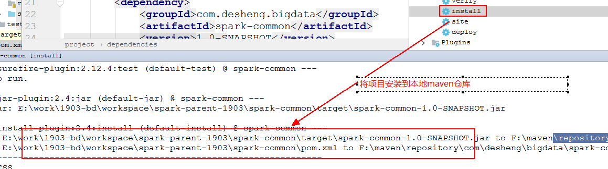

# 0. 今日大纲

- Spark入门案例的深入的学习

- Spark作业的执行流程

- SparkRDD的算子操作

# 1. Spark入门案例的深入的学习

## 1.1. 构建编程的聚合项目

### 1.1.1. 构建父目录

​		该父项目，一般做项目的管理、不做具体的编码，这个所谓管理，主要指的就是项目中涉及到的依赖的管理、版本的管理，插件的管理。


指定的maven坐标


指定存储目录


删除src目录（因为是父目录，不做编码）


进行依赖的管理

```xml
<?xml version="1.0" encoding="UTF-8"?>
<project xmlns="http://maven.apache.org/POM/4.0.0"
         xmlns:xsi="http://www.w3.org/2001/XMLSchema-instance"
         xsi:schemaLocation="http://maven.apache.org/POM/4.0.0 http://maven.apache.org/xsd/maven-4.0.0.xsd">
    <modelVersion>4.0.0</modelVersion>

    <groupId>com.desheng.parent</groupId>
    <artifactId>spark-parent-1903</artifactId>
    <version>1.0-SNAPSHOT</version>
    <properties>
        <scala.version>2.11.8</scala.version>
        <spark.version>2.2.2</spark.version>
        <junit.version>4.12</junit.version>
        <mysql.version>5.1.46</mysql.version>
    </properties>
    <dependencyManagement><!-- 依赖的管理，限制子目录继承所有依赖-->
        <dependencies>
            <dependency>
                <groupId>org.scala-lang</groupId>
                <artifactId>scala-library</artifactId>
                <version>${scala.version}</version>
            </dependency>
            <dependency>
                <groupId>junit</groupId>
                <artifactId>junit</artifactId>
                <version>${junit.version}</version>
            </dependency>
            <dependency>
                <groupId>org.apache.spark</groupId>
                <artifactId>spark-core_2.11</artifactId>
                <version>${spark.version}</version>
            </dependency>
            <dependency>
                <groupId>mysql</groupId>
                <artifactId>mysql-connector-java</artifactId>
                <version>${mysql.version}</version>
            </dependency>
        </dependencies>
    </dependencyManagement>
</project>
```

### 1.1.2. 构建子模块

#### 1.1.2.1. Spark-common


指定maven坐标


存储目录


指定maven依赖

```xml
<?xml version="1.0" encoding="UTF-8"?>
<project xmlns="http://maven.apache.org/POM/4.0.0"
         xmlns:xsi="http://www.w3.org/2001/XMLSchema-instance"
         xsi:schemaLocation="http://maven.apache.org/POM/4.0.0 http://maven.apache.org/xsd/maven-4.0.0.xsd">
    <parent>
        <artifactId>spark-parent-1903</artifactId>
        <groupId>com.desheng.parent</groupId>
        <version>1.0-SNAPSHOT</version>
    </parent>
    <modelVersion>4.0.0</modelVersion>

    <groupId>com.desheng.bigdata</groupId>
    <artifactId>spark-common</artifactId>
    <version>1.0-SNAPSHOT</version>

    <dependencies>
        <dependency>
            <groupId>junit</groupId>
            <artifactId>junit</artifactId>
        </dependency>
        <dependency>
            <groupId>mysql</groupId>
            <artifactId>mysql-connector-java</artifactId>
        </dependency>
    </dependencies>
</project>
```

此时会在spark-parent-1903的pom文件中多了modules的配置


#### 1.1.2.2. Spark-core

右键指定module


指定maven的坐标


存储的目录


指定maven的依赖

```xml
<?xml version="1.0" encoding="UTF-8"?>
<project xmlns="http://maven.apache.org/POM/4.0.0"
         xmlns:xsi="http://www.w3.org/2001/XMLSchema-instance"
         xsi:schemaLocation="http://maven.apache.org/POM/4.0.0 http://maven.apache.org/xsd/maven-4.0.0.xsd">
    <parent>
        <artifactId>spark-parent-1903</artifactId>
        <groupId>com.desheng.parent</groupId>
        <version>1.0-SNAPSHOT</version>
    </parent>
    <modelVersion>4.0.0</modelVersion>

    <groupId>com.desheng.bigdata</groupId>
    <artifactId>spark-core</artifactId>
    <version>1.0-SNAPSHOT</version>

    <dependencies>
        <dependency>
            <groupId>org.apache.spark</groupId>
            <artifactId>spark-core_2.11</artifactId>
        </dependency>
        <dependency>
            <groupId>com.desheng.bigdata</groupId>
            <artifactId>spark-common</artifactId>
            <version>1.0-SNAPSHOT</version>
            <exclusions>
                <exclusion>
                    <groupId>junit</groupId>
                    <artifactId>junit</artifactId>
                </exclusion>
            </exclusions>
        </dependency>
    </dependencies>
</project>
```

同时会在spark-parent-1903的pom中添加一个module


## 1.2. Spark入门案例之java开发

### 1.2.1. Spark编程步骤

> 第一步：构建sparkContext
>     SparkContext的构建需要SparkConf的支持
> 第二步：加载外部数据，转化为RDD
>     textFile()  --->加载外部文件系统（本地、hdfs）的一个文件
>     parallelize --->加载外部的一个集合（list,map\set\seq等待）
> 第三步：对RDD基于业务逻辑进行计算
>     操作分为了两种：
>         transformation：转化算子
>         action：行动算子
> 第四步：释放资源
>     sparkcontext.stop()

### 1.2.2. Spark编程涉及到的Master url地址写法


### 1.2.3. 撸代码

```java
package com.desheng.bigdata.spark.p2;

import org.apache.spark.SparkConf;
import org.apache.spark.api.java.JavaPairRDD;
import org.apache.spark.api.java.JavaRDD;
import org.apache.spark.api.java.JavaSparkContext;
import org.apache.spark.api.java.function.FlatMapFunction;
import org.apache.spark.api.java.function.Function2;
import org.apache.spark.api.java.function.PairFunction;
import org.apache.spark.api.java.function.VoidFunction;
import scala.Tuple2;

import java.util.Arrays;
import java.util.Iterator;

/**
 * 基于Java版本的Spark的wordcount案例
 */
public class JavaSparkWordCountOps {
    public static void main(String[] args) {

        SparkConf conf = new SparkConf();
        conf.setAppName("JavaSparkWordCountOps");
        conf.setMaster("local[*]");
        JavaSparkContext jsc = new JavaSparkContext(conf);

        JavaRDD<String> lines = jsc.textFile("file:/E:/data/hello.txt");

        JavaRDD<String> words = lines.flatMap(new FlatMapFunction<String, String>() {
            public Iterator<String> call(String line) throws Exception {
                String[] words = line.split("\\s+");
                return Arrays.asList(words).iterator();
            }
        });

        JavaPairRDD<String, Integer> pairs = words.mapToPair(new PairFunction<String, String, Integer>() {
            public Tuple2<String, Integer> call(String word) throws Exception {
                return new Tuple2<String, Integer>(word, 1);
            }
        });
        /*
            1+ ... + 10
            int sum = 0;
            for(int i = 1; i <= 10; i++) {
                sum += i;
            }
         */
        JavaPairRDD<String, Integer> ret = pairs.reduceByKey(new Function2<Integer, Integer, Integer>() {
            public Integer call(Integer v1, Integer v2) throws Exception {
                return v1 + v2;
            }
        });
        //action操作触发
        ret.foreach(new VoidFunction<Tuple2<String, Integer>>() {
            public void call(Tuple2<String, Integer> t) throws Exception {
                System.out.println(t._1 + "--->" + t._2);
            }
        });

        jsc.stop();
    }
}

```

### 1.2.4. java的lambda版本

- 在编写lambda表达式的时候有如下的错误


修改的话，将java编译的版本提高到1.8即可。

1. 修改方式一：

    步骤一：

    

    步骤二：

    

    这种方式一般都不用，因为一旦更新依赖，又会恢复原样！

2. 修改方式二：

    一劳永逸的解决，在spark-core的pom入加入jdk版本的插件

    ```xml
    <!-- 添加maven集成jdk版本的插件-->
    <build>
        <plugins>
            <plugin>
                <groupId>org.apache.maven.plugins</groupId>
                <artifactId>maven-compiler-plugin</artifactId>
                <version>3.8.1</version>
                <configuration>
                    <source>1.8</source>
                    <target>1.8</target>
                </configuration>
            </plugin>
        </plugins>
    </build>
    ```

    - 具体代码实现
    
    ```java
    /**
     * lambda表达式版本
     */
    public class JavaSparkWordCountOps2 {
        public static void main(String[] args) {
    
            SparkConf conf = new SparkConf();
            conf.setAppName("JavaSparkWordCountOps");
            conf.setMaster("local[*]");
            JavaSparkContext jsc = new JavaSparkContext(conf);
    
            JavaRDD<String> lines = jsc.textFile("file:/E:/data/hello.txt");
            int partitions = lines.getNumPartitions();
            System.out.println("##############partition: " + partitions);
            JavaRDD<String> words = lines.flatMap(line -> Arrays.asList(line).iterator());
    
            JavaPairRDD<String, Integer> pairs = words.mapToPair(word -> new Tuple2<String, Integer>(word, 1));
            JavaPairRDD<String, Integer> ret = pairs.reduceByKey((v1, v2) -> {
    //            int i = 1 / 0; //lazy验证
                return v1 + v2;
            });
            //action操作触发
            ret.foreach(t -> System.out.println(t._1 + "--->" + t._2));
    
            jsc.stop();
    }
    ```

### 1.2.5. spark代码的日志的管理

- 局部控制

	就在当前的类中指定。

	```java
	import org.apache.log4j.Level;
	import org.apache.log4j.Logger;
	
	Logger.getLogger("org.apache.spark").setLevel(Level.WARN);
	Logger.getLogger("org.apache.hadoop").setLevel(Level.WARN);
	Logger.getLogger("org.spark_project").setLevel(Level.WARN);
	```

- 全局控制

	

	log4j.properties

	```properties
	# Set everything to be logged to the console
	log4j.rootCategory=WARN, console
	log4j.appender.console=org.apache.log4j.ConsoleAppender
	log4j.appender.console.target=System.err
	log4j.appender.console.layout=org.apache.log4j.PatternLayout
	log4j.appender.console.layout.ConversionPattern=%d{yy/MM/dd HH:mm:ss} %p %c{1}: %m%n
	
	# Set the default spark-shell log level to WARN. When running the spark-shell, the
	# log level for this class is used to overwrite the root logger's log level, so that
	# the user can have different defaults for the shell and regular Spark apps.
	log4j.logger.org.apache.spark.repl.Main=WARN
	
	# Settings to quiet third party logs that are too verbose
	log4j.logger.org.spark_project.jetty=WARN
	log4j.logger.org.spark_project.jetty.util.component.AbstractLifeCycle=ERROR
	log4j.logger.org.apache.spark.repl.SparkIMain$exprTyper=INFO
	log4j.logger.org.apache.spark.repl.SparkILoop$SparkILoopInterpreter=INFO
	log4j.logger.org.apache.parquet=ERROR
	log4j.logger.parquet=ERROR
	
	# SPARK-9183: Settings to avoid annoying messages when looking up nonexistent UDFs in SparkSQL with Hive support
	log4j.logger.org.apache.hadoop.hive.metastore.RetryingHMSHandler=FATAL
	log4j.logger.org.apache.hadoop.hive.ql.exec.FunctionRegistry=ERROR
	```

     

## 1.3. Spark入门案例之Scala开发

### 1.3.1.修改sdk，支持scala开发


### 1.3.2. scala代码完整版

```scala
object _01ScalaWordCountOps {
    def main(args: Array[String]): Unit = {
        val conf = new SparkConf()
                    .setAppName("ScalaWordCount")
                    .setMaster("local[*]")
        val sc = new SparkContext(conf)

        val lines = sc.textFile("file:/E:/data/hello.txt")

        val ret = lines.flatMap(_.split("\\s+")).map((_, 1)).reduceByKey(_+_)

//      ret.foreach(t => println(t._1 + "--->" + t._2))
        //模式匹配的写法
        ret.foreach{case (word, count) => println(word + "--->" + count)}
        sc.stop()
    }
}
```

### 1.3.3. 读取hdfs文件

编码如下，但是有异常


怎么解决

​	将能够解析ns1是神马东西的配置加载到项目的classpath中即可。

​	也就是hdfs-site.xml和core-site.xml


### 1.3.4. 编译打包之后再集群中运行

#### 1.3.4.0. 编译打包

- 可视化

    ​	使用maven的声明周期中的package进行打包

    

    但是出现如下错误：

    

    意为spark-core模块无法找到对应的spark-common的依赖

    

    pom中的依赖，全都加载自maven的仓库(中央仓库、私服、本地仓库)，先本地仓库没有对应的spark-common，中央仓库更没有。只有将对应的依赖，提交或者安装到仓库。

    如何提交/安装依赖到仓库

    到对应的maven项目/模块上面执行install命令即可。

    

    成功之后执行package打包即可。

- 命令行

    

- 执行打包scala

    最终的pom配置

    ```xml
    <?xml version="1.0" encoding="UTF-8"?>
    <project xmlns="http://maven.apache.org/POM/4.0.0"
             xmlns:xsi="http://www.w3.org/2001/XMLSchema-instance"
             xsi:schemaLocation="http://maven.apache.org/POM/4.0.0 http://maven.apache.org/xsd/maven-4.0.0.xsd">
        <parent>
            <artifactId>spark-parent-1903</artifactId>
            <groupId>com.desheng.parent</groupId>
            <version>1.0-SNAPSHOT</version>
        </parent>
        <modelVersion>4.0.0</modelVersion>
    
        <groupId>com.desheng.bigdata</groupId>
        <artifactId>spark-core</artifactId>
        <version>1.0-SNAPSHOT</version>
    
        <dependencies>
            <dependency>
                <groupId>org.apache.spark</groupId>
                <artifactId>spark-core_2.11</artifactId>
                <!--
                    scope：代表的是当前dependency的作用域范围
                        compiled    : 默认的，在scope的各个范围内都能使用
                        test        : 代表当前dependency只能在src/test测试目录下面能用
                        runtime     : 代表的是在源代码和编译阶段不用，在运行时才是用
                                        最典型的代表就是jdbc的驱动
                        provided    : 编译和源代码阶段使用，在运行的时候，不用，使用集群中已经提供的依赖
                -->
                <scope>provided</scope>
            </dependency>
            <dependency>
                <groupId>com.desheng.bigdata</groupId>
                <artifactId>spark-common</artifactId>
                <version>1.0-SNAPSHOT</version>
                <exclusions>
                    <exclusion>
                        <groupId>junit</groupId>
                        <artifactId>junit</artifactId>
                    </exclusion>
                </exclusions>
            </dependency>
        </dependencies>
        <!-- 添加maven集成jdk版本的插件-->
        <build>
            <sourceDirectory>src/main/scala</sourceDirectory>
            <plugins>
                <plugin>
                    <groupId>org.scala-tools</groupId>
                    <artifactId>maven-scala-plugin</artifactId>
                    <executions>
                        <execution>
                            <goals>
                                <goal>compile</goal>
                                <goal>testCompile</goal>
                            </goals>
                        </execution>
                    </executions>
                    <configuration>
                        <scalaVersion>${scala.version}</scalaVersion>
                        <args>
                            <arg>-target:jvm-1.5</arg>
                        </args>
                    </configuration>
                </plugin>
                <plugin>
                    <groupId>org.apache.maven.plugins</groupId>
                    <artifactId>maven-eclipse-plugin</artifactId>
                    <configuration>
                        <downloadSources>true</downloadSources>
                        <buildcommands>
                            <buildcommand>ch.epfl.lamp.sdt.core.scalabuilder</buildcommand>
                        </buildcommands>
                        <additionalProjectnatures>
                            <projectnature>ch.epfl.lamp.sdt.core.scalanature</projectnature>
                        </additionalProjectnatures>
                        <classpathContainers>
                            <classpathContainer>org.eclipse.jdt.launching.JRE_CONTAINER</classpathContainer>
                            <classpathContainer>ch.epfl.lamp.sdt.launching.SCALA_CONTAINER</classpathContainer>
                        </classpathContainers>
                    </configuration>
                </plugin>
                <plugin>
                    <groupId>org.apache.maven.plugins</groupId>
                    <artifactId>maven-compiler-plugin</artifactId>
                    <version>3.8.1</version>
                    <configuration>
                        <source>1.8</source>
                        <target>1.8</target>
                    </configuration>
                </plugin>
                <!-- 对第三方依赖进行打包-->
                <plugin>
                    <artifactId>maven-assembly-plugin</artifactId>
                    <configuration>
                        <descriptorRefs>
                            <descriptorRef>jar-with-dependencies</descriptorRef>
                        </descriptorRefs>
                        <archive>
                            <!--<manifest>
                              <mainClass></mainClass>
                            </manifest>-->
                        </archive>
                    </configuration>
                    <executions>
                        <execution>
                            <id>make-assembly</id>
                            <phase>package</phase>
                            <goals>
                                <goal>single</goal>
                            </goals>
                        </execution>
                    </executions>
                </plugin>
            </plugins>
        </build>
    </project>
    ```

#### 1.3.4.1. standalone的模式

​		代码的提交，要参考spark官方文档：http://spark.apache.org/docs/2.2.2/submitting-applications.html

- client

```sh
#!/bin/sh


SPARK_HOME=/home/bigdata/app/spark

$SPARK_HOME/bin/spark-submit \
--master spark://bigdata01:7077 \
--deploy-mode client \
--class com.desheng.bigdata.spark.p2._02ScalaWordCountRemoteOps \
--executor-memory 600M \
--executor-cores 1 \
--total-executor-cores 1 \
/home/bigdata/jars/spark/1903-bd/spark-core-1.0-SNAPSHOT-jar-with-dependencies.jar \
hdfs://ns1/data/spark/hello.log
```

- cluster

执行脚本

```sh
#!/bin/sh


SPARK_HOME=/home/bigdata/app/spark

$SPARK_HOME/bin/spark-submit \
--master spark://bigdata01:7077 \
--deploy-mode cluster \
--class com.desheng.bigdata.spark.p2._02ScalaWordCountRemoteOps \
--executor-memory 600M \
--executor-cores 1 \
--driver-cores 1 \
--supervise \
--total-executor-cores 2 \
/home/bigdata/jars/spark/1903-bd/spark-core-1.0-SNAPSHOT-jar-with-dependencies.jar \
hdfs://ns1/data/spark/hello.log
```

报错：


报错的原因：

​	因为基于cluster的模式下，dirver需要在worker节点上面进行启动，自然加载数据的时候也就会从对应的worker节点上面加载，包括对应jar也在对应的节点上面加载，而提交的脚本是在bigdata01，worker在02和03上面，所以是无法找到对应的jar的。


解决方法就是将jar上传到hdfs中。

```sh
#!/bin/sh
SPARK_HOME=/home/bigdata/app/spark
$SPARK_HOME/bin/spark-submit \
--master spark://bigdata01:7077 \
--deploy-mode cluster \
--class com.desheng.bigdata.spark.p2._02ScalaWordCountRemoteOps \
--executor-memory 600M \
--executor-cores 1 \
--driver-cores 1 \
--supervise \
--total-executor-cores 2 \
hdfs://ns1/jars/spark/1903-bd/spark-core-1.0-SNAPSHOT-jar-with-dependencies.jar \
hdfs://ns1/data/spark/hello.log
```

#### 1.3.4.2. yarn模式（大多数情况下的运行方式）

​	需要启动yarn集群

- client

```sh
SPARK_HOME=/home/bigdata/app/spark
export HADOOP_CONF_DIR=/home/bigdata/app/hadoop/etc/hadoop

$SPARK_HOME/bin/spark-submit \
--master yarn \
--deploy-mode client \
--class com.desheng.bigdata.spark.p2._02ScalaWordCountRemoteOps \
--executor-memory 600M \
--executor-cores 1 \
--driver-cores 1 \
--num-executors 1 \
--driver-memory 600M \
/home/bigdata/jars/spark/1903-bd/spark-core-1.0-SNAPSHOT-jar-with-dependencies.jar \
hdfs://ns1/data/spark/hello.log
```

- cluster

```sh
#!/bin/sh


SPARK_HOME=/home/bigdata/app/spark
export HADOOP_CONF_DIR=/home/bigdata/app/hadoop/etc/hadoop

$SPARK_HOME/bin/spark-submit \
--master yarn \
--deploy-mode cluster \
--class com.desheng.bigdata.spark.p2._02ScalaWordCountRemoteOps \
--executor-memory 600M \
--executor-cores 1 \
--driver-cores 1 \
--num-executors 1 \
--driver-memory 600M \
hdfs://ns1/jars/spark/1903-bd/spark-core-1.0-SNAPSHOT-jar-with-dependencies.jar \
hdfs://ns1/data/spark/hello.lo
```

注意：

​		基于yarn模式的运行，一般的会无法提交，报错！虚拟内存受限制。类似

Container killed by YARN for exceeding memory limits. 15.6 GB of 15.5 GB physical memory used. 

解决问题：

在yarn-site.xml中添加如下两个配置

```xml
<property>
    <name>yarn.nodemanager.pmem-check-enabled</name>
    <value>false</value>
</property>
<property>
    <name>yarn.nodemanager.vmem-check-enabled</name>
    <value>false</value>
</property>
```

# 2. Spark作业的执行流程

## 2.1. 基于wordcount研究spark作业的执行原理


## 2.2. spark作业运行架构原理图


# 3. Spark的操作

spark官网的翻译：https://www.cnblogs.com/BYRans/p/5057110.html

​	Spark中有两个重要的抽象概念，其一为RDD，其一为共享变量(仅有的两种：广播变量Broadcast ，累加器Accumulator)。

## 3.1. RDD的操作

### 3.1.1. RDD的简述


​	RDD的操作，大体上分为了两种：transformation，action。前者是转换算子，同时是lazy的，执行需要action行动算子的触发。详细了分还可以有输入算子，转换算子，缓存算子，行动算子。


### 3.1.2. RDD的操作

#### 3.1.2.1. transformation的操作

- map

    map(func),为该rdd中的每一条记录执行一次该func函数，返回一个新的RDD操作

    注意：每一条操作执行完毕之后的数据还是一条，所以map的操作是one-2-one

    eg. 给集合中的每一个元素乘以7

    ```scala
    object _03SparkTransformationOps {
        def main(args: Array[String]): Unit = {
            val conf = new SparkConf()
                        .setAppName("SparkTransformation")
                        .setMaster("local[*]")
            val sc = new SparkContext(conf)
            val list = 1 to 7
            val listRDD:RDD[Int] = sc.parallelize(list)
    
    //        listRDD.map(num => num * 7)
            val retRDD:RDD[Int] = listRDD.map(_ * 7)
    
            retRDD.foreach(println)
            sc.stop()
        }
    }
    ```

- flatMap

    flatMap(func):为该RDD中的每一条记录执行一次该func函数，处理之后的结果是多个，和map非常相似，不同之处在于，map操作是one-2-one，而flatMap是one-2-many。

    eg.对一行字符串进行拆分，转化为多个单词

    ```scala
    val list = List(
        "wei hang hang",
        "liu peng fei xiao fei fei",
        "song hai ning xiao pretty sister"
    )
    val listRDD:RDD[String] = sc.parallelize(list)
    
    val words = listRDD.flatMap(line => {
        println(s"line=$line")
        line.split("\\s+")
    })
    words.foreach(word => println(word))
    ```

- filter

    filter(func),为该RDD中的每一条记录执行一次该func函数，返回值为boolean，含义是保留结果值为true，过滤结果为false的数据。

    eg. 过滤集合中的偶数even，保留奇数odd

    ```scala
    private def fliterOps(sc: SparkContext) = {
        val list = 1 until 10
    
        val listRDD:RDD[Int] = sc.parallelize(list)
    
        val filteredRDD = listRDD.filter(num => num % 2 != 0)
    
        filteredRDD.foreach(println)
    }
    ```

- sample

    sample(withReplacement, fraction, seed),为了弄清楚该rdd中数据的分布情况，需要对该RDD进行抽样处理，涉及到三个参数，withReplacement：Boolean为有无放回的抽样，true，代表有放回，false为无放回；fraction：Double，意为抽样的比例，是一个小数(0, 1)；seed：Long是一个抽样的随机数种子，有默认值，一般都不做处理。

    需要注意一点的时候：这个spark的sample是一个不准确的抽样，这个不准确指的是，抽样的结果记录数并不是严格的抽样比例，会在这个抽样比例上下浮动。

    常见的一个使用，就是在<span style="color:red">解决data skew(数据倾斜)的时候来观察key的分布情况</span>。

    

    eg,从100000个数中，抽取10%(0.1)的数据,查看结果

    ```scala
    def sampleOps(sc: SparkContext) = {
        val list = 1 to 100000
        val listRDD = sc.parallelize(list)
    
        val sampledRDD:RDD[Int] = listRDD.sample(true, 0.1)
    
        println("有放回抽样之后的结果数：" + sampledRDD.count())
        val sampledRDD1:RDD[Int] = listRDD.sample(false, 0.1)
        println("无放回抽样之后的结果数：" + sampledRDD1.count())
    }
    ```

- union

    union(otherRDD):就是前面了解到的联合操作，把两个rdd的数据整合到一起，成为一个新的RDD。

    类似sql中的union，sql中的union有两种：

    union: 联合去重

    union all :联合不去重

    spark中的union操作，相当于union all。

    ```scala
    def unionOps(sc: SparkContext) = {
        val list1 = sc.parallelize(List(1, 3, 5, 7, 9))
        val list2 = sc.parallelize(List(1, 3, 6, 8, 10))
        val unionRDD = list1.union(list2)
    
        println("counts = " + unionRDD.count())
    
        unionRDD.foreach(num => print(num + "\t"))
    }
    ```

- groupByKey

    groupByKey(numPartitions):按照key进行分组，默认有8个线程去处理，这个操作要求数据的格式为RDD[K, V],处理之后的结果,RDD[K, Iterable[V]]。

    eg.按照班级，将学员进行分组

    ```scala
    def gbkOps(sc: SparkContext) = {
        val list = List(
            "bd-wh-1903 杨浡 男 20",
            "bd-sz-1903 王宁 女 18",
            "bd-sz-1903 于治东 男 30",
            "bd-wh-1903 曹天武 男 21",
            "bd-bj-1903 赵莹 男 38",
            "bd-bj-1903 熊益 男 18",
            "bd-bj-1903 麻宁娜 女 18"
        )
    
        val clazz2Info:RDD[(String, String)] = sc.parallelize(list).map(line => {
            val clazz = line.substring(0, line.indexOf(" "))
            val info = line.substring(line.indexOf(" ") + 1)
            (clazz, info)
        })
        //按照班级进行分组
        val clazz2Infos:RDD[(String, Iterable[String])] = clazz2Info.groupByKey()
    
        clazz2Infos.foreach{case (clazz, infos) => {
            println(s"$clazz===>${infos.mkString("[", ",", "]")}")
        }}
    }
    ```

    还有一个类似的操作，groupBy，这里和groupByKey区别，可以基于的没有K的数据类型进行分组。底层还是groupByKey。

    > 但是一般情况下，这个groupByKey的性能相对较差，能不用则不用，能带则一定要代替。性能较差的原因主要和reduceByKey进行比较，reduceByKey在执行过程当中有一个本地预聚合mapSideCombine，而groupByKey没有，很多情况下，groupByKey能够完成的工作，同样也可以使用reduceByKey.

- join

    rdd：RDD[K, V]

    otherRDD:RDD[K, W]

    rdd.join(otherRDD),这个join操作就是sql中的join操作。join的rdd的类型必须是k-v

    join的结果RDD[K, (V, W)]

    left outer join的结果RDD[K, (V, Option[W])]

    right outer join的结果RDD[K, (Option[V], W)]

    full outer join的结果RDD[K, (Option[V],  Option[W])]

sql中的常见的join

​	左表A，右表B，关联字段A(id),B(aid)

1. 交叉连接 accross join 没有写连接条件

    select a.* ,  b.*  from A a accross join B b

    产生笛卡尔积，一般不用

2. 内连接 [inner] join 返回左表和右表中都能关联上的数据。

    select a.* ,  b.*  from A a [inner] join B b on a.id = b.aid

    所以内连接的返回值结果一定确定的，没有关联上的数据不作为返回值。

3. 外连接

    select a.* ,  b.*  from A a <left|right> outer join B b on a.id = b.aid

    left outer join： 显示左表所有数据，右表能够关联上的正常显示，关联不上的显示为null

    right outer join：和left outer join刚好相反

    和内连接相比，这个外连接的结果可能有，可能没有。Option/Some|None

4. 半连接 semi join  

5. 全连接 full outer join

    select a.* ,  b.*  from A a full outer join B b on a.id = b.aid

    全连接是相对于外连接而言 fullouterjoin=leftouterjoin union right outer join

    结果不确定，因为左表都显示，无法关联上右表的显示为null，其余正常，又变都显示，无法关联上左表显示为null，其余正常。

eg. 

```scala
def joinOps(sc: SparkContext) = {
    val stu = Map[String, String](
        "秦剑兵" -> "男 187 23",
        "张力" -> "男 180 22",
        "张琰博" -> "男 180 18",
        "蔚凯璐" -> "女 168 18",
        "武小康" -> "男 178 20"
    )
    val score = Map[String, Double](
        "秦剑兵" -> 33,
        "张力" -> 90,
        "张琰博" -> 59,
        "蔚凯璐" -> 100,
        "oldLi" -> 0
    )

    val stuRDD:RDD[(String, String)] = sc.parallelize(stu.toList)
    val scoreRDD:RDD[(String, Double)] = sc.parallelize(score.toList)
    //关联相关学生的所有信息
    println("------------------^_^-----------------------")
    val leftJoinedRDD:RDD[(String, (String, Option[Double]))] = stuRDD.leftOuterJoin(scoreRDD)

    /*leftJoinedRDD.foreach(t => {
            println(s"${t._1}==>(${t._2._1}, ${t._2._2})")
        })*/

    leftJoinedRDD.foreach{case (name, (info, scoreOption)) => {
        println(s"${name}==>(${info}, ${scoreOption.getOrElse(null)})")
    }}
    println("------------------$_$-----------------------")
    //关联两张表中都有的结果
    val joinedRDD:RDD[(String, (String, Double))] = stuRDD.join(scoreRDD)
    joinedRDD.foreach{case (name, (info, score)) => {
        println(s"${name}==>(${info}, ${score})")
    }}
    println("------------------>~<-----------------------")
    //查询所有人的信息 full outer join
    val fullJoinedRDD:RDD[(String, (Option[String], Option[Double]))] = stuRDD.fullOuterJoin(scoreRDD)

    fullJoinedRDD.foreach{case (name, (infoOption, scoreOption)) => {
        println(s"${name}==>(${infoOption.getOrElse(null)}, ${scoreOption.getOrElse(null)})")
    }}
}
```

- reduceByKey

    按照key进行reduce操作，数据类型rdd[K, V] ---rdd.reduceByKey(func)---[K, V]

    就以wordcount为例来进行说明，其次尝试用reduceByKey模拟groupByKey

    ```scala
    def rbkOps(sc: SparkContext) = {
        val list = List(
            "wei hang hang",
            "liu peng fei xiao fei fei",
            "song hai ning xiao pretty sister"
        )
        val listRDD = sc.parallelize(list)
        val ret = listRDD.flatMap(_.split("\\s+")).map((_, 1)).reduceByKey(_+_)
    
        ret.foreach(println)
        println("---------reduceByKey来模拟groupByKey----------")
        val stuList = List(
            "bd-wh-1903 杨浡 男 20",
            "bd-sz-1903 王宁 女 18",
            "bd-sz-1903 于治东 男 30",
            "bd-wh-1903 曹天武 男 21",
            "bd-bj-1903 赵莹 男 38",
            "bd-bj-1903 熊益 男 18",
            "bd-bj-1903 麻宁娜 女 18"
        )
        val clazz2Info:RDD[(String, String)] = sc.parallelize(stuList).map(line => {
            val clazz = line.substring(0, line.indexOf(" "))
            val info = line.substring(line.indexOf(" ") + 1)
            (clazz, info)
        })
        //groupByKey的一个结果，拉取数据到一起
        val classInfo:RDD[(String, String)] = clazz2Info.reduceByKey((info1, info2) => {
            info1 + "," + info2
        })
        classInfo.foreach(println)
        println("------处理数据类型为(String, Iterable[String])----")
        val class2Infos:RDD[(String, Iterable[String])] = classInfo.map{case (clazz, infos) => {
            (clazz, infos.split(",").toIterable)
        }}
        class2Infos.foreach{case (clazz, infos) => {
            println(s"$clazz==>${infos.mkString("[", ",", "]")}")
        }}
    }
    ```

- sortByKey（排序相关）

- combineByKey aggregateByKey 按照key进行combine操作和按照key进行aggregate操作

    这二者其实说的都是同一回事，同时aggregateByKey和combineByKey底层都是通过combineByKeyWithClassTag来进行实现的，其中combineByKey是combineByKeyWithClassTag的一个简写方式，从本质上说combineByKey和aggregateByKey没有区别，只不过一般建议在不同的场景下使用不同的算子。

    通过combineByKey和aggregateByKey模拟reduceByKey和groupByKey来学习。

    - combineByKey

    ​	1. 模拟groupByKey

    ```scala
    def main(args: Array[String]): Unit = {
        val conf = new SparkConf()
        .setAppName(s"${_02CombineByKey2GroupByKeyOps.getClass.getSimpleName}")
        .setMaster("local[*]")
    
        val sc = new SparkContext(conf)
    
        val list = List(
            "bd-wh-1903 杨浡 男 20",
            "bd-sz-1903 王宁 女 18",
            "bd-sz-1903 于治东 男 30",
            "bd-wh-1903 曹天武 男 21",
            "bd-bj-1903 赵莹 男 38",
            "bd-bj-1903 熊益 男 18",
            "bd-bj-1903 麻宁娜 女 18"
        )
    
        val clazz2Info:RDD[(String, String)] = sc.parallelize(list).map(line => {
            val clazz = line.substring(0, line.indexOf(" "))
            val info = line.substring(line.indexOf(" ") + 1)
            (clazz, info)
        })
    
        val clazz2Infos:RDD[(String, ArrayBuffer[String])] = clazz2Info.combineByKey(createCombiner, mergeValue, mergeCombiners)
    
        clazz2Infos.foreach{case (clazz, infos) => {
            println(s"$clazz===>$infos")
        }}
        sc.stop()
    }
    /**
          * 分布式计算的过程
          * 1+。。。+100=5050
          * 需要5台计算机来完成上述的操作
          * A：1+。。。+20
          *     var sum1 = 1 //初始化
          *     for(i <- 2 to 20) {
          *         sum1 = sum1 + i
          *     }
          *     所以这个sum1就是当前机器上聚合之后的结果
          *     而这个i就是每一参与聚合计算的原集合中的一个元素
          * B：21+。。。+40
          *     var sum2 = 21
          *     for(i <- 22 to 20) {
          *         sum2 = sum2 + i
          *     }
          *     所以这个sum2就是当前机器上聚合之后的结果
          *     而这个i就是每一参与聚合计算的原集合中的一个元素
          * C：41+。。。+60
          *     ....sum3
          * D：61+。。。+80
          *     ...sum4
          * E：81+。。。+100
          *     ...sum5
          * 最后的结果
          *     所有结果的汇总
          *        sums = [sum1 sum2 sum3 sum4 sum5]
          *      val sum = 0
          *      for(i <- sums) {
          *         sum = sum + i
          *      }
          *      
          *  所谓分布式计算就是咱们高中写作文的过程
          *  总--->分---->总
          */
    def createCombiner(info:String): ArrayBuffer[String] = {
        val ab = ArrayBuffer[String]()
        ab.append(info)//将该key对应的第一次出现的元素，在初始化的时候赋值给了ab聚合结果 同一个分区内，相同的key之处初始化一次
        ab
    }
    //分区内的聚合操作
    def mergeValue(ab:ArrayBuffer[String], info:String): ArrayBuffer[String] = {
        ab.append(info)
        ab
    }
    
    def mergeCombiners(ab1:ArrayBuffer[String], ab2:ArrayBuffer[String]): ArrayBuffer[String] = {
        ab1.++(ab2)
    }
    ```

    ​	2. 模拟reduceByKey

    ```scala
    object _03CombineByKey2ReduceByKeyOps {
        def main(args: Array[String]): Unit = {
            val conf = new SparkConf()
                    .setAppName(s"${_03CombineByKey2ReduceByKeyOps.getClass.getSimpleName}")
                    .setMaster("local[*]")
    
            val sc = new SparkContext(conf)
            val list = List(
                "wei hang hang",
                "liu peng fei xiao fei fei",
                "song hai ning xiao pretty sister"
            )
            val listRDD: RDD[String] = sc.parallelize(list)
    
            val pairs = listRDD.flatMap(line => {
                line.split("\\s+")
            }).map((_, 1))
    
    //        pairs.combineByKey[Int](num => createCombiner(num), (sum, value) => mergeValue(sum, value), (sum, sumi) => mergeCombiners(sum, sumi))
            val ret = pairs.combineByKey(createCombiner, mergeValue, mergeCombiners)
    
            ret.foreach(println)
    
            sc.stop()
        }
        def createCombiner(value:Int): Int = {
            value
        }
    
        def mergeValue(sum:Int, value:Int): Int = {
    //        sum = sum + value
    //        sum
            sum + value
        }
    
        def mergeCombiners(sum:Int, sumi:Int):Int = {
            sum + sumi
        }
    }
    ```

    - aggregateByKey

    ​	1. 模拟groupByKey

    ```scala
    package com.desheng.bigdata.spark.p3
    
    import org.apache.spark.rdd.RDD
    import org.apache.spark.{SparkConf, SparkContext}
    
    import scala.collection.mutable.ArrayBuffer
    
    object _04AggregateByKey2GroupByKeyOps {
        def main(args: Array[String]): Unit = {
            val conf = new SparkConf()
                    .setAppName(s"${_04AggregateByKey2GroupByKeyOps.getClass.getSimpleName}")
                    .setMaster("local[*]")
    
            val sc = new SparkContext(conf)
    
            val list = List(
                "bd-wh-1903 杨浡 男 20",
                "bd-sz-1903 王宁 女 18",
                "bd-sz-1903 于治东 男 30",
                "bd-wh-1903 曹天武 男 21",
                "bd-bj-1903 赵莹 男 38",
                "bd-bj-1903 熊益 男 18",
                "bd-bj-1903 麻宁娜 女 18"
            )
    
            val clazz2Info:RDD[(String, String)] = sc.parallelize(list).map(line => {
                val clazz = line.substring(0, line.indexOf(" "))
                val info = line.substring(line.indexOf(" ") + 1)
                (clazz, info)
            })
    
            val clazz2Infos:RDD[(String, ArrayBuffer[String])] =
                clazz2Info.aggregateByKey(ArrayBuffer[String]())(mergeValue, mergeCombiners)
    
    
            clazz2Infos.foreach{case (clazz, infos) => {
                println(s"$clazz===>$infos")
            }}
            sc.stop()
        }
        def mergeValue(ab:ArrayBuffer[String], info:String): ArrayBuffer[String] = {
            ab.append(info)
            ab
        }
    
        def mergeCombiners(ab1:ArrayBuffer[String], ab2:ArrayBuffer[String]): ArrayBuffer[String] = {
            ab1.++(ab2)
        }
    }
    
    ```

    

    ​	2. 模拟reduceByKey

    ```scala
    object _05AggregateByKey2ReduceByKeyOps {
        def main(args: Array[String]): Unit = {
            val conf = new SparkConf()
                    .setAppName(s"${_05AggregateByKey2ReduceByKeyOps.getClass.getSimpleName}")
                    .setMaster("local[*]")
    
            val sc = new SparkContext(conf)
            val list = List(
                "wei hang hang",
                "liu peng fei xiao fei fei",
                "song hai ning xiao pretty sister"
            )
            val listRDD: RDD[String] = sc.parallelize(list)
    
            val pairs = listRDD.flatMap(line => {
                line.split("\\s+")
            }).map((_, 1))
    
            val ret = pairs.aggregateByKey(0)(mergeValue, mergeCombiners)
    
            ret.foreach(println)
    
            sc.stop()
        }
        def mergeValue(sum:Int, value:Int): Int = {
            sum + value
        }
    }    
    ```

    总结：其实combineByKey和aggregateByKey本质上没有区别，都是基于combineByKeyWithClassTag做的实现，主要的不同之处只有一点，做初始化的时候不一样！combineByKey会在分区能将key相同第一个元素用于初始化，计算1+。。。+10相当于

    ```scala
    var sum = 1
    for(i <- 2 to 10) {
        sum += i
    }
    ```

    而aggregateByKey需要构建一个零值的聚合结果，相当于

```scala
var sum = 0
for(i <- 1 to 10) {
    sum += i
}
```

​	在使用的时候，如果经过聚合之后的结果类型和聚合之前的结果类型一致，我们建议使用aggregateByKey；反之建议使用combineByKey。

#### 3.1.2.2. action操作

- foreach

    遍历集合(RDD)中的每一个元素，返回值为null

    略

- count

    统计该RDD中总共有多少条记录

    略

- countByKey/countByValue

    countByKey就是统计每个key出现的次数

    

    countByValue

    ```scala
    println("----------countByValue-------------------")//了解
    val countByValue = words.map(t => (t, null)).countByKey()
    countByValue.foreach(println)
    ```

- collect

    收集，将该RDD中各个分区中的数据收集起来，存储在driver的内存中成为一个本地集合进行计算。这就很容易会造成driver由于内存不足造成driver内存溢出的异常(OutOfMemory OOM),所以在使用该算子的时候要慎重，最好在collect之前执行一下filter。

    ```scala
    val collect:Array[(String, Iterable[Int])] = gbk.collect()
    collect.foreach(println)
    ```

- take

    take(num),获取该集合（RDD）中的前num个元素，如果该RDD是一个有序的集合呢？那么take(N)得到结果是什么？topN

- first

    take(1)

    ```scala
    println("----------take/first-------------------")//了解
    val take:Array[(String, Int)] = ret.take(3)
    println(take.mkString(","))
    ```

- reduce

    需要注意，这是一个action，同时不要保证集合类型时K-V

    ```scala
    //通过sum操作模拟sum的操作
    val nums = sc.parallelize(1 to 100)
    val sum = nums.reduce(_+_)
    println("sum: " + sum)
    ```

- saveXxx

    将RDD中的数据落地到磁盘或者hdfs等等。

    ```
    println("--------------save----------------------")
    //ret的格式(K ,V)
    //        ret.saveAsTextFile("file:///E:/data/out/1903/text1", classOf[DefaultCodec])//存储为普通的文本文件
    //        ret.saveAsObjectFile("file:///E:/data/out/1903/obj")
    ret.saveAsNewAPIHadoopFile("hdfs://ns1/out/1903/save",
    classOf[Text],
    classOf[IntWritable],
    classOf[TextOutputFormat[Text, IntWritable]]
    )
    ```

### 3.1.3. RDD的持久化缓存

#### 3.1.3.1. 持久化概述

​		rdd在计算过程中数据的状态数据，由一个RDDA经过transformation转化RDDB之后，由于内存的优先，所以在设计的时候，会自动释放对应的RDDA对应的数据，所以如果此时还想对RDDA进行操作，比如转化为RDDC，但是前者已经释放了数据，所以RDDA的数据只能重新计算，进而导致RDDA转化为RDDC的时候效率过低，为了提升执行的效率，或者说，满足一个rdd被重复使用时候的高效率问题，就有了rdd持久化的问题，将这个重复使用的RDD保存在内存或者磁盘，再在下一次的使用中就不用再从源头计算一遍，直接从持久化的数据进行计算即可，这样提升了程序执行的效率。

#### 3.1.3.2. 持久化策略

​	进行持久化的方式多种多样，到底有哪些呢？

| 策略                | 说明                                                         |
| ------------------- | ------------------------------------------------------------ |
| MEMORY_ONLY(默认)   | 该rdd的数据会以未经序列化的对象的格式存储在内存中，如果内存不足，不会进行持久化，那么下一次使用的时候会重新计算，同时由于存储是未经序列化的java对象，会造成非常大的内存压力，有可能会频繁的触发gc，甚至造成OOM（对象的数量和gc的频率成正比）。 |
| MEMORY_ONLY_SER     | 该rdd的数据以进行序列化之后的格式存储在内存中，如果内存不足，不会进行持久化，那么下一次使用的时候会重新计算，由于在内存中存储，内存压力也还是蛮大，需要注意OOM异常。有额外的性能开销，就是序列化和反序列化的操作，同时序列化之后，一个partition分组就转化为了一个字节数组。 |
| MEMORY_AND_DISK     | 该rdd的数据会以未经序列化的对象的格式尽可能优先存储在内存中，如果内存不足，持久化到磁盘。 |
| MEMORY_AND_DISK_SER | 和MEMORY_AND_DISK一样，多了序列化                            |
| DISK_ONLY           | 把MEORY_AND_DISK中的MEMORY去掉，效率很低，一般不用。         |
| XXX_2               | 这就MEMORY_ONLY_2或者MEMEORY_ONLY_SER_2或者MEMEORY_AND_DISK_2等等，为了高可用做了一个备份。因为需要在网络中传输数据，性能会急剧下降，所以一般也不用，只有对数据安全性要求非常高，采用或者，数据丢失之后重新计算的代价超过了备份采用。 |
| OFF_HEAP（实验性）  | 不占用executor或者spark的内存，比如tachyon                   |

#### 3.1.3.3. how to choose right persist strategy？

​		做如下的尝试，第一使用MEMORY_ONLY，如果频繁触发gc，说明内存不足，退而求其次使用MEMORY_ONLY_SER，这种的主要的性能开销就是序列化和反序列化，但是还是频繁gc，说明内存不足，再退而求其次，使用MEMORY_AND_DISK_SER，跳过MEMORY_AND_DISK，因为到这一步，数据量真的很大，从效率触发，应该尽可能在内存中多存储数据，所以选择MEMORY_AND_DISK_SER，一般情况下DISK_ONLY性能太差，不用，XXX_2慎用。

#### 3.1.3.4. 持久化操作    

​	对rdd进行持久化操作非常简单，rdd.persist()/cache()搞定，返回值还是该rdd本身，指定具体的持久化策略的话rdd.persist(StorageLevel.XXX),使用完毕之后做数据的及时卸载，rdd.unPersist().

```scala
object _07SparkPersistOps {
    def main(args: Array[String]): Unit = {
        val conf = new SparkConf()
            .setAppName(s"${_07SparkPersistOps.getClass.getSimpleName}")
            .setMaster("local[*]")

        val sc = new SparkContext(conf)
        //读取外部数据
        var start = System.currentTimeMillis()
        val lines = sc.textFile("file:///E:/data/spark/core/sequences.txt")
        var count = lines.count()
        println("没有持久化：#######lines' count: " + count + ", cost time: " + (System.currentTimeMillis() - start) + "ms")
        lines.persist() //lines.cache()
        start = System.currentTimeMillis()
        count = lines.count()
        println("持久化之后：#######lines' count: " + count + ", cost time: " + (System.currentTimeMillis() - start) + "ms")
        lines.unpersist()//卸载持久化数据
        sc.stop()
    }
}
```

结果

```tex
没有持久化：#######lines' count: 1000000, cost time: 4882ms
持久化之后：#######lines' count: 1000000, cost time: 1227ms
```

#### 3.1.3.5. 序列化的学习

```java
/**
 * 序列化的操作
 */
public class SerializableOps {
    public static void main(String[] args) throws Exception {
        String path = "data/obj.txt";
        writeArray(path);
        readArray(path);
    }
    /*
        Exception in thread "main" java.io.EOFException
        EOF---->End of File 无法读取文件结束的标记，怎么解决？今天的作业！！！
        方案一：加一个文件结束的标记，比如null，但是有局限，null在java中能够识别，在scala中识别不了
        方案二：将的数据只写一个对象到文件，读取的时候只需要读取一次即可。
     */
    private static void readObjs(String path) throws Exception {
        FileInputStream fis = new FileInputStream(path);
        ObjectInputStream ois = new ObjectInputStream(fis);

        Object obj = null;
        while((obj = ois.readObject()) != null) {
            if (obj instanceof Person) {
                Person p = (Person) obj;
                System.out.println(p.getName() + "---" + p.getAge());
            }
        }

        ois.close();
    }

    private static void readArray(String path) throws Exception {
        FileInputStream fis = new FileInputStream(path);
        ObjectInputStream ois = new ObjectInputStream(fis);

        Object obj = ois.readObject();
        if (obj instanceof  Person[]) {
            Person[] ps = ( Person[]) obj;
            for(Person p : ps) {
                System.out.println(p.getName() + "---" + p.getAge());
            }
        }
        ois.close();
    }

    private static void writeArray(String path) throws Exception {
        //write object
        FileOutputStream fos = new FileOutputStream(path);
        ObjectOutputStream oos = new ObjectOutputStream(fos);
        Person[] ps = {
                new Person("何铭", 48),
                new Person("张文悦", 28),
                new Person("张力", 18)
        };
        oos.writeObject(ps);
        fos.close();
    }

    private static void writeObjs(String path) throws Exception {
        //write object
        FileOutputStream fos = new FileOutputStream(path);
        ObjectOutputStream oos = new ObjectOutputStream(fos);
        Person p1 = new Person("何铭", 48);
        Person p2 = new Person("张文悦", 28);
        Person p3 = new Person("张力", 18);
        oos.writeObject(p1);
        oos.writeObject(p2);
        oos.writeObject(p3);
        oos.writeObject(null);
        fos.close();
    }


    private static void readObj(String path) throws Exception {
        FileInputStream fis = new FileInputStream(path);
        ObjectInputStream ois = new ObjectInputStream(fis);

        Object obj = ois.readObject();
        if(obj instanceof Person) {
            Person p = (Person)obj;
            System.out.println(p.getName() + "---" + p.getAge());
        }
        ois.close();
    }


    private static void writeObj(String path) throws Exception {
        //write object
        FileOutputStream fos = new FileOutputStream(path);
        ObjectOutputStream oos = new ObjectOutputStream(fos);
        Person p = new Person("何铭", 48);
        oos.writeObject(p);
        fos.close();
    }
}

class Person implements Serializable {
    private String name;

    private int age;

    public Person() {
    }

    public Person(String name, int age) {
        this.name = name;
        this.age = age;
    }

    public String getName() {
        return name;
    }

    public void setName(String name) {
        this.name = name;
    }

    public int getAge() {
        return age;
    }

    public void setAge(int age) {
        this.age = age;
    }

    @Override
    public String toString() {
        return name + "\t" + age;
    }
}
```

#### 3.1.3.6. 关键字说明（作业）

- transient：瞬时态，被transient修饰的关键字，不参与序列化，主要作用，其一可以将无用的字段过滤，节省空间；节省序列化的时间；其二为了安全考虑，不去序列化相关关键字，比如用户银行卡号，手机号等等。

    ```java
    class Person implements Serializable {    
        private transient String name;    
        private transient int age;    
        public Person() {    }
    }    
    ```


- volatile：内存可见性，是一把轻量级的锁，相当于synchronized

- atomic变量：原子变量

- native：本地化

## 3.2. 共享变量的操作

### 3.2.0. 为啥要提供一个共享变量


### 3.2.1. 广播变量

##### 3.2.1.1. 概述

​		广播变量，broadcast variable，其实就是我们在上图中对网络传输压力的优化方式，也就是说，将task中使用到的变量，通过广播变量传播到相关的executor中，再由executor中的task来共享着一份公共的变量即可。

​		需要注意的问题：不适合广播大变量(超过100m就需要开始慎重了，超过500m或者1G不建议进行广播)；不适合传输频繁更新的数据。

​		让普通变量转变为广播变量非常简单，只需要在该变量外部包装一层即可。sparkContext.broadcast(variable)，返回值便是该变量variable对应的广播变量bc，如何使用？只需要在对应的transformation中通过bc.value来获取对应的值即可。

##### 3.2.1.2. 代码实现

```scala
/**
  * 学习广播变量的使用
  */
object _01BroadcastOps {
    def main(args: Array[String]): Unit = {
        val conf = new SparkConf()
            .setAppName("_01BroadcastOps")
            .setMaster("local[*]")
        val sc = new SparkContext(conf)

        /**
          * 做一个表之间的关联操作，这里不用join
          */
        val sex = Map[Int, String](
            0 -> "女",
            1 -> "男"
        )
        //构建广播变量
        val sexBC:Broadcast[Map[Int, String]] = sc.broadcast(sex)

        val stu = List[Student](
            Student(110, "雷雪雯", "1999-11-03", 1),
            Student(111, "王胜芃", "1996-11-11", 1),
            Student(112, "汪松伟", "1992-08-08", 1),
            Student(113, "刘香媛", "2001-08-07", 0)
        )

        val stuRDD:RDD[Student] = sc.parallelize(stu)

        val infoRDD:RDD[String] = stuRDD.map(stu => {
            val gender = sexBC.value(stu.gender)//基于广播变量中的值进行操作
            s"${stu.sid}\t${stu.name}\t${stu.birthday}\t${gender}"
        })
        infoRDD.foreach(println)
        sc.stop()
    }
}
case class Student(sid:Int, name:String, birthday:String, gender:Int)
```

### 3.2.2. 累加器

#### 3.2.2.1. 概述

​		累加器，英文Accumulator，作用和MR中学习的Counter一样，如果我们需要对某些值或者变量进行统计，除了使用前面学习的各种transformation操作以外，还可以使用Accumulator方式来进行求解，使用这个accumulator可以减少一个额外的job。能够提升作业执行的效率。

​		使用的时候，也是用sc.accumulator(zeroValue)(已过时，2.0之后不建议使用)，2.0之后的正确的accumulator的做法，是sc.longAccumulator(zerorValue, accuName)/doubleAccumulator(zerorValue, accuName)，在transformation中完成累加的工作，获取累加器的值，在driver中完成。

​		需要注意的是，获取累加器Accumulator的值，需要在执行完成相关action之后才可以获取，因为累加的操作是在transformation中完成的，在action触发前获取，因为transformation没有执行，所以得到的值是zeroValue。

​		同时在构建累加器的时候指定了一个accuName，主要是为了方面在web-ui(4040)上面来进行查看，如果不指定accuName是无法在web-ui看到对应的累加器。

​		最后还需要大家额外注意的是，当时用完累加器之后要做到立即的数据重置，以免多次执行action而操作的多次重复累加。

#### 3.2.2.1. 编码

- 普通的累加器

```scala
/**
  * 累加器操作
  *     使用累计器完成相关字段的统计，前提是在完成wordcount的统计之下
  */
object _02AccumulatorOps {
    def main(args: Array[String]): Unit = {
        val conf = new SparkConf()
                    .setAppName(s"${_02AccumulatorOps.getClass.getSimpleName}")
                    .setMaster("local[*]")
        val sc = new SparkContext(conf)

        val lines = sc.textFile("file:///E:/work/1903-bd/workspace/spark-parent-1903/data/accu.txt")
        //构建累加器
        val forAccu = sc.longAccumulator("forAccu")//指定累加器的名称，可在web-ui上面显示
        val words = lines.flatMap(_.split("\\s+"))
        val pairs = words.map(word => {
            if(word == "for")
                forAccu.add(1)
            (word, 1)
        })
        val ret = pairs.reduceByKey(_+_)
        println("action触发前获取accu的值：" + forAccu.value)//0
        ret.foreach(println)
        println("action触发后获取accu的值：" + forAccu.value)//4

        //还需要注意累计器重复提交的操作，也就是说在使用完累加器之后做到及时地重置
        forAccu.reset()
        println("------------------二次action操作-------------------")
        pairs.count()
        println("action二次触发后获取accu的值：" + forAccu.value)
        Thread.sleep(10000000)
        sc.stop()
    }

    /**
      * 下面的这种操作，针对结果求取触发了两次的job，性能相对不好，应该使用累加器完成处理
      */
    def method(lines:RDD[String]): Unit = {
        val words = lines.flatMap(_.split("\\s+"))
        val pairs = words.map((_, 1))
        val ret = pairs.reduceByKey(_+_)

```

- 自定义累加器

```scala
/**
  * 用户自定义累加器的操作
  * 但凡自定义，一步就三个步骤：
  *    1、扩展或者继承某个类，复写其中的相关方法
  *    2、进行自定义注册
  *    3、直接使用
  *  累加器中要扩展的是AccumulatorV2[IN, OUT]
  */
object _03UserDefinedAccumulatorOps {
    def main(args: Array[String]): Unit = {
        val conf = new SparkConf()
                    .setAppName(s"${_03UserDefinedAccumulatorOps.getClass.getSimpleName}")
                    .setMaster("local[*]")
        val sc = new SparkContext(conf)

        val lines = sc.textFile("file:///E:/work/1903-bd/workspace/spark-parent-1903/data/accu.txt")
        //构建累加器
        val myAccu = new MyAccumulator
        sc.register(myAccu, "myAccu")
        val words = lines.flatMap(_.split("\\s+"))
        val pairs = words.map(word => {
            if(word == "for" || word == "of")
                myAccu.add(word)
            (word, 1)
        })
        val ret = pairs.reduceByKey(_+_)
        println("action触发前获取accu的值：" + myAccu.value)//0
        ret.foreach(println)
        println("action触发后获取accu的值：" + myAccu.value)//4
        Thread.sleep(10000000)
        sc.stop()
    }
}
```

自定义的累加器

```scala
/*
    1、扩展或者继承某个类，复写其中的相关方法
    IN:输入参数的类型，accu.add(IN)
    OUT:输出结果的类型 OUT = accu.value

    "for:4"
    "of:3"
 */
class MyAccumulator extends AccumulatorV2[String, Map[String, Long]] {
    private var map = mutable.Map[String, Long]()//初始化记录临时累加的结果

    //返回当前累加器是否有zeroValue long的zeroValue就是0，集合的空值中就是空集合
    override def isZero: Boolean = true
    /*
        创建当前累加器的一个备份
     */
    override def copy(): AccumulatorV2[String, Map[String, Long]] = {
        val newAccu = new MyAccumulator
        newAccu.map = map
        newAccu
    }
    /*
    重置累加器，清空map中的数据即可
     */
    override def reset(): Unit = map.clear()

    //当前task(partition)内的累加
    override def add(word: String): Unit = {
        //for //of
        if(map.contains(word)) {
            map.put(word, map(word) + 1)
        } else {
            map.put(word, 1)
        }
        //一句话搞定
//        map.put(word, map.getOrElse(word, 0) + 1)
    }

    //task(partition)之间的累加
    override def merge(other: AccumulatorV2[String, Map[String, Long]]): Unit = {
        val otherValue = other.value
        for ((word, count) <- otherValue) {
            if(map.contains(word)) {
                map.put(word, count + map(word))
            } else {
                map.put(word, count)
            }
        }
    }
    /*
        获取累加器的累加结果
     */
    override def value: Map[String, Long] = map.toMap
}
```

## 3.3. 高级排序

### 3.3.1. 普通的排序

- sortByKey

```scala
object _05SortOps {
    def main(args: Array[String]): Unit = {
        val conf = new SparkConf()
                .setAppName("SortOps")
                .setMaster("local[*]")
        val sc = new SparkContext(conf)

        val list = List(
            "wei hang hang",
            "liu peng fei xiao fei fei",
            "song hai ning xiao pretty sister"
        )

        val listRDD: RDD[String] = sc.parallelize(list)
        val words = listRDD.flatMap(line => {
            line.split("\\s+")
        })
        val pairs = words.map((_, 1))

        val rbk:RDD[(String, Int)] = pairs.reduceByKey(_+_)
        println("分区个数：" + rbk.getNumPartitions)
        /*
            要 按照每个key出现的次数排序
            ascending:Boolean 升（true）/降（false）序
            numPartitions：Int，排序是分区的个数，如果要做全局排序，只能numPartitions=1，反之就是分区内有序
         */
        rbk.map(t => (t._2, t._1))//因为是按照key进行排序，所以做了k-v的调换
            .sortByKey(numPartitions=1, ascending = false)
            .map(t => (t._2, t._1))//排完序之后，再次调换
//            .saveAsTextFile("file:///E:/data/out/sort")
            .foreach(println)
        sc.stop()
    }
}
```

- sortBy

```scala
def sortBy(kvs:RDD[String]): Unit = {
    implicit val ord = new Ordering[Int](){
        override def compare(x: Int, y: Int) = {
            y.compareTo(x)
        }
    }
    val sorted = kvs.sortBy(
        kv => {
            //获取word_count中的排序的字段count
            kv.substring(kv.indexOf("_") + 1).toInt
        },
        ascending = true,
        numPartitions = 1
    )(ord, ClassTag.Int.asInstanceOf[ClassTag[Int]])

    sorted.foreach(println)
}
```

```scala
//使用sortBy进行排序
val kvs:RDD[String] = rbk.map{case (word, count) => s"${word}_${count}"}

kvs.sortBy(kv => kv, false, 1)(
    new Ordering[String](){
        override def compare(x: String, y: String) = {
            val xCount = x.substring(x.indexOf("_") + 1).toInt
            val yCount = y.substring(y.indexOf("_") + 1).toInt
            yCount.compareTo(xCount)
        }
    }
    ,
    ClassTag.Object.asInstanceOf[ClassTag[String]]
).foreach(println)
```

### 3.3.2. topN

​	基于排序的结果，获取前N个，使用take(n),当然还可以使用takeOrdered的action操作，在没有顺序的rdd之上边获取，边排序。

- sort之后take(n)

```scala
//使用take获取topN
def topnBySort(kvs:RDD[String]): Unit = {
    val sorted:RDD[String] = kvs.sortBy(kv => kv, true, 1)(
        new Ordering[String](){
            override def compare(x: String, y: String) = {
                val xCount = x.substring(x.indexOf("_") + 1).toInt
                val yCount = y.substring(y.indexOf("_") + 1).toInt
                yCount.compareTo(xCount)
            }
        }
        ,
        ClassTag.Object.asInstanceOf[ClassTag[String]]
    )
    //topN
    val top = sorted.take(4)
    for (str <- top) {
        println(str)
    }
}
```

- takeOrdered

```scala
//使用sortBy进行排序
val kvs:RDD[String] = rbk.map{case (word, count) => s"${word}_${count}"}
//使用takeOrdered进行TopN
kvs.takeOrdered(4)( new Ordering[String](){
    override def compare(x: String, y: String) = {
        val xCount = x.substring(x.indexOf("_") + 1).toInt
        val yCount = y.substring(y.indexOf("_") + 1).toInt
        yCount.compareTo(xCount)
    }
}).foreach(println)
```

注意：在使用takeOrdered的时候一定要注意，确保kvs的数据集不大，因为takeOrdered的操作，是将rdd中所有的数据都拉取到driver端进行全局排序，所以如果数据量很大，很容易造成OOM异常，所以要慎重。

### 3.3.3. 二次排序

​	所谓二次排序就是，排序字段不唯一，相当于sql中再order by后有多个排序字段。

```scala
/**
  * 二次排序
  */
object _07SecondSortOps {
    def main(args: Array[String]): Unit = {
        val conf = new SparkConf()
            .setAppName("07SecondSortOps")
            .setMaster("local[*]")
        val sc = new SparkContext(conf)
        val list = List[Person](
            new Person("zhangwenyue", 18),
            new Person("qizhaoyang", 17),
            new Person("xueyudong", 18),
            new Person("changbaopeng", 28),
            new Person("zhanghaibo", 22)
        )
        val personRDD:RDD[Person] = sc.parallelize(list)

        //sortByKey 先年龄，后姓名
        personRDD.sortBy(p => p, true, 1)(
            new Ordering[Person](){
                override def compare(x: Person, y: Person) = {
                    var ret = y.age.compareTo(x.age)
                    if(ret == 0) {
                        ret = x.name.compareTo(y.name)
                    }
                    ret
                }
            },
            ClassTag.Object.asInstanceOf[ClassTag[Person]]
        ).foreach(println)
        //如果要使用sortByKey进行二次排序的话，就需要将所有的排序字段都放在key上面
        sc.stop()
    }
}

//case class Person(name:String, age:Int) //默认会提供序列化的操作
//Serialization stack:
class Person extends Serializable {
    var name:String = _
    var age:Int = _
    def this(name:String, age:Int) {
        this()
        this.name = name
        this.age = age
    }

    override def toString: String = this.name + "\t" + this.age
}
```

### 3.3.4. 分组TopN

​		将数据进行分组，其次进行排序，最后求出前几名。

```scala
/**
  * 分组TopN求取
  * chinese ls 91
    english ww 56
    course  name    score
    每门课程成绩最高的前3
  */
object _08GroupTopNOps {
    def main(args: Array[String]): Unit = {
        val conf = new SparkConf()
            .setAppName("_08GroupTopNOps")
            .setMaster("local[*]")
        val sc = new SparkContext(conf)

        val lines = sc.textFile("file:///E:/work/1903-bd/workspace/spark-parent-1903/data/topn.txt")

        val course2Stu:RDD[(String, GroupStudent)] = lines.map(line => {
            val fields = line.split("\\s+")
            val course = fields(0)
            val name = fields(1)
            val score = fields(2).toInt
            (course, GroupStudent(name, score))
        })
        //分组topn ，第一步就是先要分组，第二步，组内排序，第三步，组内取前N
        //step 1 分组
        val course2Stus:RDD[(String, Iterable[GroupStudent])] = course2Stu.groupByKey()

        course2Stus.map{case (course, stus) => {
            val top3 = stus.toList.sortWith((stu1, stu2) => {
                stu1.score > stu2.score
            }).take(3)
            (course, top3)
        }}.foreach(println)
        sc.stop()
    }
}
case class GroupStudent(name:String, score:Int)
```

### 3.3.5. 分组TopN的优化

​		在上面的排序过程中使用到了groupByKey，前面提到过，groupByKey的性能不高，能不用则不用，使用reduceByKey或者combineByKey或者aggregateByKey去代替它。

​		这里使用combineByKey模拟groupByKey，并完成分组topN的优化操作。

- 第一步，combineByKey模拟groupByKey

```scala
object _09GroupTopNCombineByKeyOps {
    def main(args: Array[String]): Unit = {
        val conf = new SparkConf()
            .setAppName("_08GroupTopNOps")
            .setMaster("local[*]")
        val sc = new SparkContext(conf)

        val lines = sc.textFile("file:///E:/work/1903-bd/workspace/spark-parent-1903/data/topn.txt")

        val course2Stu:RDD[(String, GroupStudent)] = lines.map(line => {
            val fields = line.split("\\s+")
            val course = fields(0)
            val name = fields(1)
            val score = fields(2).toInt
            (course, GroupStudent(name, score))
        })
        //分组topn ，第一步就是先要分组，第二步，组内排序，第三步，组内取前N
        //step 1 分组
        val course2Stus:RDD[(String, ArrayBuffer[GroupStudent])] =
                    course2Stu.combineByKey(createCombiner, mergeValue, mergeCombiners)

        course2Stus.map{case (course, stus) => {
            val top3 = stus.toList.sortWith((stu1, stu2) => {
                stu1.score > stu2.score
            }).take(3)
            (course, top3)
        }}.foreach(println)
        sc.stop()
    }
    //初始化 并做赋值操作
    def createCombiner(stu: GroupStudent): ArrayBuffer[GroupStudent] = {
        val ab = ArrayBuffer[GroupStudent]()
        ab.append(stu)
        ab
    }
    //分区内聚合
    def mergeValue(stus: ArrayBuffer[GroupStudent], stu: GroupStudent): ArrayBuffer[GroupStudent] = {
        stus.append(stu)
        stus
    }
    //分区间的聚合操作
    def mergeCombiners(stus: ArrayBuffer[GroupStudent], stus1: ArrayBuffer[GroupStudent]): ArrayBuffer[GroupStudent] = {
        stus.++(stus1)
    }
}
case class GroupStudent(name:String, score:Int)
```

- 第二步,优化

    优化的是groupByKey没有进行本地预聚合的操作，

```scala
object _10GroupTopNOptimizationOps {
    def main(args: Array[String]): Unit = {
        val conf = new SparkConf()
            .setAppName("_08GroupTopNOps")
            .setMaster("local[*]")
        val sc = new SparkContext(conf)

        val lines = sc.textFile("file:///E:/work/1903-bd/workspace/spark-parent-1903/data/topn.txt")

        val course2Stu:RDD[(String, GroupStudent)] = lines.map(line => {
            val fields = line.split("\\s+")
            val course = fields(0)
            val name = fields(1)
            val score = fields(2).toInt
            (course, GroupStudent(name, score))
        })
        //分组topn ，第一步就是先要分组，第二步，组内排序，第三步，组内取前N
        //step 1 分组
        val course2Stus:RDD[(String,  mutable.TreeSet[GroupStudent])] =
                    course2Stu.combineByKey(createCombiner, mergeValue, mergeCombiners)

        course2Stus.foreach(println)
        sc.stop()
    }
    //初始化 并做赋值操作
    def createCombiner(stu: GroupStudent):  mutable.TreeSet[GroupStudent] = {
        val ts = mutable.TreeSet[GroupStudent]()(new Ordering[GroupStudent](){
            override def compare(x: GroupStudent, y: GroupStudent) = {
                y.score.compareTo(x.score)
            }
        })
        ts.add(stu)
        ts
    }
    //分区内聚合---->完成groupByKey的优化--->本地预聚合
    def mergeValue(stus: mutable.TreeSet[GroupStudent], stu: GroupStudent): mutable.TreeSet[GroupStudent] = {
        stus.add(stu)
        if(stus.size > 3) {
            stus.take(3)
        } else
            stus
    }
    //分区间的聚合操作
    def mergeCombiners(stus: mutable.TreeSet[GroupStudent], stus1: mutable.TreeSet[GroupStudent]): mutable.TreeSet[GroupStudent] = {
        val ts = stus.++(stus1)
        if(ts.size > 3) {
            ts.take(3)
        } else
            ts
    }
}
```

