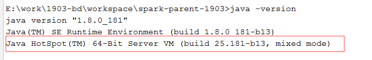
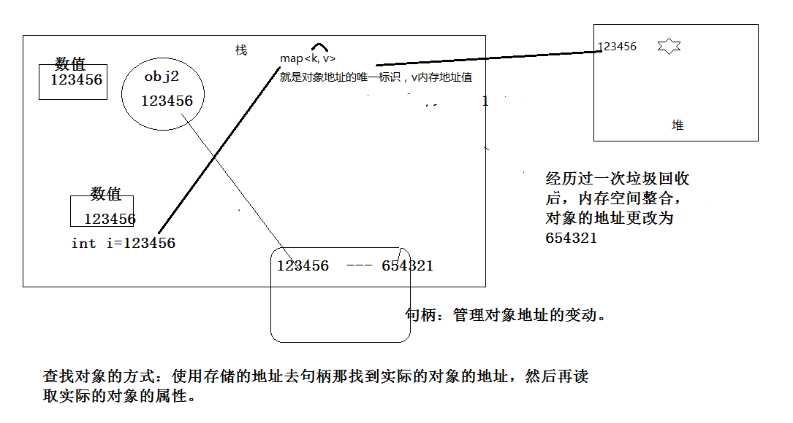

# 0.大纲

- jvm发展史

- jvm运行时内存区域

- jvm gc的基本原理和常见垃圾收集器

- jvm内存分配问题

- 常见的jvm分析工具

# 1. JVM的发展史

## 1.1 jvm简介

​		所谓jvm就是Java Virtual Machine（java虚拟机），是java程序运行的载体。一个java进程就是一个jvm，或者一个jvm代表了一个java的进程。

- 平台无关性

    平台无关性，指的是说，在一个操作系统编译之后的虚拟机码，可以在其他操作系统上（对程序员而言）不需要进行转换便可以直接进行运行，而这背后的工作都是由于jvm的平台无关性实现的，windows有windows的jvm，linux有linux的jvm，mac有mac的版本。

- jvm简介

    虚拟机：通过软件来模拟出来的具有完整的硬件系统功能的、运行在完全隔离的环境中的完整的计算机系统。例如：在人工的草原养殖场模拟真实的草原环境，你们家里的小池塘模拟真实的海洋环境。JVM世界观：java对象在jvm里的生老病死。

    JVM一样也是通过在实际的计算机中软件虚构出来的，用来模拟一套完整的运行平台。
    Java的一次编写处处运行：是指在一段代码可以在不同的平台运行，这就归功于JVM。
    作为java编译器和os之间的虚拟解释器，JVM根据不同的os，将java编译后的目标代码（字节码）解释成不同os可以运行的机器指令，所以说：有了JVM之后呢，java语言在不同平台上运行时不需要重新编译。一次编写，处处运行！

- 代码的执行方式

    1. 解释执行

        静态语言（java、c）

        ​		源代码----->编译（机器码(一堆0和1)）----->解释（执行）

        动态语言(js,html,css)

        ​		源代码---解释执行

    2. 编译执行

        ​	源代码----->编译（虚拟机码）----->解释（机器码）--->执行

## 1.2. JVM的发展史

### 1.2.0. 如何查看jdk自带的jvm

### 1.2.1. Classic VM

​		世界上第一款商用Java虚拟机
​		1996年1月23日，Sun公司发布JDK 1.0，Java语言首次拥有了商用的正式运行环境，这个JDK中所带的虚拟机就是Classic VM。不过只能使用纯解释器方式来执行Java代码，如果要使用JIT编译器(JIT Compiler(Just-in-time Compiler) 即时编译器)，就要使用第三方外挂，一旦使用了JIT编译器，JIT编译器就完全接管了虚拟机的执行系统，解释器便不再工作了。
 		Classic VM (build JDK-1.2.2-001, green threads, sunwjit) 
​		如果使用即时编译器就不得不对每一个方法、每一行代码都进行编译，而无论它们执行的频率是否具有编译的价值。基于程序响应时间的压力，这些编译器根本不敢应用编译耗时稍高的优化技术。有的时候一些代码的编译时间比执行时间还要长。
​	因此这个阶段的虚拟机即使使用了编译器，执行效率也和传统的C/C++程序有很大差距，“Java语言很慢”的形象就是在这时候开始在用户心中树立起来的。

### 1.2.2. Exact  VM

JDK 1.2时，曾在Solaris平台上发布过一款名为Exact VM的虚拟机，它的执行系统已经具备现代高性能虚拟机的雏形：如支持编译器与解释器混合工作模式。

Exact VM因它使用准确式内存管理（Exact Memory Management，也可以叫Non-Conservative/Accurate Memory Management）而得名。

虚拟机可以知道内存中某个位置的数据具体是什么类型。譬如内存中有一个32位的整数123456，它到底是一个reference类型指向123456的内存地址还是一个数值为123456的整数，虚拟机将有能力分辨出来，这样才能在GC（垃圾收集）的时候准确判断堆上的数据是否还可能被使用。

由于使用了准确式内存管理，Exact VM可以抛弃以前Classic VM基于handle的对象查找方式每次定位对象都少了一次间接查找的开销，提升执行性能。

基于handle(句柄)的对象查找：当123456指向的对象经过一次垃圾回收后，内存地址需要重新规整。内存地址发生了变化为654321，不能将内存中所有的值为123456数据都改为654321。使用句柄来管理对象内存地址的变动，所以定位对象时先去句柄查下实际的地址再去查找对象本身的属性。类似于对象的户口变更登记册。
句柄可以理解为：引用的引用。指针的指针。

###  1.2.3. HotSpot VM

​		hotspot vm  是Sun JDK和OpenJDK中所带的虚拟机，也是目前使用范围最广的Java虚拟机
​		最初并非由Sun公司开发，而是由一家名为“Longview Technologies”的小公司设计的；Sun公司注意到了这款虚拟机在JIT编译上有许多优秀的理念和实际效果，在1997年收购了Longview Technologies公司，从而获得了HotSpot VM。
​		oracle收购了SUN，获得了HotSpot VM。
​		HotSpot VM既继承了Sun之前两款商用虚拟机的优点（如前面提到的准确式内存管理），也有许多自己新的技术优势，如它名称中的HotSpot指的就是它的热点代码探测技术。

​		01、可以通过执行计数器找出最具有编译价值的代码，
​	根据执行计数器判断是否达到阈值，没到就解释执行，否则提交编译请求，通知JIT编译器以方法为单位进行编译。
​		所以：如果一个方法被频繁调用，或方法中有效循环次数很多，将会分别触发标准编译和OSR（栈上替换）编译动作。
​	OSR：由于代码块可能是在解释执行过程中直接切换到本地代码执行，所以也叫做栈上替换（OSR，OnStackReplacement）
​	02、通过编译器与解释器恰当地协同工作，可以在最优化的程序响应时间与最佳执行性能中取得平衡，即时编译的时间压力也相对减小，这样有助于引入更多的代码优化技术，输出质量更高的本地代码[机器执行码]。

