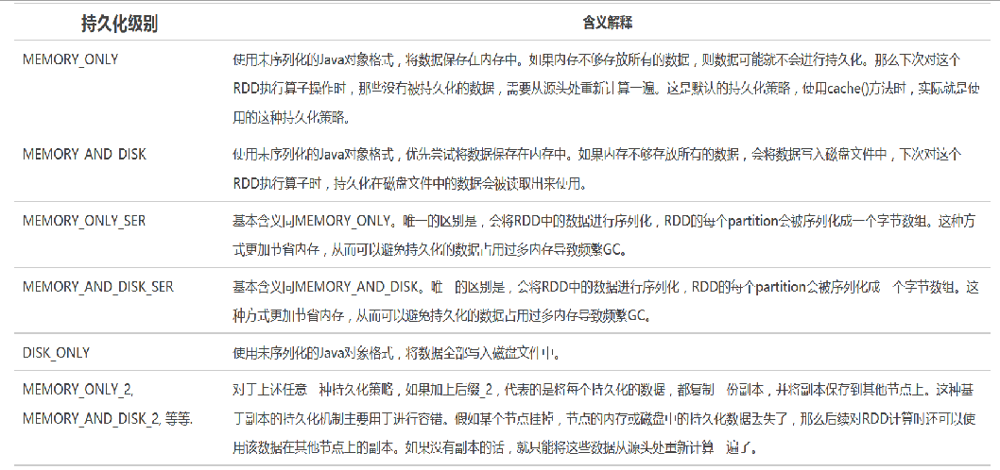
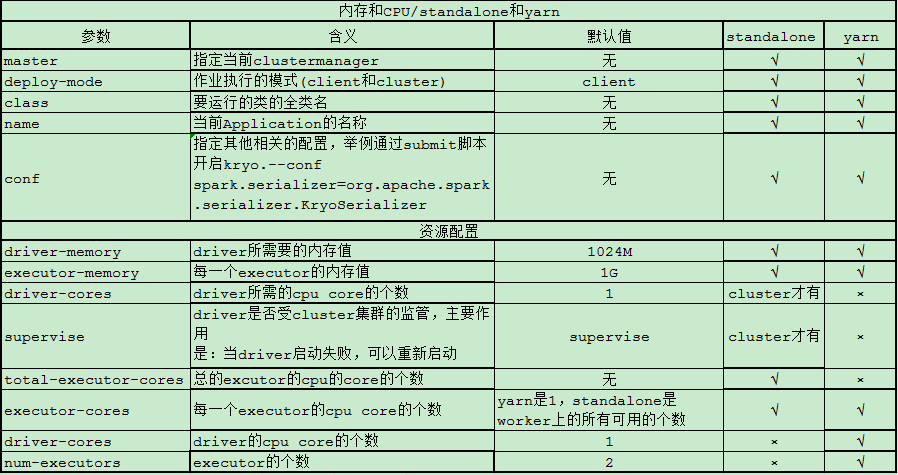
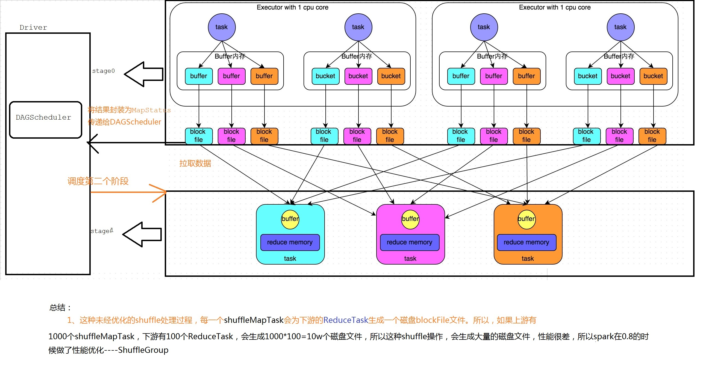
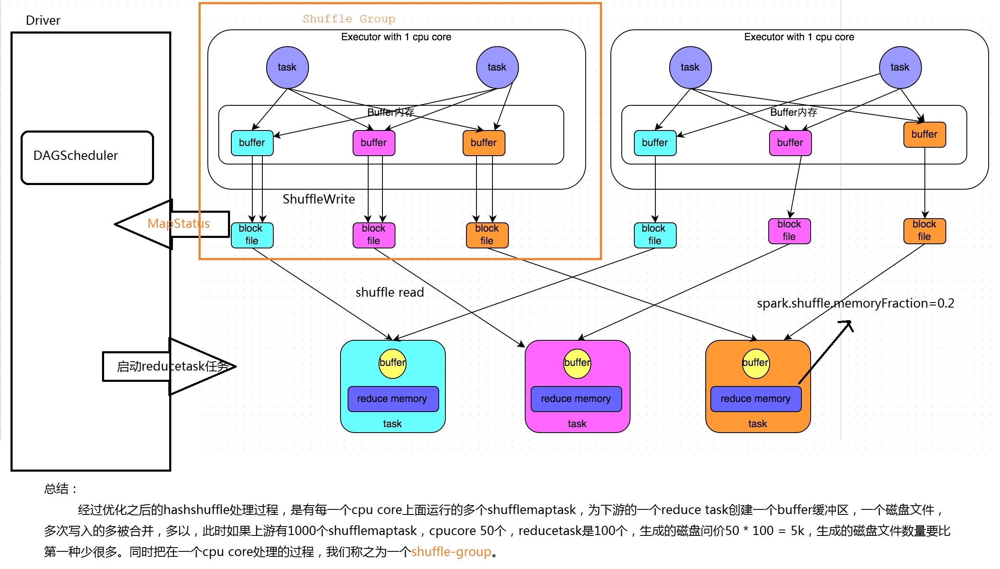
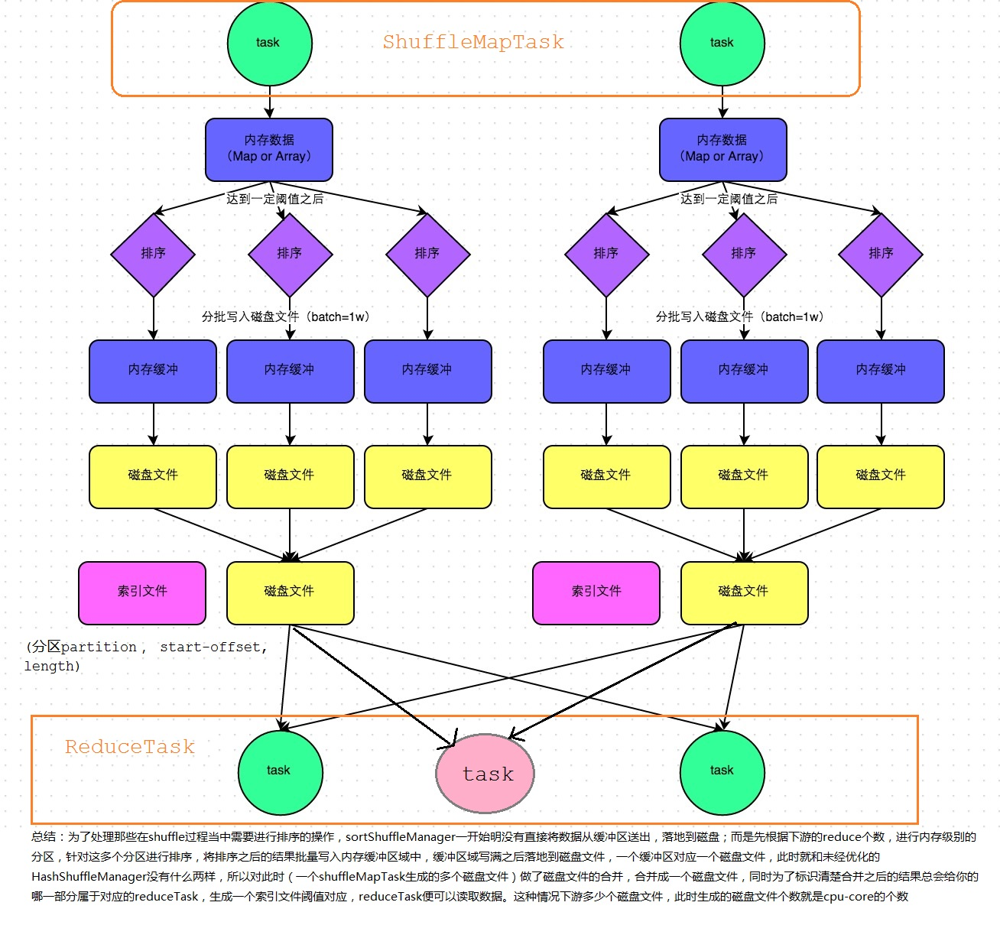
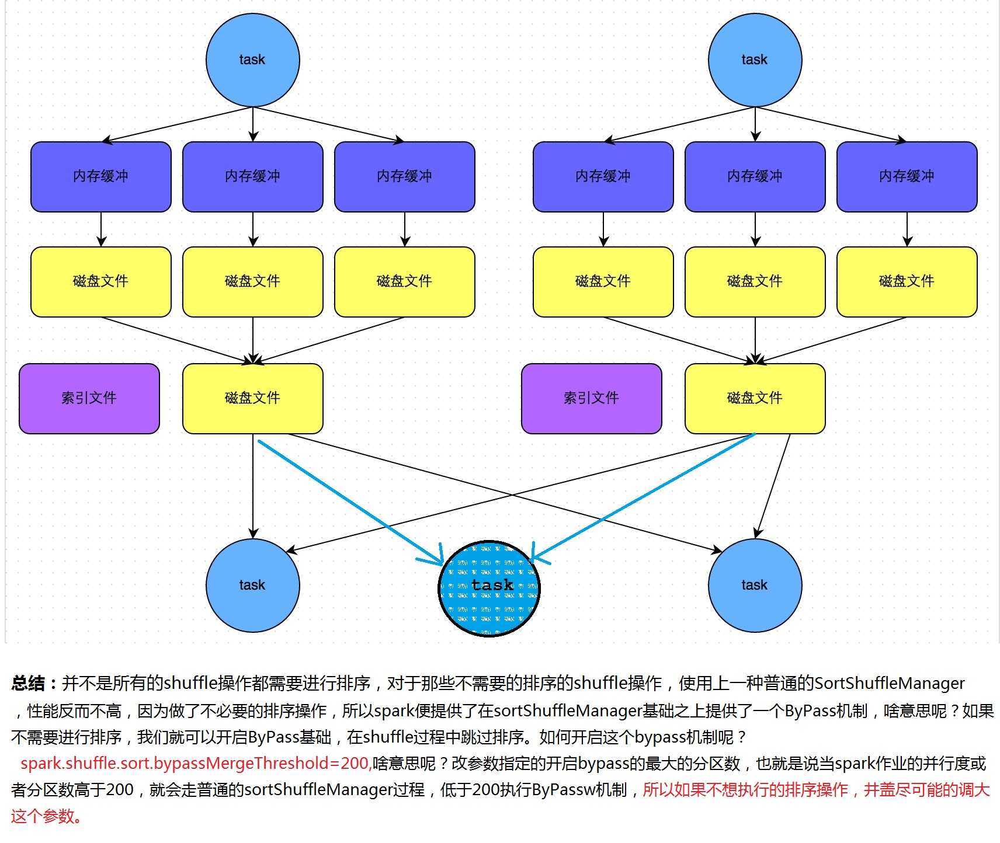
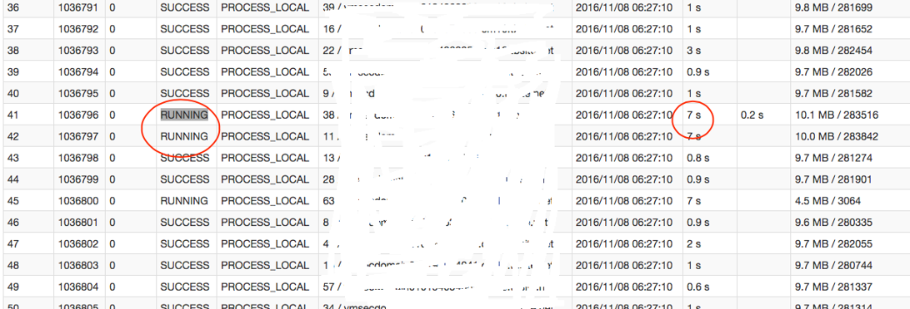
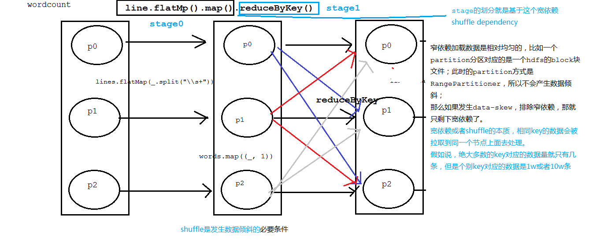
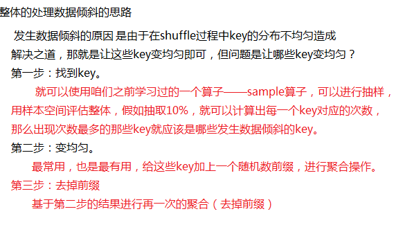
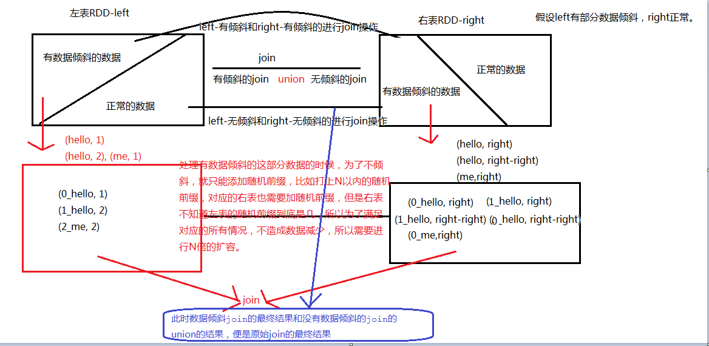

# 0.性能调优大纲

- 调优简介

- 开发调优

- 资源调优

- 数据倾斜调优

- shuffle调优

- jvm调优

# 1. 调优简介

​		

​		为啥要做调优，上图已经告诉我们答案了~

# 2. 开发调优

​		开发出高质量的代码，从如下几个角度去说明，当然避免使用一些性能比较低的算子，使用一些占用空间比较小的数据结构，使用一些占用体积比较小的序列化的方式等等。

## 2.1. 避免创建重复的RDD

## 2.2. 尽可能复用同一个RDD
## 2.3. 对多次使用的RDD进行持久化
​		前三个方案其实说的都是一回事，避免创建重复的RDD，说白了就是多次使用数据具有相似、雷同、包含的关系；所以要进行多次操作的时候，只能复用同一个RDD；但是一个RDD进行转换之后，数据自然会释放，所以要想高性能的执行计算，就应该对这个重复使用的RDD进行持久化。

### 2.3.1. 持久化策略



### 2.3.2. 如何选择一款合适的持久化策略

1. 默认情况下，性能最高的当然是MEMORY_ONLY，但前提是你的内存必须足够足够大，可以绰绰有余地存放下整个RDD的所有数据。因为不进行序列化与反序列化操作，就避免了这部分的性能开销；对这个RDD的后续算子操作，都是基于纯内存中的数据的操作，不需要从磁盘文件中读取数据，性能也很高；而且不需要复制一份数据副本，并远程传送到其他节点上。但是这里必须要注意的是，在实际的生产环境中，恐怕能够直接用这种策略的场景还是有限的，如果RDD中数据比较多时（比如几十亿），直接用这种持久化级别，会导致JVM的OOM内存溢出异常。

2. 如果使用MEMORY_ONLY级别时发生了内存溢出，那么建议尝试使用MEMORY_ONLY_SER级别。该级别会将RDD数据序列化后再保存在内存中，此时每个partition仅仅是一个字节数组而已，大大减少了对象数量，并降低了内存占用。这种级别比MEMORY_ONLY多出来的性能开销，主要就是序列化与反序列化的开销。但是后续算子可以基于纯内存进行操作，因此性能总体还是比较高的。此外，可能发生的问题同上，如果RDD中的数据量过多的话，还是可能会导致OOM内存溢出的异常。

3. 如果纯内存的级别都无法使用，那么建议使用MEMORY_AND_DISK_SER策略，而不是MEMORY_AND_DISK策略。因为既然到了这一步，就说明RDD的数据量很大，内存无法完全放下。序列化后的数据比较少，可以节省内存和磁盘的空间开销。同时该策略会优先尽量尝试将数据缓存在内存中，内存缓存不下才会写入磁盘。

4. 通常不建议使用DISK_ONLY和后缀为_2的级别：因为完全基于磁盘文件进行数据的读写，会导致性能急剧降低，有时还不如重新计算一次所有RDD。后缀为_2的级别，必须将所有数据都复制一份副本，并发送到其他节点上，数据复制以及网络传输会导致较大的性能开销，除非是要求作业的高可用性，否则不建议使用。

### 2.3.3. RDD大小估算

​		一般情况下，加载外部数据集的时候，RDD的partition到底有多少个，到底每一个partition的大小是多少？

​		一般的思路，RDD中的partition的个数，一般和hdfs中文件block块的个数一一对应；在local模式下可不是这样，partition的个数，取决于我们制定master的参数local[N]中N。

## 2.4. 尽量避免使用shuffle类算子

### 2.4.1. 概述

1. 如果有可能的话，要尽量避免使用shuffle类算子。因为Spark作业运行过程中，最消耗性能的地方就是shuffle过程。shuffle过程，简单来说，就是将分布在集群中多个节点上的同一个key，拉取到同一个节点上，进行聚合或join等操作。比如reduceByKey、join等算子，都会触发shuffle操作。

2. shuffle过程中，各个节点上的相同key都会先写入本地磁盘文件中，然后其他节点需要通过网络传输拉取各个节点上的磁盘文件中的相同key。而且相同key都拉取到同一个节点进行聚合操作时，还有可能会因为一个节点上处理的key过多，导致内存不够存放，进而溢写到磁盘文件中。因此在shuffle过程中，可能会发生大量的磁盘文件读写的IO操作，以及数据的网络传输操作。磁盘IO和网络数据传输也是shuffle性能较差的主要原因。
   
3. 因此在我们的开发过程中，能避免则尽可能避免使用reduceByKey、join、distinct、repartition等会进行shuffle的算子，尽量使用map类的非shuffle算子。这样的话，没有shuffle操作或者仅有较少shuffle操作的Spark作业，可以大大减少性能开销。

### 2.4.2. 举例说明

​    	通过一个非常经典的案例使用map的操作来代替shuffle操作。使用map+广播变量代替join操作。

- 共用的数据

```scala
case class Province(pid:Int, province:String, capital:String)
case class Student(sid:Int, name:String, gid:Int, pid:Int)
case class Gender(gid:Int, gender: String)
```

- 使用join操作

```scala
/*
        使用map类算子，代替shuffle的操作(join)
     */
def joinOps(sc:SparkContext): Unit = {

    val provinces = List(
        "62 甘肃 兰州",
        "41 河南 郑州",
        "61 陕西 西安",
        "34 安徽 合肥"
    )

    val stus = List(
        "101 张顺 0 41",
        "102 汪子翔 1 61",
        "103 秦剑兵 2 41",
        "104 old李 0 62",
        "105 lucy 0 -1"
    )
    val genders = List(
        "0 female",
        "1 male",
        "2 ladyboy"
    )

    //使用join类的操作完成学生信息管理
    val pid2Province:RDD[(Int, Province)] = sc.parallelize(provinces).map(line => {
        val fields = line.split("\\s+")
        val pid = fields(0).toInt
        val province = fields(1)
        val capital = fields(2)
        (pid, Province(pid, province, capital))
    })

    val stuRDD:RDD[Student] = sc.parallelize(stus).map(line => {
        val fields = line.split("\\s+")
        val sid = fields(0).toInt
        val name = fields(1)
        val gid = fields(2).toInt
        val pid = fields(3).toInt
        Student(sid, name, gid, pid)
    })

    val gid2Gender:RDD[(Int, Gender)] = sc.parallelize(genders).map(line => {
        val fields = line.split("\\s+")
        val gid = fields(0).toInt
        val gender = fields(1)
        (gid, Gender(gid, gender))
    })
    /*
            select
                s.*,p.*,g.*
            from student s
            left join province p on s.pid = p.pid
            left join gender g on s.gid = g.gid
         */
    //先完成student和province的join操作
    val stuJoinProvince:RDD[(Int, (Student, Option[Province]))] = stuRDD.map(stu => (stu.pid, stu)).leftOuterJoin(pid2Province)

    val gid2StuInfo:RDD[(Int, (Student, Province))] = stuJoinProvince.map{case (pid, (stu, provinceOption)) => {
        val gid = stu.gid
        (gid, (stu, provinceOption.getOrElse(Province(-1, "Null", "Null"))))
    }}
    //student和gender进行join操作
    val gidJoinInfo:RDD[(Int, ((Student, Province), Gender))] = gid2StuInfo.join(gid2Gender)

    gidJoinInfo.foreach{case (gid, ((stu, province), gender)) => {
        println(s"sid=${stu.sid}\tname=${stu.name}\tgender=${gender.gender}\tprovince=${province.province}\tcapital=${province.capital}")
    }}

}
```

- map类算子+广播的优化

```scala
//使用map类的算子+广播变量来完成join操作(map join)
def  joinOptimzation(sc:SparkContext): Unit = {
    val provinces = List(
        "62 甘肃 兰州",
        "41 河南 郑州",
        "61 陕西 西安",
        "34 安徽 合肥"
    )
    val genders = List(
        "0 female",
        "1 male",
        "2 ladyboy"
    )
    val pMap = provinces.map(line => {
        val fields = line.split("\\s+")
        val pid = fields(0).toInt
        val province = fields(1)
        val capital = fields(2)
        (pid, Province(pid, province, capital))
    }).toMap

    val gMap = genders.map(line => {
        val fields = line.split("\\s+")
        val gid = fields(0).toInt
        val gender = fields(1)
        (gid, Gender(gid, gender))
    }).toMap
    //声明广播变量
    val pBC:Broadcast[Map[Int, Province]] = sc.broadcast(pMap)
    val gBC:Broadcast[Map[Int, Gender]] = sc.broadcast(gMap)

    val stus = List(
        "101 张顺 0 41",
        "102 汪子翔 1 61",
        "103 秦剑兵 2 41",
        "104 old李 0 62",
        "105 lucy 0 -1"
    )

    val stuRDD:RDD[Student] = sc.parallelize(stus).map(line => {
        val fields = line.split("\\s+")
        val sid = fields(0).toInt
        val name = fields(1)
        val gid = fields(2).toInt
        val pid = fields(3).toInt
        Student(sid, name, gid, pid)
    })

    stuRDD.map(stu => {
        val province = pBC.value.getOrElse(stu.pid, Province(-1, "Null", "Null")).province
        val gender = gBC.value(stu.gid).gender
        s"sid=${stu.sid}\tname=${stu.name}\tgender=${gender}\tprovince=${province}"
    }).foreach(println)
}
```

## 2.5. 使用map-side预聚合的shuffle操作

​		   如果因为业务需要，一定要使用shuffle操作，无法用map类的算子来替代，那么尽量使用可以map-side预聚合的算子。
   	所谓的map-side预聚合，说的是在每个节点本地对相同的key进行一次聚合操作，类似于MapReduce中的本地combiner。map-side预聚合之后，每个节点本地就只会有一条相同的key，因为多条相同的key都被聚合起来了。其他节点在拉取所有节点上的相同key时，就会大大减少需要拉取的数据数量，从而也就减少了磁盘IO以及网络传输开销。通常来说，在可能的情况下，建议使用reduceByKey或者aggregateByKey算子来替代掉groupByKey算子。因为reduceByKey和aggregateByKey算子都会使用用户自定义的函数对每个节点本地的相同key进行预聚合。而groupByKey算子是不会进行预聚合的，全量的数据会在集群的各个节点之间分发和传输，性能相对来说比较差。

​	具体案例参见之前combineByKey和aggregateBykey模拟groupByKey或者分组topN的优化版本。

## 2.6. 使用高性能的算子

### 2.6.1. 使用mapPartitions代替map操作

- talk is cheap

    ​		map(func)的操作就是对rdd中的每一条记录应用一次func函数，mapPartitions(func)是对每一个分区的所有的数据应用一次func函数；换句话说，map一次处理一条记录，mapPartitions一次处理一个分区的数据。有点批量处理的感觉。

- show me code

    ```scala
    /*
            数据的分区，
                对于输入的数据，也就是说普通集合转化为rdd的分区过程，采用RangePartitioner
                在shuffle过程中采用的分区方式是HashPartitioner
         */
    def mapPartitionsOps(sc: SparkContext) = {
        val list = 1 to 10
        val listRDD = sc.parallelize(list)
        //        listRDD.map(_ * 7)
        listRDD.mapPartitions((partition:Iterator[Int]) => {
            println("----------start------------")
            println(partition.mkString("[", ",", "]"))
            println("----------end------------")
            partition.map(_ * 7)
        }).count()
    }
    ```

### 2.6.2. 使用foreachPartition代替foreach

上代码

- foreach完成统计结果入库

1. 有序列化问题的代码

```scala
/*
        将spark统计的结果写入到mysql
        create table wordcount(word varchar(20), `count` int);

        有异常：
            Caused by: java.io.NotSerializableException: com.mysql.jdbc.JDBC42PreparedStatement
            Serialization stack:
     */
def foreach2MySQL(ret:RDD[(String, Int)]): Unit = {
    //加载驱动
    //        Class.forName("com.mysql.jdbc.Driver")
    classOf[Driver]
    //构建连接
    val url = "jdbc:mysql://localhost:3306/test"
    val username = "bigdata"
    val password = "sorry"
    val connection = DriverManager.getConnection(url, username, password)
    val sql =
    """
              |insert into wordcount (word, `count`) values(?, ?)
            """.stripMargin
    //获取执行器
    val ps = connection.prepareStatement(sql)
    ret.foreach{case (word, count) => {
        ps.setString(1, word)
        ps.setInt(2, count)
        //执行sql
        ps.execute()
    }}
    //处理结果集
    //释放资源
    ps.close()
    connection.close()
}
```

2. 修正的结果

```scala
//解决序列化的问题
def foreach2MySQL2(ret:RDD[(String, Int)]): Unit = {
    ret.foreach{case (word, count) => {
        classOf[Driver]
        val url = "jdbc:mysql://localhost:3306/test"
        val username = "bigdata"
        val password = "sorry"
        val connection = DriverManager.getConnection(url, username, password)
        val sql =
        """
                  |insert into wordcount (word, `count`) values(?, ?)
                """.stripMargin
        val ps = connection.prepareStatement(sql)
        ps.setString(1, word)
        ps.setInt(2, count)
        ps.execute()
        ps.close()
        connection.close()
    }}

}
```

- foreachPartition代替foreach

```scala
//使用foreachPartition代替foreach
def foreachPartition2MySQL(ret:RDD[(String, Int)]) {
    ret.foreachPartition(partition => {
        classOf[Driver]
        val url = "jdbc:mysql://localhost:3306/test"
        val username = "bigdata"
        val password = "sorry"
        val connection = DriverManager.getConnection(url, username, password)
        val sql =
        """
                  |insert into wordcount (word, `count`) values(?, ?)
                """.stripMargin
        val ps = connection.prepareStatement(sql)
        partition.foreach{case (word, count) => {
            ps.setString(1, word)
            ps.setInt(2, count)
            ps.addBatch()//加入批量队列
        }}
        ps.executeBatch()//批量操作（提交）
        ps.close()
        connection.close()
    })
}
```

- foreachPartition代替foreach升级版本---数据库连接池

```java
/**
 * 自定义数据库连接池
 */
public class ConnectionPool {

    private ConnectionPool(){}

    private static LinkedList<Connection> pool = new LinkedList<Connection>();
    private static int poolSize = 10;
    static {//静态代码块
        try {
            InputStream in = ConnectionPool.class.getClassLoader().getResourceAsStream("jdbc.properties");
            Properties properties = new Properties();
            properties.load(in);
            Class.forName(properties.getProperty(Constants.JDBC_DRIVER_CLASS_NAME));
            for (int i = 0; i < poolSize; i++) {
                pool.push(DriverManager.getConnection(
                        properties.getProperty(Constants.JDBC_URL),
                        properties.getProperty(Constants.JDBC_USERNAME),
                        properties.getProperty(Constants.JDBC_PASSWORD)
                ));
            }
        } catch (Exception e) {
            throw new ExceptionInInitializerError(e);
        }
    }

    //获取连接
    public static Connection getConnection() {
        while(pool.isEmpty()) {
            CommonUtil.sleep(1000);
        }
        return pool.poll();
    }

    //释放连接
    public static void release(Connection connection) {
        pool.push(connection);
    }
}
```

配置文件

```properties
jdbc.driverClassName=com.mysql.jdbc.Driver
jdbc.url=jdbc:mysql://localhost:3306/test
jdbc.username=bigdata
jdbc.password=sorry
```

常量类

```java
public interface Constants {

    String JDBC_DRIVER_CLASS_NAME = "jdbc.driverClassName";

    String JDBC_URL = "jdbc.url";
    String JDBC_USERNAME = "jdbc.username";
    String JDBC_PASSWORD = "jdbc.password";
}

```

使用数据库连接池的操作

```scala
def foreachPartitionByPool2MySQL(ret:RDD[(String, Int)]): Unit = {
    ret.foreachPartition(partition => {
        val connection = ConnectionPool.getConnection
        val sql =
        """
                  |insert into wordcount (word, `count`) values(?, ?)
                """.stripMargin
        val ps = connection.prepareStatement(sql)

        partition.foreach{case (word, count) => {
            ps.setString(1, word)
            ps.setInt(2, count)
            ps.addBatch()//加入批量队列
        }}
        ps.executeBatch()//批量操作（提交）
        ps.close()
        ConnectionPool.release(connection)
    })
}
```

### 2.6.3. 在filter之后进行重分区

- 概述

       通常对一个RDD执行filter算子过滤掉RDD中较多数据后（比如30%以上的数据），建议使用coalesce算子，手动减少RDD的partition数量，将RDD中的数据压缩到更少的partition中去。因为filter之后，RDD的每个partition中都会有很多数据被过滤掉，此时如果照常进行后续的计算，其实每个task处理的partition中的数据量并不是很多，有一点资源浪费，而且此时处理的task越多，可能速度反而越慢。因此用coalesce减少partition数量，将RDD中的数据压缩到更少的partition之后，只要使用更少的task即可处理完所有的partition。在某些场景下，对于性能的提升会有一定的帮助。

- 代码

```scala
val listRDD = sc.parallelize(1 to 10000)
println("partition nums: " + listRDD.getNumPartitions)
//过滤掉偶数
val filteredRDD = listRDD.filter(_ % 2 != 0)
//重分区 repartition
/*
            coalesce 默认是一个窄依赖Narrow Dependency
                只能进行分区减少的操作，如果分区后的分区个数超过原来的，为了保证该算子是一个
            窄依赖，那么仍然会保持原有的分区个数
            如果要想进行增大分区，需要传入第二个参数shuffle=true 相当于repartition
         */
val coalesceRDD = filteredRDD.coalesce(8, true)//将原先的4个分区，减少到2个
println("coalesceRDD's partition num: " + coalesceRDD.getNumPartitions)

println("repartitions' partition num: " + coalesceRDD.repartition(16).getNumPartitions)
```

## 2.7. 广播大变量

​		神马时候不建议使用广播变量：

​		1、数据体积比较大，也就是广播大变量

​		2、频繁更新的不适合做广播变量

## 2.8. 使用Kryo优化序列化性能

### 2.8.1. 什么是序列化

1、在任何一个分布式系统中，序列化都是扮演着一个重要的角色的。如果使用的序列化技术，在执行序列化操作的时候很慢，或者是序列化后的数据还是很大，那么会让分布式应用程序的性能下降很多。所以，进行Spark性能优化的第一步，就是进行序列化的性能优化。

2、Spark自身默认就会在一些地方对数据进行序列化，比如Shuffle。还有就是，如果我们的算子函数使用到了外部的数据（比如Java内置类型，或者自定义类型），那么也需要让其可序列化。

3、而Spark自身对于序列化的便捷性和性能进行了一个取舍和权衡。默认，Spark倾向于序列化的便捷性，使用了Java自身提供的序列化机制——基于ObjectInputStream和ObjectOutputStream的序列化机制。因为这种方式是Java原生提供的，很方便使用。

4、但是问题是，Java序列化机制的性能并不高。序列化的速度相对较慢，而且序列化以后的数据，还是相对来说比较大，还是比较占用内存空间。因此，如果你的Spark应用程序对内存很敏感，那么，实际上默认的Java序列化机制并不是最好的选择。

5、我们有时候会根据我的应用场景来进行取舍，稳定性 OR 性能？

### 2.8.2. Spark的两种序列化机制

   1、Java序列化机制：默认情况下，Spark使用Java自身的ObjectInputStream和ObjectOutputStream机制进行对象的序列化。只要你的类实现了Serializable接口，那么都是可以序列化的。而且Java序列化机制是提供了自定义序列化支持的，只要你实现Externalizable接口即可实现自己的更高性能的序列化算法。Java序列化机制的速度比较慢，而且序列化后的数据占用的内存空间比较大。
   2、Kryo序列化机制：Spark也支持使用Kryo类库来进行序列化。Kryo序列化机制比Java序列化机制更快，而且序列化后的数据占用的空间更小，通常比Java序列化的数据占用的空间要小10倍。Kryo序列化机制之所以不是默认序列化机制的原因是，有些类型虽然实现了Seriralizable接口，但是它也不一定能够进行序列化；此外，如果你要得到最佳的性能，Kryo还要求你在Spark应用程序中，对所有你需要序列化的类型都进行注册。

### 2.8.3. Spark涉及序列化的三个地方

1、在算子函数中使用到外部变量时，该变量会被序列化后进行网络传输（见“优化方案七：广播大变量”这个的时候已经解决过，使用BroadCast进行广播，肯定要使用序列化的机制传输！！！！）。

2、将自定义的类型作为RDD的泛型类型时（比如JavaRDD，Student是自定义类型），所有自定义类型对象，都会进行序列化。因此这种情况下，也要求自定义的类必须实现Serializable接口。
如果说你实现了一个自定义的这种类型，那么必须注册让kryo知道，你要进行此类的一个序列化类

3、使用可序列化的持久化策略时（比如MEMORY_ONLY_SER），Spark会将RDD中的每个partition都序列化成一个大的字节数组。

   对于这三种出现序列化的地方，我们都可以通过使用Kryo序列化类库，来优化序列化和反序列化的性能。Spark默认使用的是Java的序列化机制，也就是ObjectOutputStream/ObjectInputStream API来进行序列化和反序列化。但是Spark同时支持使用Kryo序列化库，Kryo序列化类库的性能比Java序列化类库的性能要高很多。官方介绍，Kryo序列化机制比Java序列化机制，性能高10倍左右。Spark之所以默认没有使用Kryo作为序列化类库，是因为Kryo要求最好要注册所有需要进行序列化的自定义类型，因此对于开发者来说，这种方式比较麻烦。

### 2.8.4. 如何开启kryo序列化

 以下是使用Kryo的代码示例，我们只要设置序列化类，再注册要序列化的自定义类型即可（比如算子函数中使用到的外部变量类型、作为RDD泛型类型的自定义类型等）：

 // 创建SparkConf对象。  
    val conf = new SparkConf().setMaster(“localhost”).setAppName(“validattionKryoPerformanceTest”)  
    // 设置序列化器为KryoSerializer。  
    conf.set("spark.serializer", "org.apache.spark.serializer.KryoSerializer")  

​    这个参数我们也可以动态的在我们的spark-submit提交我们的任务时，动态指定这个参数
​    --conf spark.serializer= org.apache.spark.serializer.KryoSerializer


​    // 注册要序列化的自定义类型。  
​    conf.registerKryoClasses(Array(classOf[MyStudent], classOf[MyClass]))   
​    
​    所以你需要进行自定义类库的一个注册

### 2.8.5. 代码实现

```scala
object _05KryoSerializationOps {
    def main(args: Array[String]): Unit = {
        val conf = new SparkConf()
            .setAppName("07SecondSortOps")
            .setMaster("local[*]")
            
            .set("spark.serializer", classOf[KryoSerializer].getName)
            .registerKryoClasses(Array(classOf[Person]))

        val sc = new SparkContext(conf)
        val list = List[Person](
            new Person("zhangwenyue", 18),
            new Person("qizhaoyang", 17),
            new Person("xueyudong", 18),
            new Person("changbaopeng", 28),
            new Person("zhanghaibo", 22)
        )
        val personRDD:RDD[Person] = sc.parallelize(list)

//        //sortByKey 先年龄，后姓名
        personRDD.sortBy(p => p, true, 1)(
            new Ordering[Person](){
                override def compare(x: Person, y: Person) = {
                    var ret = y.age.compareTo(x.age)
                    if(ret == 0) {
                        ret = x.name.compareTo(y.name)
                    }
                    ret
                }
            },
            ClassTag.Object.asInstanceOf[ClassTag[Person]]
        ).foreach(println)

        //如果要使用sortByKey进行二次排序的话，就需要将所有的排序字段都放在key上面
        sc.stop()
    }
}

//case class Person(name:String, age:Int) //默认会提供序列化的操作
//Serialization stack:
class Person  {
    var name:String = _
    var age:Int = _
    def this(name:String, age:Int) {
        this()
        this.name = name
        this.age = age
    }

    override def toString: String = this.name + "\t" + this.age
}
```

## 2.9. 优化数据结构

略

## 2.10. 提高并行度

​		什么是并行度？

​		就是说同时又多少个线程来运行task作业，运行一个task自然需要一个线程。所以有时候我们也可以粗略的将并行度理解为同时能够运行的线程个数。

1、在我们提交我们的Spark程序时，Spark集群的资源并不一定会被充分使用，所以要设置合适的并行度，来充分利用我们集群的资源。

比如，Spark在读取HDFS文件时，默认情况下会根据每个block创建一个partition，也依据这个设置并行度。

2、我们有2种方式设置我们的并行度
1）手动使用textFile()、parallelize()等方法的第二个参数来设置并行度；
2）在sparkConf 或者Spark-submit中指定使用spark.default.parallelism参数，来设置统一的并行度。
3）Spark官方的推荐是，给集群中的每个cpu core设置2~3倍个task。
3、比如说，spark-submit设置了executor数量是100个，每个executor要求分配5个core，那么我们的这个application总共会有500个core。此时可以设置new SparkConf().set("spark.default.parallelism", "1200")来设置合理的并行度，从而充分利用资源。

> spark.default.parallelism saprk程序的默认的并行度，也就是说程序当中最多的partition个数，也就是最多的task个数
>
> 默认值：
>
> ​	1、如果是reduceByKey或者join等shuffle操作，对应的并行度就是这些操作的父rdd中最大的分区数
>
> ​    2、如果是textFile或parallelize等输入算子操作，就要根据clustermanager设置来决定。
>
> ​    1)、本地模式就是local[N]中的N
>
> ​    2）、mesos的细粒度模式，就是8
>
> ​    3）、其它情况Math.max(2, executor-num * executor-core)

## 2.11. 数据本地化

### 2.11.1.什么是数据本地性？

​		指的就是数据和计算它的代码之间的距离

​	基于这个距离，数据本地性有以下几个级别：

1、**PROCESS_LOCAL**：数据和计算它的代码在同一个JVM进程中。
2、**NODE_LOCAL**：数据和计算它的代码在一个节点上，但是不在一个进程中，比如在不同的executor进程中，或者是数据在HDFS文件的block中。
3、NO_PREF：数据从哪里过来，性能都是一样的。
4、**RACK_LOCAL**：数据和计算它的代码在一个机架上。
5、**ANY**：数据可能在任意地方，比如其他网络环境内，或者其他机架上。

### 2.11.2.数据本地性的参数配置

Spark倾向于使用最好的本地化级别来调度task，但是这是不可能的。如果没有任何未处理的数据在空闲的executor上，那么Spark就会放低本地化级别。这时有两个选择：第一，等待，直到executor上的cpu释放出来，那么就分配task过去；第二，立即在任意一个executor上启动一个task。
Spark默认会等待一会儿，来期望task要处理的数据所在的节点上的executor空闲出一个cpu，从而将task分配过去。只要超过了时间，那么Spark就会将task分配到其他任意一个空闲的executor上。
可以设置参数，spark.locality系列参数，来调节Spark等待task可以进行数据本地化的时间。
spark.locality.wait（3000毫秒）、
spark.locality.wait.node、
spark.locality.wait.process、
spark.locality.wait.rack。

### 2.11.3.选择何种数据本地性

   Spark中任务的处理需要考虑所涉及的数据的本地性的场合，基本就两种，一是数据的来源是HadoopRDD; 二是RDD的数据来源来自于RDD Cache（即由CacheManager从BlockManager中读取，或者Streaming数据源RDD）。其它情况下，如果不涉及shuffle操作的RDD，不构成划分Stage和Task的基准，不存在判断Locality本地性的问题，而如果是ShuffleRDD，其本地性始终为No Prefer，因此其实也无所谓Locality。

​    在理想的情况下，任务当然是分配在可以从本地读取数据的节点上时（同一个JVM内部或同一台物理机器内部）的运行时性能最佳。但是每个任务的执行速度无法准确估计，所以很难在事先获得全局最优的执行策略，当Spark应用得到一个计算资源的时候，如果没有可以满足最佳本地性需求的任务可以运行时，是退而求其次，运行一个本地性条件稍差一点的任务呢，还是继续等待下一个可用的计算资源已期望它能更好的匹配任务的本地性呢？

​    这几个参数一起决定了Spark任务调度在得到分配任务时，选择暂时不分配任务，而是等待获得满足进程内部/节点内部/机架内部这样的不同层次的本地性资源的最长等待时间。默认都是3000毫秒。

​    **基本上，如果你的任务数量较大和单个任务运行时间比较长的情况下，单个任务是否在数据本地运行，代价区别可能比较显著，如果数据本地性不理想，那么调大这些参数对于性能优化可能会有一定的好处。反之如果等待的代价超过带来的收益，那就不要考虑了。**

# 3. 资源调优

​		所谓资源调优，就是给当前的作业分配足够或者合适的资源，那资源有哪些？内存和cpu core。这些参数在哪里进行设置？spark-submit或者SparkConf中进行设置。



spark.storage.memoryFraction: executor中进行持久化的内存比例，默认为60%

　　参数说明：该参数用于设置RDD持久化数据在Executor内存中能占的比例，默认是0.6。也就是说，默认Executor 60%的内存，可以用来保存持久化的RDD数据。根据你选择的不同的持久化策略，如果内存不够时，可能数据就不会持久化，或者数据会写入磁盘。
　　参数调优建议：如果Spark作业中，有较多的RDD持久化操作，该参数的值可以适当提高一些，保证持久化的数据能够容纳在内存中。避免内存不够缓存所有的数据，导致数据只能写入磁盘中，降低了性能。但是如果Spark作业中的shuffle类操作比较多，而持久化操作比较少，那么这个参数的值适当降低一些比较合适。此外，如果发现作业由于频繁的gc导致运行缓慢（通过spark web ui可以观察到作业的gc耗时），意味着task执行用户代码的内存不够用，那么同样建议调低这个参数的值。

spark.shuffle.memoryFraction: executor中进行shuffle的内存比例，默认为20%

​		是shuffle操作过程中shuffle read读取到的数据进行内存存放的空间比例。

　　参数说明：该参数用于设置shuffle过程中一个task拉取到上个stage的task的输出后，进行聚合操作时能够使用的Executor内存的比例，默认是0.2。也就是说，Executor默认只有20%的内存用来进行该操作。shuffle操作在进行聚合时，如果发现使用的内存超出了这个20%的限制，那么多余的数据就会溢写到磁盘文件中去，此时就会极大地降低性能。
　　参数调优建议：如果Spark作业中的RDD持久化操作较少，shuffle操作较多时，建议降低持久化操作的内存占比，提高shuffle操作的内存占比比例，避免shuffle过程中数据过多时内存不够用，必须溢写到磁盘上，降低了性能。此外，如果发现作业由于频繁的gc导致运行缓慢，意味着task执行用户代码的内存不够用，那么同样建议调低这个参数的值。
提交脚本案例：

```sh
 ./bin/spark-submit \  
      --master yarn \  
      --deploy-mode cluster \
      --num-executors 128 \  
      --executor-memory 27G \  
      --executor-cores 8 \  
      --driver-memory 8G \  
      --conf spark.serializer=org.apache.spark.serializer.KryoSerializer \
      --conf spark.default.parallelism=1600 \  
      --conf spark.storage.memoryFraction=0.5 \  
      --conf spark.shuffle.memoryFraction=0.3 \
```

# 4. shuffle调优

## 4.0. 什么是shuffle？

​		shuffle是分布式计算不可或缺的一个部分，同时是分布式计算性能消耗最大的一个部分，原因就在于发送的数据的网络传输。

​        shuffle是一个过程，如果我们把分布式计算理解为总-分-总，第一个总，是统一加载外部数据，做统一作业的拆分；分，便是处理每一个独立的task任务；第二个总，便是各个独立的task任务运行完毕之后进行的汇总，汇总的数据便是各个独立task任务计算之后的数据，显然是在不同的节点之上往某几个节点汇总，汇总的这个过程便是shuffle。其中shuffle有分为了shuffle-write的过程，和shuffle-read的过程。汇总的过程涉及到数据的重新分布，所有shuffle，顾名思义就是一个数据打乱重排的过程。

## 4.1. 掌握shuffle的执行流程

### 4.1.0. shuffle方式演进

​		spark最早的shuffle处理方式，就是HashShuffleManager，在0.8的版本中出现了优化之后的HashShuffleManager，同时在spark1.2的版本出现的SortShuffleManager成为了默认的shuffle处理方式，膜前的版本就只有一个SortShuffleManager。但是SortShuffleManager，也有普通和排序的SortShuffleManager之分。

​		如何制定shuffle处理方式呢，spark中有一个参数。spark.shuffle.manager=hash|sort(默认)。

### 4.1.1. HashShuffleManager

- 未经优化的HashShuffleManager



- 经过优化的HashShuffleManager



### 4.1.2. SortShuffleManager

- 普通的sortShuffleManager



- 开启ByPass机制的sortShufflerManager

    

## 4.2. 知晓常见的shuffle调优参数


| 参数                                    | 默认值 | 描述                                                         |
| --------------------------------------- | ------ | ------------------------------------------------------------ |
| spark.reducer.maxSizeInFlight           | 48M    | 每一次reduce拉取的数据的最大值，默认值48m，如果网络ok、spark数据很多，为了较少拉取的次数，可以适当的将这个值调大，比如96m。 |
| spark.shuffle.compress                  | true   | shuffle-write输出到磁盘的文件是否开启压缩，默认为true，开启压缩，同时配合spark.io.compression.codec(压缩方式)使用。 |
| spark.shuffle.file.buffer               | 32k    | shuffle过程中，一个磁盘文件对应一个缓存区域，默认大小32k，为了较少写磁盘的次数，可以适当的调大该值，比如48k，64k都是可以。 |
| spark.shuffle.io.maxRetries             | 3      | shuffle过程中为了避免失败，会配置一个shuffle的最大重试次数，默认为3次，如果shuffle的数据比较多，就越容易出现失败，此时可以调大这个值，比如10次。 |
| spark.shuffle.io.retryWait              | 5s     | 两次失败重试之间的间隔时间，默认5s，如果多次失败，显然问题在于网络不稳定，所以我们为了保证程序的稳定性，调大该参数的值，比如30s，60s都是可以。 |
| spark.shuffle.sort.bypassMergeThreshold | 200    | 是否开启byPass机制的阈值。                                   |
| spark.shuffle.memoryFraction            | 0.2    | 在executor中进行reduce拉取到的数据进行reduce聚合操作的内存默认空间大小，默认占executor的20%的内存，如果持久化操作相对较少，shuffle操作较多，就可以调大这个参数，比如0.3。 |

## 4.3. 比较spark的shuffle和mr的shuffle过程（面试作业题）

# 5. 数据倾斜调优

## 5.1. 数据倾斜现象

​		数据倾斜，英文data skew，就是由于数据分布不均匀，造成的数据/任务计算时间有差异，严重的会造成，绝大多数task任务执行很快结束，个儿把task任务执行非常缓慢，如果在mr中接触过的就应该知道，dataskew的现象就是程序长时间停留在99%的阶段，但是不结束。

- 个别task运行很慢

    ​	绝大多数task任务执行很快结束，个儿把task任务执行非常缓慢。一个spark程序，mr的程序也罢，执行时间是有最慢的task所决定的。这也是数据倾斜中最常见的现象。

    

- 突然OOM

    正常运行的作业，突然某一天OOM，分析原因，是由于key的分布不均匀造成的。

## 5.2. 数据倾斜成因



## 5.3. 如何解决数据倾斜

### 5.3.0. 处理数据倾斜的思路



### 5.3.1. 提高shuffle并行度

​		发生数据倾斜之后，最初的尝试就是提高shuffle的并行度，shuffle算子有第二个参数，reduceByKey(func, parillisem)，这种处理方案不能从根本上解决数据倾斜，但是会在一定程度上减轻数据倾斜的压力，因为下游分区数变多，自然每一个分区中的数据，相比较原来就减少了，但是，相同key的数据还是回到一个分区中去，所以如果发生数据倾斜，这种情况下是不可能解决数据倾斜。

​		但是提高shuffle并行度，是解决数据倾斜的第一次尝试！

### 5.3.2. 过滤key

​		在一个能够想到的是，如果把这些发生数据倾斜的key干掉，自然其余的key都是分布均匀的，分布均匀在运行的时候，task运行时间也是相对均匀的，也就不会发生数据倾斜了。

​		但是这中方案没有从根本上解决数据倾斜，同时大多数倾斜下，发生数据倾斜的这部分key还是蛮有用的，不能直接过滤，大家需要和运营、产品、项目等相关人员进行确认之后才可进行过滤。

### 5.3.3. 预处理

​		在spark阶段发生的数据倾斜，是由于数据分布不均匀造成，而spark加载的数据是从外部的介质拉取过来的，要想让spark阶段不发生dataskew，让拉取过来的数据本身就是已经处理完数据倾斜之后结果，自然就不会有数据倾斜了吧。

​		这种方案，从根本上解决了spark阶段的数据倾斜，因为压根儿就没有shuffle操作，只不过是把对应的操作提前到前置阶段，此时spark就知识利用它的一个特点——快，直接加载外部结果给程序调用者来使用。

### 5.3.4. 两阶段聚合

- 分析过程：

​		首先需要清楚，这种阶段方案主要是针对xxxByKey类的算子造成的数据倾斜。两阶段聚合=局部聚合+全局聚合。

​		以(hello, 1),(hello, 1)，(hello, 1)，(hello, 1)

​		局部聚合：给key添加N以内的随机前缀，这里比如加2以内，(0_hello, 1)，(1_hello, 1)，(0_hello, 1)，(1_hello, 1)，此时进行聚合统计，结果就变为了(0_hello, 2)，(1_hello, 2)，这就得到了一个局部的统计结果。

​		全局聚合：在局部聚合的基础之上，将随机的前缀干掉，(hello, 2)，(hello, 2)，再次进行聚合操作，(hello, 4)。

- 代码实现：

```scala
/**
  * 数据倾斜之两阶段聚合
  */
object _01DataskewTwoStageAggrOps {
    def main(args: Array[String]): Unit = {
        val conf = new SparkConf()
                .setAppName(s"${_01DataskewTwoStageAggrOps.getClass.getSimpleName}")
                .setMaster("local[*]")
        val sc = new SparkContext(conf)
        val list = List(
            "zhang zhang wen wen wen wen yue yue",
            "gong yi can can can can can can can can can can",
            "chang bao peng can can can can can can"
        )

        val listRDD = sc.parallelize(list)
        val words = listRDD.flatMap(_.split("\\s+"))
        val pairs = words.map((_, 1))
        //找到数据倾斜的key
        val sampledRDD = pairs.sample(true, 0.8)
        println("抽取的数据：" + sampledRDD.collect().mkString("[", ", ", "]"))
        val sortedList:List[(String, Long)] = sampledRDD.countByKey().toList.sortWith((kv1, kv2) => kv1._2 > kv2._2)
        println("排序之后的结果：" + sortedList.mkString("[", ", ", "]"))
        //获取发生数据倾斜的key
        val dataSkewKey = sortedList.head._1
        println("发生数据倾斜的key：" + dataSkewKey)
        //对发生数据倾斜的key添加随机前缀
//        pairs.map{t => t match {
//            case (word, count) => {
//
//            }
//        }}}
        val prefixPairs = pairs.map{case (word, count) => {
            if(word == dataSkewKey) {
                val random  = new Random()
                val prefix = random.nextInt(2)
                (s"${prefix}_${word}", count)
            } else {
                (word, count)
            }
        }}

        //局部聚合
        val partAggr = prefixPairs.reduceByKey(_+_)
        println("局部聚合之后的结果：\n" + partAggr.collect().mkString("\n"))
        //去掉前缀，进行全局聚合
        val fullAggr = partAggr.map{case (word, count) => {
            if(word.contains("_")) {
                (word.substring(word.indexOf("_") + 1), count)
            } else {
                (word, count)
            }
        }}.reduceByKey(_+_)
        println("全部聚合之后的结果：\n" + fullAggr.collect().mkString("\n"))
        sc.stop()
    }
}
```

### 5.3.5. 分拆进行join

- 思路
    	上述的两阶段聚合，并不能够解决掉join类的shuffle，要想处理join类的shuffle，使用这种所谓的分拆数据倾斜key，并进行扩容join操作。

    

- 代码实现

    ```scala
    object _02SplitKeyJoinOps extends App {
        val conf = new SparkConf()
            .setAppName(s"${_02SplitKeyJoinOps.getClass.getSimpleName}")
            .setMaster("local[*]")
        val sc = new SparkContext(conf)
        val random = new Random()
        val left = sc.parallelize(List(
            ("hello", "left0"),
            ("hello", "left1"),
            ("hello", "left2"),
            ("hello", "left3"),
            ("hello", "left4"),
            ("hello", "left5"),
            ("me", "left"),
            ("you", "left"),
            ("shit", "left")
        ))
    
        val right = sc.parallelize(List(
            ("hello", "right0"),
            ("hello", "right1"),
            ("me", "right"),
            ("you", "right")
        ))
        //step 1,找打发生数据倾斜的key
        val dataskewKey = left.sample(true, 0.8).countByKey().toList.sortWith((kv1, kv2) => kv1._2 > kv2._2).head._1
        println("左表发生数据倾斜的key为：" + dataskewKey)
        //step 2、分拆rdd数据
        val dsLeftRDD:RDD[(String, String)] = left.filter{case (word, value) => word == dataskewKey}
        println("拆分之后左表有倾斜的数据：" + dsLeftRDD.collect().mkString("[", ", ", "]"))
        val commonLeftRDD:RDD[(String, String)] = left.filter{case (word, value) => word != dataskewKey}
        println("拆分之后左表正常的数据：" + commonLeftRDD.collect().mkString("[", ", ", "]"))
    
        val dsRightRDD:RDD[(String, String)] = right.filter{case (word, value) => word == dataskewKey}
        println("拆分之后→表有倾斜的数据：" + dsRightRDD.collect().mkString("[", ", ", "]"))
        val commonRightRDD:RDD[(String, String)] = right.filter{case (word, value) => word != dataskewKey}
        println("拆分之后→表正常的数据：" + commonRightRDD.collect().mkString("[", ", ", "]"))
        //step 3、对左表异常数据添加随机前缀
    
        val prefixDSLeftRDD = dsLeftRDD.map{case (word, value) => {
            (random.nextInt(2) + "_" + word, value)
        }}
        println("添加随机之后左表有倾斜的数据：" + prefixDSLeftRDD.collect().mkString("[", ", ", "]"))
        //step 4、对对应右表异常数据进行扩容
        val prefixDSRightRDD = dsRightRDD.flatMap{case (word, value) => {
            val ab = ArrayBuffer[(String, String)]()
            for(i <- 0 until 2) {
                ab.append((i + "_" + word, value))
            }
            ab
        }}
        println("扩容之后右表有倾斜的数据：" + prefixDSRightRDD.collect().mkString("[", ", ", "]"))
    
        //step 5、左表正常的数据和右表正常的数据进行join
        val commonJoinedRDD:RDD[(String, (String, String))] = commonLeftRDD.join(commonRightRDD)
        println("正常数据join之后的结果：\n" + commonJoinedRDD.collect().mkString("\n"))
        //step 5、左表异常的数据和右表异常的数据进行join
        val prefixDSJoinedRDD:RDD[(String, (String, String))] = prefixDSLeftRDD.join(prefixDSRightRDD)
        println("异常数据join之后的结果：\n" + prefixDSJoinedRDD.collect().mkString("\n"))
    
        //step 6、去除异常数据join之后的前缀
        val dsJoinedRDD = prefixDSJoinedRDD.map{case (word, (leftValue, rightValue)) => {
            (word.substring(word.indexOf("_") + 1), (leftValue, rightValue))
        }}
    
        //step 7、最终的结果就为common和dsJoinedRDD的union操作
        val finalRDD:RDD[(String, (String, String))] = commonJoinedRDD.union(dsJoinedRDD)
    
        println("最终二者join之后的结果：\n" + finalRDD.collect().mkString("\n"))
    
        println("------------普通的join操作---------------")
        left.join(right).collect().foreach(println)
        sc.stop()
    }
    ```

    ### 5.3.6. 总结

    ​		上面的join操作，仅仅针对一张表正常，一张表少部分异常，大部分正常的情况，加入左表大部分的key都有倾斜的情况，右表正常，此时怎么办？因为此时，有倾斜的数据占大部分，所以分拆的效果也不明显，全量添加随机前缀，右表怎么做？右表全量扩容！显然对内存资源要求非常高，需要注意OOM异常。

    ​		如果在开发过程中，使用上述6种方案中的任何一种都有可能解决，或者都有可能解决不了，单一解决不了，只能多管齐下！