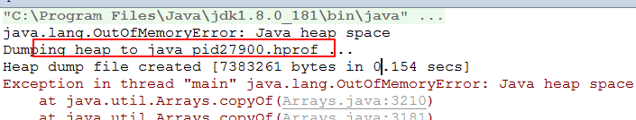

# 0.大纲

- jvm发展史

- jvm运行时内存区域

- jvm gc的基本原理和常见垃圾收集器

- jvm内存分配问题

- 常见的jvm分析工具

# 1. JVM的发展史

## 1.1 jvm简介

​		所谓jvm就是Java Virtual Machine（java虚拟机），是java程序运行的载体。一个java进程就是一个jvm，或者一个jvm代表了一个java的进程。

- 平台无关性

    ​	平台无关性，指的是说，在一个操作系统编译之后的虚拟机码，可以在其他操作系统上（对程序员而言）不需要进行转换便可以直接进行运行，而这背后的工作都是由于jvm的平台无关性实现的，windows有windows的jvm，linux有linux的jvm，mac有mac的版本。

- jvm简介

    ​	虚拟机：通过软件来模拟出来的具有完整的硬件系统功能的、运行在完全隔离的环境中的完整的计算机系统。例如：在人工的草原养殖场模拟真实的草原环境，你们家里的小池塘模拟真实的海洋环境。JVM世界观：java对象在jvm里的生老病死。

    ​	JVM一样也是通过在实际的计算机中软件虚构出来的，用来模拟一套完整的运行平台。
    	Java的一次编写处处运行：是指在一段代码可以在不同的平台运行，这就归功于JVM。
    	作为java编译器和os之间的虚拟解释器，JVM根据不同的os，将java编译后的目标代码（字节码）解释成不同os可以运行的机器指令，所以说：有了JVM之后呢，java语言在不同平台上运行时不需要重新编译。一次编写，处处运行！

- 代码的执行方式

    1. 解释执行

        静态语言（java、c）

        ​		源代码----->编译（机器码(一堆0和1)）----->解释（执行）

        动态语言(js,html,css)

        ​		源代码---解释执行

    2. 编译执行

        ​	源代码----->编译（虚拟机码）----->解释（机器码）--->执行

## 1.2. JVM的发展史

### 1.2.0. 如何查看jdk自带的jvm


### 1.2.1. Classic VM

​	世界上第一款商用Java虚拟机
	1996年1月23日，Sun公司发布JDK 1.0，Java语言首次拥有了商用的正式运行环境，这个JDK中所带的虚拟机就是Classic VM。不过只能使用纯解释器方式来执行Java代码，如果要使用JIT编译器(JIT Compiler(Just-in-time Compiler) 即时编译器)，就要使用第三方外挂，一旦使用了JIT编译器，JIT编译器就完全接管了虚拟机的执行系统，解释器便不再工作了。
 	Classic VM (build JDK-1.2.2-001, green threads, sunwjit) 
	如果使用即时编译器就不得不对每一个方法、每一行代码都进行编译，而无论它们执行的频率是否具有编译的价值。基于程序响应时间的压力，这些编译器根本不敢应用编译耗时稍高的优化技术。有的时候一些代码的编译时间比执行时间还要长。
​	因此这个阶段的虚拟机即使使用了编译器，执行效率也和传统的C/C++程序有很大差距，“Java语言很慢”的形象就是在这时候开始在用户心中树立起来的。

### 1.2.2. Exact  VM

​	JDK 1.2时，曾在Solaris平台上发布过一款名为Exact VM的虚拟机，它的执行系统已经具备现代高性能虚拟机的雏形：如支持编译器与解释器混合工作模式。

​	Exact VM因它使用准确式内存管理（Exact Memory Management，也可以叫Non-Conservative/Accurate Memory Management）而得名。

​	虚拟机可以知道内存中某个位置的数据具体是什么类型。譬如内存中有一个32位的整数123456，它到底是一个reference类型指向123456的内存地址还是一个数值为123456的整数，虚拟机将有能力分辨出来，这样才能在GC（垃圾收集）的时候准确判断堆上的数据是否还可能被使用。

​	由于使用了准确式内存管理，Exact VM可以抛弃以前Classic VM基于handle的对象查找方式每次定位对象都少了一次间接查找的开销，提升执行性能。

​	基于handle(句柄)的对象查找：当123456指向的对象经过一次垃圾回收后，内存地址需要重新规整。内存地址发生了变化为654321，不能将内存中所有的值为123456数据都改为654321。使用句柄来管理对象内存地址的变动，所以定位对象时先去句柄查下实际的地址再去查找对象本身的属性。类似于对象的户口变更登记册。
句柄可以理解为：引用的引用。指针的指针。


###  1.2.3. HotSpot VM

​	hotspot vm  是Sun JDK和OpenJDK中所带的虚拟机，也是目前使用范围最广的Java虚拟机
	最初并非由Sun公司开发，而是由一家名为“Longview Technologies”的小公司设计的；Sun公司注意到了这款虚拟机在JIT编译上有许多优秀的理念和实际效果，在1997年收购了Longview Technologies公司，从而获得了HotSpot VM。
	oracle收购了SUN，获得了HotSpot VM。
	HotSpot VM既继承了Sun之前两款商用虚拟机的优点（如前面提到的准确式内存管理），也有许多自己新的技术优势，如它名称中的HotSpot指的就是它的热点代码探测技术。

​	01、可以通过执行计数器找出最具有编译价值的代码，
	根据执行计数器判断是否达到阈值，没到就解释执行，否则提交编译请求，通知JIT编译器以方法为单位进行编译。
	所以：如果一个方法被频繁调用，或方法中有效循环次数很多，将会分别触发标准编译和OSR（栈上替换）编译动作。
	OSR：由于代码块可能是在解释执行过程中直接切换到本地代码执行，所以也叫做栈上替换（OSR，OnStackReplacement）
​	02、通过编译器与解释器恰当地协同工作，可以在最优化的程序响应时间与最佳执行性能中取得平衡，即时编译的时间压力也相对减小，这样有助于引入更多的代码优化技术，输出质量更高的本地代码[机器执行码]。

# 2. jvm运行时内存区域

## 2.1. jvm运行时内存区域划分

- 从线程是否隔离

    1. 线程隔离区域：线程独享，线程安全

    2. 线程共享区域：有线程安全问题

- 详细的分类

    ​	栈内存区域(虚拟机栈，本地方法栈)、程序计数器、堆内存区域、方法区(jdk1.8以下叫方法区，jdk1.8以上叫metaspace元数据区)

    

## 2.2. jvm各个内存区域

### 2.2.1. 栈内存区域

​	所谓“栈”包括：java虚拟机栈、本地方法栈；他们作用相似，区别只是：虚拟机栈为虚拟机执行Java方法（也就是字节码）服务，而本地方法栈则为虚拟机使用到的Native方法服务。程序员人为的分为“堆栈”中的“栈”。

​	栈里存放了编译期可知的各种基本数据类型（boolean、byte、char、short、int、float、long、double）、对象引用和指向了一条字节码指令的地址。

​	每个方法在执行的同时都会创建一个栈帧（Stack Frame）用于存储局部变量表、操作数栈、动态链接、方法出口等信息。每一个方法从调用直至执行完成的过程，就对应着一个栈帧在虚拟机栈中入栈到出栈的过程。

​	局部变量表所需的内存空间在编译期间完成分配，其中64位的long和double类型的数据会占2个局部变量空间，其余的数据类型只占用1个。当进入一个方法时，这个方法需要在帧中分配多大的局部变量空间是完全确定的，在方法运行期间不会改变局部变量表的大小。

​	操作数栈也要操作栈，主要是在方法计算时存放的栈。

​	使用命令进行反编译操作：

​	

```java
Compiled from "HelloWorld.java"
public class HelloWorld {
  public HelloWorld();
    Code:
       0: aload_0
       1: invokespecial #1                  // Method java/lang/Object."<init>":()V
       4: return

  public static void main(java.lang.String[]);
    Code:
       0: getstatic     #2                  // Field java/lang/System.out:Ljava/io/PrintStream;
       3: ldc           #3                  // String Hello World~
       5: invokevirtual #4                  // Method java/io/PrintStream.println:(Ljava/lang/String;)V
       8: return

  public void method();
    Code:
       0: iconst_0
       1: istore_1
       2: iconst_1
       3: istore_2
       4: iload_1
       5: iload_2
       6: iadd
       7: istore_3
       8: getstatic     #2                  // Field java/lang/System.out:Ljava/io/PrintStream;
      11: new           #5                  // class java/lang/StringBuilder
      14: dup
      15: invokespecial #6                  // Method java/lang/StringBuilder."<init>":()V
      18: ldc           #7                  // String sum=
      20: invokevirtual #8                  // Method java/lang/StringBuilder.append:(Ljava/lang/String;)Ljava/lang/StringBuilder;
      23: iload_3
      24: invokevirtual #9                  // Method java/lang/StringBuilder.append:(I)Ljava/lang/StringBuilder;
      27: invokevirtual #10                 // Method java/lang/StringBuilder.toString:()Ljava/lang/String;
      30: invokevirtual #4                  // Method java/io/PrintStream.println:(Ljava/lang/String;)V
      33: aload_0
      34: invokevirtual #11                 // Method method1:()V
      37: return

  public void method1();
    Code:
       0: getstatic     #2                  // Field java/lang/System.out:Ljava/io/PrintStream;
       3: ldc           #12                 // String method1
       5: invokevirtual #4                  // Method java/io/PrintStream.println:(Ljava/lang/String;)V
       8: return
}
```

### 2.2.2. 程序计数器内存区域

​	程序计数器（Program Counter Register）是当前线程所执行的字节码的行号指示器，字节码解释器工作时就是通过改变这个计数器的值来选取下一条需要执行的字节码指令。分支、循环、跳转、异常处理、线程恢复等基础功能都需要依赖这个计数器来完成。
	为了线程切换后能恢复到正确的执行位置，每条线程都需要有一个独立的程序计数器，各条线程之间计数器互不影响，独立存储，所以程序计数器这类内存区域为“线程私有”的内存。
	如果线程正在执行的是Native方法，这个计数器值则为空（Undefined）。
	native方法 是与C++联合开发的时候用的！使用native关键字说明这个方法是原生函数，也就是这个方法是用C/C++语言实现的，并且被编译成了DLL(动态链接库 dynamic link library)，由java去调用。

### 2.2.3. 堆内存区域

​	Java堆（Java Heap）是Java虚拟机所管理的内存中最大的一块，此内存区域就是存放对象实例，几乎所有的对象实例都在这里分配内存。

​	Java堆是垃圾收集器管理的主要区域；内存回收的角度来看Java堆中还可以细分为：新生代和老年代；新生代细致一点的有Eden空间、From Survivor空间、To Survivor空间。

​	在实现时，既可以实现成固定大小的，也可以是可扩展的，不过当前主流的虚拟机都是按照可扩展来实现的（通过-Xmx设置最大内存和-Xms设置初始内存）
	java  -Xms10m -Xmx100m Hello

### 2.2.4. 方法区内存区域

​	方法区又叫静态区：用于存储已被虚拟机加载的类信息、常量池、静态变量、即时编译器编译后的代码等数据。虽然Java虚拟机规范把方法区描述为堆的一个逻辑部分，但是它却有一个别名叫做Non-Heap（非堆）；
​	对于HotSpot虚拟机是使用永久代来实现方法区；
​	Java虚拟机规范对方法区的限制非常宽松，除了不需要连续的内存和可以选择固定大小或者可扩展外，还可以选择不实现垃圾收集。相对而言，垃圾收集行为在这个区域是比较少出现的，这区域的内存回收目标主要是针对常量池的回收和对类型的卸载，条件相当苛刻。
​	java中的常量池技术，是为了方便快捷地创建某些对象而出现的，当需要一个对象时，就可以从池中取一个出来（如果池中没有则创建一个），在需要重复创建相等变量时节省了很多时间。

```java
public class ConstantPool {
    public static void main(String[] args) {
        //创建了几个对象
		String str1 = new String("hello");

        String str2 = new String("hello");
        /**
         * ==
         *  引用型数据类型比较的是两个对象的内存地址值
         *  基本数据类型比较的就是值
         * equals本质上还是比较的内存地址值，不同的对象对equals方法做了复写，String复写的结果就是比较两个字符串的值
         */
        System.out.println(str1==str2);//false
        System.out.println(str1.equals(str2));//true
        System.out.println(str1.toString()==str2.toString());//false
        String str3="hello";
        String str4="hello";
     
        System.out.println(str3==str4);//true str3和str4直接指向的常量池中的字符串对象
        System.out.println("------------------------------------------------");
        System.out.println(new Integer(1) == new Integer(1));//false
        int a = new Integer(127);
        int b = new Integer(127);
        System.out.println("a==b?" + (a == b));//true
        Integer c = 127;
        Integer d = 127;
        System.out.println("c==d?" + (c == d));//true
        Integer e = 128;
        Integer f = 128;
        System.out.println("e==f?" + (e == f)); //false
        /**
         * 因为一个byte[-128, 127]范围内的这些数据，使用频率是非常高，所以jvm便将这些数据避免重复创建，就在常量池中进行优化创建，
         * 第一次如果没有，就在常量池中创建，后续直接从常量池中获取数据
         */
    }
}
```

### 2.2.5. 常见的内存区域异常

- 程序计数器
    没有指定任何OutOfMemoryError情况

- java虚拟机栈\本地方法栈区域
    如果线程请求的栈深度大于虚拟机所允许的深度，将抛出StackOverflowError异常；如果扩展时无法申请到足够的内存，就会抛出OutOfMemoryError异常

    ```java
    public class JavaVMStackSOF {
    
        private int stackLength = 1;
    
        public void stackLeak() {//递归调用
            stackLength++;
            stackLeak();
        }
    
        public static void main(String[] args) throws Throwable {
            JavaVMStackSOF oom = new JavaVMStackSOF();
            try {
                oom.stackLeak();
            } catch (Throwable e) {
                System.out.println("stack length:" + oom.stackLength);
                throw e;
            }
        }
    }
    ```

    

- 堆
    如果在堆中没有内存完成实例分配，并且堆也无法再扩展时，将会抛出OutOfMemoryError异常 
     报错后dump出信息： -XX:+HeapDumpOnOutOfMemoryError

    ```java
    public class HeapOOM {
    
        static class OOMObject {
        }
    
        public static void main(String[] args) {
            List<OOMObject> list = new ArrayList<OOMObject>();
    
            while (true) {
                list.add(new OOMObject());
            }
        }
    }
    ```

> java -Xms5m -Xmx5m HeapOOM


下载oom是的内存状况




- 方法区
    当方法区无法满足内存分配需求时，将抛出OutOfMemoryError异常

```java
public class MethodOOM {
	//永久代内存异常
    public static void main(String[] args) {
        //保持引用，防止自动垃圾回收
        List<String> list = new ArrayList<>();
        int i = 0;
        while(true){
            //通过intern方法向常量池中手动添加常量
            list.add(String.valueOf(i++));
        }
    }
}
```


jdk1.8的指定：

-XX:MetaspaceSize===》初始化元数据区内存大小

-XX:MaxMetaspaceSize===》最大元数据区内存大小

jdk1.7的指定：

-XX:PermSize===》初始化永久代内存大小

-XX:MaxPermSize===》最大永久代内存大小

# 3. Java对象的GC

## 3.1. 对象的引用类型

​	java中的引用分为：强引用、软引用、弱引用、虚引用（幽灵引用或者幻影引用），这4种引用强度依次逐渐减弱。
​	强引用：在程序代码之中正常的类似于“Person p = new Person()”这类的引用；垃圾收集器不会回收掉被强引用的对象。
	软引用：有用但非必须的对象，jdk中提供了SoftReference类来实现软引用；系统在发生内存溢出异常之前，会把只被软引用的对象进行回收。
用途？可以做缓存。
​	弱引用：非必须的对象，jdk中提供了WeakReference类来实现弱引用，比软引用弱一些；垃圾回收不论内存是否不足都会回收只被弱引用关联的对象。
​	虚引用：对被引用对象的生存时间不影响；无法通过虚引用来取得一个对象实例；为一个对象设置虚引用关联的唯一目的就是能在这个对象被收集器回收时收到一个系统通知；jdk提供PhantomReference类来实现虚引用。

```java
/**
 * Java引用分为：强引用>软引用>弱引用>虚引用
 *
 */
public class ReferenceTest {
    public static void main(String[] args) {
        System.out.println("===========强引用========");
        //强引用
        Person p = new Person();
        System.gc();//手动执行垃圾回收
        System.out.println(p);
        //软引用
        System.out.println("===========软引用========");
        SoftReference<Person> sp = new SoftReference<Person>(new Person());
        System.gc();
        System.out.println(sp.get());
        //弱引用
        System.out.println("===========弱引用========");
        WeakReference<Person> wp = new WeakReference<Person>(new Person());
        System.gc();
        System.out.println(wp.get());
        System.out.println("===========虚引用========");
        //虚引用
        ReferenceQueue<Person> referenceQueue = new ReferenceQueue<Person>();
        Person person = new Person();
        PhantomReference<Person> pp = new PhantomReference<Person>(person, referenceQueue);
        person = null;
        System.out.println(referenceQueue.poll());
        System.gc();
        System.out.println(pp.get());
        try {
            //gc后等1秒看结果
            Thread.sleep(1000);
        } catch (InterruptedException e) {
            e.printStackTrace();
        }
        System.out.println(referenceQueue.poll());
        //发送oom异常
        try {
            List<HeapOOM.OOMObject> list = new ArrayList<HeapOOM.OOMObject>();
            while (true) {
                list.add(new HeapOOM.OOMObject());
            }
        } catch (Throwable e) {
            e.printStackTrace();
        } finally {
            System.out.println("OOM移除之后的软引用对象：" + sp.get());
        }
    }
}

class Person {
    String name = "张三";

    @Override
    public String toString() {
        return name;
    }
}
```

> ===========强引用========
> 张三
> ===========软引用========
> 张三
> ===========弱引用========
> null
> ===========虚引用========
> null
> null
> java.lang.ref.PhantomReference@6d5380c2
> java.lang.OutOfMemoryError: Java heap space
> OOM移除之后的软引用对象：null

## 3.2. 判定对象存活的方式

### 3.2.1. 引用计数器法

​	给对象中添加一个引用计数器，每当有一个地方引用它时，计数器值就加1；当引用失效时，计数器值就减1；任何时刻计数器为0的对象就是不可能再被使用的。

​	缺点：会将一些有附带引用的对象当做没有回收的对象所回收掉。

### 3.2.2. 可达性分析

​	通过一系列的称为“GC Roots”的对象作为起始点，从这些节点开始向下搜索，搜索所走过的路径称为引用链（Reference Chain），当一个对象到GC Roots没有任何引用链相连（即不可达）时，则证明此对象是不可用的。


好处是：可达性分析可以回收掉，那些不可达，但是如果用引用计数器法判断的话，计数器的值不为0的引用。

- 常见的gc root

    虚拟机栈（栈帧中的本地变量表）中引用的对象。
    方法区中类静态属性引用的对象。
    方法区中常量引用的对象。
    本地方法栈中JNI（Java Native Interface即一般说的Native方法）引用的对象。

## 3.3. 判定对象是否存活

​	不可达的对象真正死亡需要两次标记：
	当不可达时标记第一次标记，当对象覆盖finalize()方法并且finalize()方法没有被虚拟机调用过，此对象将会放置在一个叫做F-Queue的队列之中，稍后由一个由虚拟机自动建立的、低优先级的Finalizer线程去触发这个方法，但并不承诺会等待它运行结束再执行垃圾回收。
	finalize()方法是对象逃脱死亡命运的最后一次机会，稍后GC将对F-Queue中的对象进行第二次小规模的标记，如果对象要在finalize()中重新与引用链上的任何一个对象建立关联那么他被移除出“即将回收”的集合，否则就被回收了。

```java
public class FinalizeObj {
    public static FinalizeObj obj;

    @Override
    protected void finalize() throws Throwable {
        super.finalize();
        System.out.println("FinalizeObj finalize called !!!");
        obj = this;//在finalize方法中复活对象
    }

    @Override
    public String toString() {
        return "I am FinalizeObj";
    }

    public static void main(String[] args) throws InterruptedException {
        obj = new FinalizeObj();
        obj = null; //将obj设为null
        System.gc();//垃圾回收

        Thread.sleep(1000);//
        if(obj == null) {
            System.out.println("obj is null");
        } else {
            System.out.println("obj is alive");
        }

        System.out.println("第2次调用gc后");
        obj = null;//由于obj被复活，此处再次将obj设为null
        System.gc();//再次gc
        Thread.sleep(1000);
        if(obj == null) {
            //对象的finalize方法仅仅会被调用一次，所以可以预见再次设置obj为null后，obj会被垃圾回收，该语句会被调用
            System.out.println("obj is null");
        } else {
            System.out.println("obj is alive");
        }
    }
}
```

## 3.4. 垃圾回收算法

### 3.4.1. 标记清除

​	最基础的收集算法是“标记-清除”（Mark-Sweep）算法，此方法分为两个阶段：标记、清除。
标记要清除的对象，统一清除；
不足有两个：
​	一个是效率问题，标记和清除两个过程的效率都不高；
​	另一个是空间问题，标记清除之后会产生大量不连续的内存碎片，空间碎片太多可能会导致以后在程序运行过程中需要分配较大对象时，无法找到足够的连续内存而不得不提前触发另一次垃圾收集动作。


### 3.4.2. 标记整理

​	标记+清除+整理=标记整理算法

​	在标记清除的基础之上，将可用的对象做了重新的整理，是的内存空间变得连续。


### 3.4.3. 复制算法

​	复制算法：它将可用内存按容量划分为大小相等的两块，每次只使用其中的一块。当这一块的内存用完了，就将还存活着的对象复制到另外一块上面，然后再把已使用过的内存空间一次清理掉。
	优点：无内存碎片，只要移动堆顶指针，按顺序分配内存即可，实现简单，运行高效。缺点：实际可用内存缩小为了原来的一半。


### 3.4.4. 垃圾回收算法总结

​	现在的商业虚拟机都采用这种复制算法来回收新生代，使用标记清除或者标记整理来回收老年代。

​	在回收新生代的时候：

​	1、将新生代内存分为一块较大的Eden空间和两块较小的Survivor空间；
​	2、每次使用Eden和其中一块Survivor。
​	3、当回收时，将Eden和Survivor中还存活着的对象一次性地复制到另外一块Survivor空间上，并清理掉Eden和刚才用过的Survivor空间。

​	HotSpot虚拟机默认Eden和Survivor的大小比例是8:1:1；浪费10%。

新生代垃圾回收过程示意图


### 3.5. 垃圾回收分类

​	垃圾回收方式分为了三类

- Minor GC：

    新生代的垃圾回收过程，被称之为Minor GC。每次 Minor GC 会清理年轻代的内存。

- Major GC：

    老年代或者永久代的垃圾回收过程，被称之为Major GC。

- Full GC：

    新生代和老年代或者永久代一起执行垃圾回收的过程，称之为Full GC。

# 4. jvm内存分配问题

## 4.1. 对象进入老年代的问题

​	大多数情况下，对象在新生代Eden区中分配。当Eden区没有足够空间进行分配时，虚拟机将发起一次Minor GC，此时对象会进入survivor区，当对象满足一些条件后会进入老年代。

​	对象有新生代进入到老年代，有三种策略。

- 策略一：

    ​	当对象的年龄达到默认的阈值（15岁）的时候，便进入到老年代。如何衡量对象年龄呢？一个对象在eden去创建，对象年龄为0，经历过一次gc之后，仍然存活，年龄+1。如此经过15次gc，还存活，便进入到老年代。我们可以通过一个参数来调整这个阈值：-XX:MaxTenuringThreshold.

    

- 策略二：

    ​	当survivor中某一年龄存活的对象体积，超过了survivor空间的一半的时候，大于等于该年龄的所有的对象直接晋升到老年代，无须等到MaxTenuringThreshold中要求的年龄。

- 策略三：

    ​	在创建大对象的时候，超过阈值体积的对象，直接在老年代创建，不用再新生代中创建，这样可以避免因为新生代空间不足，频繁触发gc，以及内存对象复制。到底是多大的对象在老年中创建呢，没有默认值，但是可以通过一个参数来进行指定：-XX:PretenureSizeThreshold

    

    上图，说明一个对象的体积超过3m的话，将会在老年代中创建。

## 4.2. gc时的空间担保失败问题

​	空间担保问题，指的是，存活对象由新生代进入到老年代的时候，如果老年代空间不足，不足以存储晋升的对象的时候，出现的问题。

​	在发生Minor GC之前，虚拟机会先检查老年代最大可用的连续空间是否大于新生代的所有对象总空间，如果这个条件成立，那么Minor GC可以确保是安全的。

​	如果不成立（新生代对象的总空间 > 老年代中最大的连续内存空间），则虚拟机会查看-XX:+HandlePromotionFailure（在jdk1.6之后默认开启）设置值是否允许担保失败。

​	如果设置这个参数，需要做进一步的判断：判断历次由新生代进入到老年的对象的平均总体积（第一次10m，第二次9m，第三次8m，这三次平均值就9m），判定这个平均总体积是否大于老年代中的最大的连续内存空间。如果小于（老年代最大连续内存空间为10m），则会执行一次又**风险**的minor gc；如果大于（老年代最大连续内存空间为8m）呢，说明老年代空间不足，触发一次major gc，因为在新生代还要执行minor gc，说白了会触发一次full  gc。

​	如果没有设置这个参数，直接执行一次full  gc。

# 5. 常见的垃圾收集器

​	这里所说的垃圾收集器，就是对前面学习的垃圾回收算法的实现。

## 5.1. 并行和并发

​	在jvm中运行的线程，分为了两类，一类是用户的工作（用户）线程；另外一类就是垃圾收集（守护）线程。

​	垃圾收集时候的并行的概念：多个垃圾收集线程同时并行执行垃圾回收任务，此时用户工作线程处于等待的状态。

​	垃圾收集时候的并发的概念：指用户线程和垃圾收集线程同时执行（但不一定是并行的，可能会交替执行），用户程序在继续运行，而垃圾收集程序运行于另一个cpu上。

## 5.2. 常见的垃圾收集器

### 5.2.1. 垃圾收集器之Serial(*)

​	Serial收集器是最基础、历史最悠久的适合新生代的收集器。
​	特点：单线程、stop-the-world 、复制算法
​	缺点：影响用户响应时间
​	优点：回收时简单高效、对于限定单个cpu环境下，serial收集器由于没有线程交互的开销，专心做垃圾收集，可以获得最高的单线程收集效率。
​	所以：serial 收集器 对于运行在client模式下的虚拟机来说，是一个很好的选择。
​	SerialOld收集器是Serial的老年代收集器，采用“标记-整理”

​	如何指定jvm采用Serial垃圾收集器呢？

-XX:+UseSerialGC


### 5.2.2. 垃圾收集器之ParNew(*)

​	ParNew收集器其实是Serial的多线程版本，除了他是使用多条线程来进行垃圾回收之外和Serial是完全一样的。新生代收集器
​	特点：多线程、stop-the-world、复制算法
​	缺点：单个cpu下，运行效果甚至没Serial好。
​	优点：回收时简单高效、对于限定多个cpu环境下，效果比serial好。
​	所以：parnew收集器是运行在server模式下的首选收集器。

​	如何指定jvm采用Serial垃圾收集器呢？

-XX:+UseParNewGC


### 5.2.3. 垃圾收集器之Parallel Scanvenge

Parallel Scanvenge收集器是一个新生代收集器，采用复制算法。
特点：收集新生代，复制算法，多线程，高吞吐、自适应
1、与其它的收集器侧重垃圾回收时用户的停顿时间不同，它主要侧重于吞吐量，吞吐量=运行用户代码时间/(运行用户代码时间+垃圾收集时间)。
停顿时间越短就越适合需要与用户交互的程序，高吞吐量则是可以高效率地利用cpu时间尽快完成任务。
2、他有一个自适应开关(-XX:+UseAdaptiveSizePolicy)：打开后，用户只需要把基本的内存数据（堆最大，初始量）设置好，然后设置更关注最大停顿时间或者更关注吞吐量，收集器会把细节参数自动调节。
Parallel Old 老年代收集器，采用标记-整理算法。

​	如何指定jvm采用Serial垃圾收集器呢？

-XX:+UseParallelGC


### 5.2.4. 垃圾收集器之CMS(*)

CMS（concurrent mark sweep）收集器是一个以获取最短回收停顿时间为目标的老年代收集器。
特点：并发收集、低停顿。
基于 标记-清除算法实现，但是整个过程比较复杂一些。过程分为4步：
1、初始标记：仅仅标记GCRoot能直接关联到的对象。速度很快，“stop the world”

2、并发标记：GCRoot Tracing。耗时长和用户线程同步。

3、重新标记：修正并发标记时，由于用户程序运行导致的标记变动。“stop the world”停顿稍长一些。

4、并发清除：耗时长，和用户线程同步。

缺点：吞吐量会变低、浮动垃圾无法处理、标记-清除的碎片（设置参数是 fullgc前开启碎片整理功能，gc停顿时间延长）。
可以兼容的新生代收集器：ParNew和Serial

​	如何指定jvm采用Serial垃圾收集器呢？

-XX:+UseConcMarkSweepGC


### 5.2.5. 垃圾收集器之G1(*)

G1（Garbage-First）收集器是当今收集器领域最前沿成果之一。2004年sun发表第一篇G1论文，10年后才开发出G1的商用版本。
hotspot开发团队赋予它的使命：未来替调CMS收集器。
特点：
1、并行与并发：利用多cpu缩短stop-the-world的时间，使用并发方式解决其它收集器需要停顿的gc动作。

2、分代收集：新老代收集区分对待。

3、空间整合：G1从整理看是基于标记-整理，但是局部看是基于复制算法实现的，不会产生碎片。

4、可预测的停顿：能够让使用者指定在M毫秒的时间片段上，消耗在垃圾回收的时间不得超过N毫秒。
过程：初始标记、并发标记、最终标记、筛选回放。前三个和CMS一致，筛选回放是根据用户设置的停顿目标来选择回收价值最高的进行回收。

​	如何指定jvm采用Serial垃圾收集器呢？

-XX:+UseG1GC


# 6. jvm常见的分析工具

​	jvm有非常多的分析工具，这些工具都可以在$JAVA_HOME/bin目录中找到身影，总体上可以分为两类，一类是命令行的脚本命令，另外一类就是图形化界面的软件，其实后者就是集成前者的功能而已。

## 6.1. CLI的分析命令

### 6.1.1. jps （*）

​	jps(java process status) java进程状态命令，主要作用，就是获取java进程的相关状态信息，比如进程名、比如pid，比如进程参数，比如jvm参数等等。用法如下：


​	-q：获取对应java进程的pid


​	-l：获取java进程对应的启动类的全类名

​		

​	-m：获取java进程对应的主函数的参数信息

​	

​	-v：获取java进程对应的虚拟机的参数信息


​	-V：jps命令就是jps -V的缩写

​	hostid：要使用该操作，就需要和jstatd搭配使用

### 6.1.2. jstatd（了解）

​	jstatd：Virtual Machine jstat Daemon
http://docs.oracle.com/javase/1.5.0/docs/tooldocs/share/jstatd.html
jstatd [ options ]
启动jvm监控服务。它是一个基于rmi（远程接口调用）的应用，向远程机器提供本机jvm应用程序的信息。默认端口1099。-p指定端口。

实例：jstatd -J-Djava.security.policy=my.policy &
my.policy文件需要自己建立，内如如下：

grant codebase "file:${java.home}/../lib/tools.jar" { permission java.security.AllPermission; };

这是安全策略文件，因为jdk对jvm做了jaas（Java验证和授权API）的安全检测，所以我们必须设置一些策略，使得jstatd被允许作网络操作;


其他机器查看


### 6.1.3. jmap （*）

Memory Map 观察运行中的jvm物理内存的占用情况。
官方地址：http://docs.oracle.com/javase/1.5.0/docs/tooldocs/share/jmap.html
jmap [ option ] pid

pid   进程号（常用）

参数如下：
-heap：打印jvm heap的情况(垃圾收集器类型)
-histo：打印jvm heap的直方图。其输出信息包括类名，对象数量，对象占用大小。
-histo：live ：同上，但是只打印存活对象的情况
-permstat：打印permanent generation heap（方法区）情况
-finalizerinfo：打印正等候回收的对象信息

```properties
[bigdata@bigdata01 jvm]$ jmap  -heap   3261
Attaching to process ID 3261, please wait...
Debugger attached successfully.
Server compiler detected.
JVM version is 25.112-b15

using thread-local object allocation.
Parallel GC with 4 thread(s)

Heap Configuration:
   MinHeapFreeRatio         = 0 堆最小空闲比例
   MaxHeapFreeRatio         = 100	堆最大空闲比例
   MaxHeapSize              = 1048576000 (1000.0MB)（最大堆内存空间-Xmx指定）
   NewSize                  = 21495808 (20.5MB)	（新生代内存大小）
   MaxNewSize               = 349175808 (333.0MB)(最大新生代内存大小)
   OldSize                  = 43515904 (41.5MB)	（老代内存大小）
   NewRatio                 = 2				（新生代和老年代内存比例=1:2）
   SurvivorRatio            = 8	(新生代中eden区和survivor内存比例=8:1:1)
   MetaspaceSize            = 21807104 (20.796875MB)（元数据区内存大小）
   CompressedClassSpaceSize = 1073741824 (1024.0MB)(压缩类空间大小)
   MaxMetaspaceSize         = 17592186044415 MB(最大元数据区内存大小)
   G1HeapRegionSize         = 0 (0.0MB)（G1堆区域大小）

Heap Usage:
PS Young Generation 新生代
Eden Space:	eden区
   capacity = 19922944 (19.0MB) 容量
   used     = 3529480 (3.3659744262695312MB)	已用容量
   free     = 16393464 (15.634025573730469MB)	空闲容量
   17.715654875102796% used		已用占比
From Space:	survivor区
   capacity = 524288 (0.5MB)	当前容量
   used     = 262176 (0.250030517578125MB)	已用容量
   free     = 262112 (0.249969482421875MB)  空闲容量
   50.006103515625% used		已用占比
To Space: survivor区
   capacity = 1048576 (1.0MB) 当前容量
   used     = 0 (0.0MB)			已用容量
   free     = 1048576 (1.0MB)  空闲容量
   0.0% used		已用占比
PS Old Generation	老年代
   capacity = 58195968 (55.5MB)	当前容量
   used     = 29716984 (28.34032440185547MB)	已用容量
   free     = 28478984 (27.15967559814453MB)	空闲容量
   51.06364757091075% used	已用占比
```

### 6.1.4. jstat （了解）

jstat: Java Virtual Machine Statistics Monitoring Tool
http://docs.oracle.com/javase/1.5.0/docs/tooldocs/share/jstat.html
 Usage: jstat -help|-options
   jstat -<option> [-t] [-h<lines>] <pid> [<interva[s|ms]> [<count>]]
参数解释：
Options — 选项，我们一般使用 -gcutil /-gc 查看gc情况
pid      — VM的进程号，即当前运行的java进程号
interval[s|ms]  ——  间隔时间，单位为秒或者毫秒，默认为ms。必须是正整型。
count     — 打印次数，如果缺省则打印无数次
例如：jstat -gc 4645 500 10  表示查看进程号为4645的gc 每500ms打印一次  共打印10次


```propertie
S0C	 ---->	survivor0的capacity
S1C	 ---->	survivor1的capacity
S0U	 ---->	survivor0的used
S1U	 ---->	survivor1的used
EC 	 ---->	Eden区的capacity
EU 	 ---->	Eden区的used
OC 	 ---->	老年代的capacity
OU 	 ---->	老年代的used
MC 	 ---->	Metaspace区的capacity
MU 	 ---->	Metaspace区的used
CCSC ---->  CompressClassSpace的capacity
CCSU ---->  CompressClassSpace的used
YGC  ---->  到目前为止执行过多少次的minor gc
YGCT ---->  到目前为止执行的minor gc所消耗的时间
FGC  ---->  到目前为止执行过多少次的full gc  
FGCT ---->  到目前为止执行的full gc所消耗的时间  
GCT  ---->  到目前为止执行的gc所消耗的时间(YGCT + FGCT)    
```

### 6.1.5. jinfo（了解）

Configuration Info
官方地址：http://docs.oracle.com/javase/1.5.0/docs/tooldocs/share/jinfo.html
jinfo [ option ] pid
pid   进程号
参数如下：
no option  打印命令行参数和系统属性
-flags  打印命令行参数
-sysprops  打印系统属性
-h  帮助

### 6.1.6. jstack（关注死锁）

jstack:Stack Trace

http://docs.oracle.com/javase/1.5.0/docs/tooldocs/share/jstack.html

jstack能得到运行java程序的java stack和native stack的信息。可以轻松得知当前线程的运行情况

jstack [ option ] pid

[ option ] 参数如下

-l长列表. 打印关于锁的附加信息,例如属于java.util.concurrent的ownable synchronizers列表.
-m打印java和native c/c++框架的所有栈信息.

tid指Java Thread id。nid指native线程的id。prio是线程优先级。[0x00007fd4f8684000]是线程栈起始地址

dump 文件里，值得关注的线程状态有：

 死锁，Deadlock（重点关注）
 等待资源，Waiting on condition（重点关注）
 等待获取监视器，Waiting on monitor entry（重点关注）
 阻塞，Blocked（重点关注） 

 执行中，Runnable  
 暂停，Suspended
 对象等待中，Object.wait() 或 TIMED_WAITING
 停止，Parked


## 6.2. GUI的分析软件

### 6.2.1. jconsole

可视化的jvm监控软件。

可以监控本地或者远程进程。

主要包括：概览、内存、线程、类、VM概要、MBean选项卡。

概览选项卡：呈现四幅图表：主要包括堆内存使用量、类、线程、CPU占有率。

内存选项卡：包含堆内、非堆、内存池的使用量图表和详细信息。相当于jstat命令。

线程选项卡：显示所有的线程的信息和图表。相当于jstack

类选项卡：加载的类的信息。

Vm概要：VM的概要信息包括堆大小，垃圾收集信息、vm参数等。

Mbean选项：managed beans ，被管理的beans


### 6.2.2. jvisualvm

多合一故障处理工具
visual vm是迄今为止，jdk发布的功能最强大的运行监视和故障处理程序。可以查看本地和远程的的状态。
优点：不需要被监控的程序基于特殊的Agent运行，因此他对应用程序的实际性能影响很小，这样他可以直接运行在生产环境中。这是其它监视工具比如：jprofile、yourkit无法与之相比的。

visualvm.exe
主要特点：
1、插件安装。
2、生成、浏览堆转储快照和线程快照。
3、抽样器和profiler中分析程序性能。
4、BTrace插件动态日志跟踪。


装载程序OOM堆快照信息：


# 7.总结

Java1.7的jvm参数查看一下官方网站。
http://docs.oracle.com/javase/7/docs/technotes/tools/windows/java.html
Java1.8
http://docs.oracle.com/javase/8/docs/technotes/tools/windows/java.html
Hotspotvm知识查看一下官方网站。
http://www.oracle.com/technetwork/java/javase/tech/index-jsp-136373.html
主要的参数是：堆的大小、栈的大小、新生代和老年代的比值、新生代中eden和s0、s1的比值。
-Xms:初始堆大小，默认是物理内存的1/64。默认(MinHeapFreeRatio参数可以调整)空余堆内存小于40%时，JVM就会增大堆直到--Xmx的最大限制。例如：-Xms 20m。
-Xmx:最大堆大小。默认是物理内存的1/4  默认(MaxHeapFreeRatio参数可以调整)空余堆内存大于70%时，JVM会减少堆直到 -Xms的最小限制。
-XX:NewSize=n：设置年轻代大小（初始值）。 
-XX:MaxNewSize：设置年轻代最大值。
-XX:NewRatio=n:设置年轻代和年老代的比值。
-XX:SurvivorRatio=n:年轻代中Eden区与两个Survivor区的比值。
-XX:PermSize（1.8之后改为MetaspaceSize）  设置持久代(perm gen)初始值，默认是物理内存的1/64。
-XX:MaxPermSize=n:（1.8之后改为MaxMetaspaceSize）设置最大持久代大小。
-Xss：每个线程的堆栈大小。

