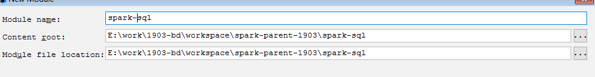
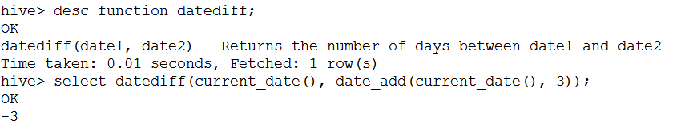

# SparkSQL

# 0. 学习大纲

- SparkSQL的发展

- SparkSQL的编程入口和模型

- SparkSQL的数据加载和落地

- SparkSQL和Hive的整合

- SparkSQL中的函数操作

- SparkSQL和SparkCore整合操作

- SparkSQL的sql优化操作

# 1. SparkSQL的发展

## 1.1. 简述

​		SparkSQL，顾名思义，就是Spark生态体系中的构建在SparkCore基础之上的一个基于SQL的计算模块。SparkSQL的前身不叫SparkSQL，而叫Shark，最开始的时候底层代码优化，sql的解析、执行引擎等等完全基于Hive，总是Shark的执行速度要比hive高出一个数量级，但是hive的发展制约了Shark，所以在15年中旬的时候，shark负责人，将shark项目结束掉，重新独立出来的一个项目，就是sparksql，不在依赖hive，做了独立的发展，逐渐的形成两条互相独立的业务：SparkSQL和Hive-On-Spark。在SparkSQL发展过程中，同时也吸收了Shark有些的特点：基于内存的列存储，动态字节码优化技术。

## 1.2. 特点


## 1.3. 总结

​		SparkSQL就是Spark生态体系中用于处理结构化数据的一个模块。结构化数据是什么？存储在关系型数据库中的数据，就是结构化数据；半结构化数据是什么？类似xml、json等的格式的数据被称之为半结构化数据；非结构化数据是什么？	音频、视频、图片等为非结构化数据。

​		换句话说，SparkSQL处理的就是二维表数据。

# 2. SparkSQL的编程入口和模型

## 2.1. SparkSQL的编程模型

### 2.1.1. 编程模型简介

​		主要通过两种方式操作SparkSQL，一种就是SQL，另一种为DataFrame和Dataset。

- SQL

    ​		SQL不用多说，就和Hive操作一样，但是需要清楚一点的时候，SQL操作的是表，所以要想用SQL进行操作，就需要将SparkSQL对应的编程模型转化成为一张表才可以。

    ​		同时支持，通用sql和hiveql。

- DataFrame和Dataset

    ​		DataFrame和Dataset是SparkSQL中的编程模型。DataFrame和Dataset我们都可以理解为是一张mysql中的二维表，表有什么？表头，表名，字段，字段类型。RDD其实说白了也是一张二维表，但是这张二维表相比较于DataFrame和Dataset却少了很多东西，比如表头，表名，字段，字段类型，只有数据。

    ​		Dataset是在spark1.6.2开始出现出现的api，DataFrame是1.3的时候出现的，早期的时候DataFrame叫SchemaRDD，SchemaRDD和SparkCore中的RDD相比较，就多了Schema，所谓约束信息，元数据信息。

    ​		一般的，将RDD称之为Spark体系中的第一代编程模型；DataFrame比RDD多了一个Schema元数据信息，被称之为Spark体系中的第二代编程模型；Dataset吸收了RDD的优点(强类型推断和强大的函数式编程)和DataFrame中的优化(SQL优化引擎，内存列存储)，成为Spark的最新一代的编程模型。

### 2.1.2. RDD V.S. DataFrame V.S. Dataset

#### 2.1.2.1. RDD

弹性分布式数据集，是Spark对数据进行的一种抽象，可以理解为Spark对数据的一种组织方式，更简单些说，RDD就是一种数据结构，里面包含了数据和操作数据的方法

从字面上就能看出的几个特点：

a. 弹性：

数据可完全放内存或完全放磁盘，也可部分存放在内存，部分存放在磁盘，并可以自动切换

RDD出错后可自动重新计算（通过血缘自动容错）

可checkpoint（设置检查点，用于容错），可persist或cache（缓存）

里面的数据是分片的（也叫分区，partition），分片的大小可自由设置和细粒度调整

b. 分布式：

RDD中的数据可存放在多个节点上

c. 数据集：

数据的集合，没啥好说的

相对于与DataFrame和Dataset，RDD是Spark最底层的抽象，目前是开发者用的最多的，但逐步会转向DataFrame和Dataset（当然，这是Spark的发展趋势）

#### 2.1.2.2. DataFrame

DataFrame：理解了RDD，DataFrame就容易理解些，DataFrame的思想来源于Python的pandas库，RDD是一个数据集，DataFrame在RDD的基础上加了Schema（描述数据的信息，可以认为是元数据，DataFrame曾经就有个名字叫SchemaRDD）

假设RDD中的两行数据长这样.

 

那么DataFrame中的数据长这样

 

从上面两个图可以看出，DataFrame比RDD多了一个表头信息（Schema），像一张表了，DataFrame还配套了新的操作数据的方法，DataFrame API（如df.select())和SQL(select id, name from xx_table where ...)。

有了DataFrame这个高一层的抽象后，我们处理数据更加简单了，甚至可以用SQL来处理数据了，对开发者来说，易用性有了很大的提升。

不仅如此，通过DataFrame API或SQL处理数据，会自动经过Spark 优化器（Catalyst）的优化，即使你写的程序或SQL不高效，也可以运行的很快，很爽吧！

#### 2.1.2.1. Dataset

 

相对于RDD，Dataset提供了强类型支持，也是在RDD的每行数据加了类型约束

假设RDD中的两行数据长这样

 

那么Dataset中的数据长这样

 

或者长这样（每行数据是个Object）

 

使用Dataset API的程序，会经过Spark SQL的优化器进行优化（优化器叫什么还记得吗？）

目前仅支持Scala、Java API，尚未提供Python的API（所以一定要学习Scala）

相比DataFrame，Dataset提供了编译时类型检查，对于分布式程序来讲，提交一次作业太费劲了（要编译、打包、上传、运行），到提交到集群运行时才发现错误，实在是想骂人，这也是引入Dataset的一个重要原因。

使用DataFrame的代码中json文件中并没有score字段，但是能编译通过，但是运行时会报异常！如下图代码所示.

 

而使用Dataset实现，会在IDE中就报错，出错提前到了编译之前

 

## 2.2. SparkSQL的编程入口

​		在SparkSQL中的编程模型，不在是SparkContext，但是创建需要依赖SparkContext。SparkSQL中的编程模型，在spark2.0以前的版本中为SQLContext和HiveContext，HiveContext是SQLContext的一个子类，提供Hive中特有的一些功能，比如row_number开窗函数等等，这是SQLContext所不具备的，在Spark2.0之后将这两个进行了合并——SparkSession。SparkSession的构建需要依赖SparkConf或者SparkContext。使用工厂构建器(Builder方式)模式创建SparkSession。

# 3. SparkSQL基本编程

## 3.1. 创建SparkSQL的模块


maven坐标


存储位置



引入sparksql相关的依赖

```xml
 <dependency>
     <groupId>org.apache.spark</groupId>
     <artifactId>spark-sql_2.11</artifactId>
     <version>${spark.version}</version>
</dependency>
<dependency>
    <groupId>org.apache.spark</groupId>
    <artifactId>spark-hive_2.11</artifactId>
    <version>${spark.version}</version>
</dependency>
```

最后的pom文件

```xml
<?xml version="1.0" encoding="UTF-8"?>
<project xmlns="http://maven.apache.org/POM/4.0.0"
         xmlns:xsi="http://www.w3.org/2001/XMLSchema-instance"
         xsi:schemaLocation="http://maven.apache.org/POM/4.0.0 http://maven.apache.org/xsd/maven-4.0.0.xsd">
    <parent>
        <artifactId>spark-parent-1903</artifactId>
        <groupId>com.desheng.parent</groupId>
        <version>1.0-SNAPSHOT</version>
    </parent>
    <modelVersion>4.0.0</modelVersion>

    <groupId>com.desheng.bigdata</groupId>
    <artifactId>spark-sql</artifactId>
    <version>1.0-SNAPSHOT</version>

    <dependencies>
        <dependency>
            <groupId>org.apache.spark</groupId>
            <artifactId>spark-hive_2.11</artifactId>
        </dependency>
        <dependency>
            <groupId>mysql</groupId>
            <artifactId>mysql-connector-java</artifactId>
        </dependency>
    </dependencies>
</project>
```

## 3.2. SparkSQL编程初体验

- SparkSession的构建

```scala
val spark = SparkSession.builder()
	.appName("SparkSQLOps")
	.master("local[*]")
//.enableHiveSupport()//支持hive的相关操作
	.getOrCreate()
```

- 基本编程

```scala
object _01SparkSQLOps {
    def main(args: Array[String]): Unit = {

        val spark = SparkSession.builder()
                .appName("SparkSQLOps")
                .master("local[*]")
//                .enableHiveSupport()//支持hive的相关操作
                .getOrCreate()

        //加载数据

        val pdf:DataFrame = spark.read.json("file:///E:/data/spark/sql/people.json")

        //二维表结构
        pdf.printSchema()
        //数据内容 select * from tbl
        pdf.show()
        //具体的查询 select name, age from tbl
        pdf.select("name", "age").show()
        import spark.implicits._//导入sparksession中的隐式转换操作，增强sql的功能
        pdf.select($"name",$"age").show()
        //列的运算，给每个人的年龄+10 select name, age+10,height-1 from tbl
        pdf.select($"name",$"height" - 1, new Column("age").+(10)).show()
        //起别名  select name, age+10 as age,height-1  as height from tbl
        pdf.select($"name",($"height" - 1).as("height"), new Column("age").+(10).as("age")).show()
        //做聚合统计 统计不同年龄的人数 select age, count(1) counts from tbl group by age
        pdf.select($"age").groupBy($"age").count().show()
        //条件查询 获取年龄超过18的用户  select * from tbl where age > 18
//        pdf.select("name", "age", "height").where($"age".>(18)).show()
        pdf.select("name", "age", "height").where("age > 18").show()

        //sql
//        pdf.registerTempTable()//在spark2.0之后处于维护状态，使用createOrReplaceTempView
        /*
            从使用范围上说，分为global和非global
                global是当前SparkApplication中可用，非global只在当前SparkSession中可用
            从创建的角度上说，分为createOrReplace和不Replace
                createOrReplace会覆盖之前的数据
                create不Replace，如果视图存在，会报错
         */
        pdf.createOrReplaceTempView("people")

        spark.sql(
            """
              |select
              | age,
              | count(1) as countz
              |from people
              |group by age
            """.stripMargin).show

        spark.stop()
    }
}
```

## 3.3. SparkSQL编程模型的操作

### 3.3.1. DataFrame的构建方式

​		构建方式有两，一种通过Javabean+反射的方式来进行构建；还有一种的话通过动态编码的方式来构建。

- javabean+反射

```scala
object _02SparkSQLDataFrameOps {
    def main(args: Array[String]): Unit = {
        val spark = SparkSession.builder()
                    .master("local[*]")
                    .appName("SparkSQLDataFrame")
                    .getOrCreate()

        /*
            创建DataFrame---javabean
            需要注意一点的是：javabean需要使用java中对应的class
         */
        import scala.collection.JavaConversions._ //通过工具类JavaConversions完成java和scala集合的互相转换
        val list = List(
            new Student(1, "王盛芃", 1, 19),
            new Student(2, "李金宝", 1, 49),
            new Student(3, "张海波", 1, 39),
            new Student(4, "张文悦", 0, 29)
        )
//        val jList = JavaConversions.seqAsJavaList(list)
        val sdf =spark.createDataFrame(list, classOf[Student])
        sdf.printSchema()
        sdf.show()

        spark.stop()
    }
}

/*
class Student(id:Int, name:String, gender:Int, age:Int) {

}*/
```

```java
public class Student {
    private int id;
    private String name;
    private int gender;
    private int age;

    public Student(int id, String name, int gender, int age) {
        this.id = id;
        this.name = name;
        this.gender = gender;
        this.age = age;
    }

    public Student() {
    }

    public int getId() {
        return id;
    }

    public void setId(int id) {
        this.id = id;
    }

    public String getName() {
        return name;
    }

    public void setName(String name) {
        this.name = name;
    }

    public int getGender() {
        return gender;
    }

    public void setGender(int gender) {
        this.gender = gender;
    }

    public int getAge() {
        return age;
    }

    public void setAge(int age) {
        this.age = age;
    }
}
```

- 动态编程

```scala
/*
            使用动态编程的方式构建DataFrame
            Row-->行，就代表了二维表中的一行记录，jdbc中的resultset，就是java中的一个对象
         */
val row:RDD[Row] = spark.sparkContext.parallelize(List(
    Row(1, "李伟", 1, 180.0),
    Row(2, "汪松伟", 2, 179.0),
    Row(3, "常洪浩", 1, 183.0),
    Row(4, "麻宁娜", 0, 168.0)
))
//表对应的元数据信息
val schema = StructType(List(
    StructField("id", DataTypes.IntegerType, false),
    StructField("name", DataTypes.StringType, false),
    StructField("gender", DataTypes.IntegerType, false),
    StructField("height", DataTypes.DoubleType, false)
))

val df = spark.createDataFrame(row, schema)
df.printSchema()
df.show()
```

​	说明，这里学习三个新的类：

Row：代表的是二维表中的一行记录，或者就是一个Java对象

StructType：是该二维表的元数据信息，是StructField的集合

StructField：是该二维表中某一个字段/列的元数据信息（主要包括，列名，类型，是否可以为null）

- 总结：

    这两种方式，都是非常常用，但是动态编程更加的灵活，因为javabean的方式的话，提前要确定好数据格式类型，后期无法做改动。

### 3.3.2. Dataset的构建方式

​	Dataset是DataFrame的升级版，创建方式和DataFrame类似，但有不同。

```scala
//dataset的构建
object _03SparkSQLDatasetOps {
    def main(args: Array[String]): Unit = {

        val spark = SparkSession.builder()
                    .appName("SparkSQLDataset")
                    .master("local[*]")
                    .getOrCreate()

        //dataset的构建
        val list = List(
            new Student(1, "王盛芃", 1, 19),
            new Student(2, "李金宝", 1, 49),
            new Student(3, "张海波", 1, 39),
            new Student(4, "张文悦", 0, 29)
        )
        import spark.implicits._
        val ds = spark.createDataset[Student](list)
        ds.printSchema()
        ds.show()
        spark.stop()
    }
}
case class Student(id:Int, name:String, gender:Int, age:Int)
```

注意：


​		在创建Dataset的时候，需要注意数据的格式，必须使用case class，或者基本数据类型，同时需要通过import spark.implicts._来完成数据类型的编码，而抽取出对应的元数据信息，否则编译无法通过

### 3.3.3. RDD和DataFrame以及DataSet的互相转换

RDD--->DataFrame

```scala
    def beanRDD2DataFrame(spark:SparkSession): Unit = {
        val stuRDD:RDD[Student] = spark.sparkContext.parallelize(List(
            new Student(1, "王盛芃", 1, 19),
            new Student(2, "李金宝", 1, 49),
            new Student(3, "张海波", 1, 39),
            new Student(4, "张文悦", 0, 29)
        ))
        val sdf =spark.createDataFrame(stuRDD, classOf[Student])
        sdf.printSchema()
        sdf.show()
    }
```

RDD--->Dataset

```scala
def  rdd2Dataset(spark:SparkSession): Unit = {
    val stuRDD = spark.sparkContext.parallelize(List(
        Student(1, "王盛芃", 1, 19),
        Student(2, "李金宝", 1, 49),
        Student(3, "张海波", 1, 39),
        Student(4, "张文悦", 0, 29)
    ))
    import spark.implicits._
    val ds:Dataset[Student] = spark.createDataset(stuRDD)

    ds.show()
}	
case class Student(id:Int, name:String, gender:Int, age:Int)
```

在RDD转换为DataFrame和Dataset的时候可以有更加简单的方式

```scala
import spark.implicits._
rdd.toDF()
rdd.toDS()
```

DataFrame--->RDD

```scala
val rdd:RDD[Row] = df.rdd
rdd.foreach(row => {
    //            println(row)
    val id = row.getInt(0)
    val name = row.getString(1)
    val gender = row.getInt(2)
    val height = row.getAs[Double]("height")
    println(s"id=${id},name=$name,gender=$gender,height=$height")
})
```

DataFrame--->Dataset

​	无法直接将DataFrame转化为Dataset

Dataset --->RDD

```scala
val stuDS: Dataset[Student] = list2Dataset(spark)
        //dataset --> rdd
val stuRDD:RDD[Student] = stuDS.rdd
stuRDD.foreach(println)
```

Dataset--->DataFrame

```scala
val stuDS: Dataset[Student] = list2Dataset(spark)      
//dataset --->dataframe
val df:DataFrame = stuDS.toDF()
df.show()
```

# 4. SparkSQL统一数据的加载与落地

## 4.1. 数据的加载

​		sparksql中加载外部的数据，使用统一的api入口，

> spark.read.format(数据文件格式).load(path)
>
> 这个方式有更加清晰的简写方式，比如要加载json格式的文件
>
> spark.read.json(path)
>
> 默认加载的文件格式为parquet

```scala
def main(args: Array[String]): Unit = {
    val spark = SparkSession.builder()
    .master("local[*]")
    .appName("SparkSQLLoadAndSave")
    .getOrCreate()

    //加载数据 默认的加载文件的格式为parquet
    var pdf = spark.read.format("json").load("file:///E:/data/spark/sql/people.json")
    //简写方式
    pdf = spark.read.json("file:///E:/data/spark/sql/people.json")
    //parquet
    pdf = spark.read.parquet("file:///E:/data/spark/sql/users.parquet")
    //text 加载普通的文本文件，只能解析成一列
    pdf = spark.read.text("file:///E:/data/spark/sql/dailykey.txt")
    //csv 普通的文本文件，但是每一列之间是,作为分隔符
    pdf = spark.read.csv("file:///E:/data/spark/sql/province.csv")
    .toDF("pid", "province", "code", "cid")//重新根据需要命名列名 数据类型全部是字符串
    //orc 是rc文件格式的升级版本
    pdf = spark.read.orc("file:///E:/data/spark/sql/student.orc")
    //jdbc
    val url = "jdbc:mysql://localhost:3306/test"
    val table = "wordcount"
    val properties = new Properties()
    properties.put("user", "bigdata")
    properties.put("password", "sorry")
    pdf = spark.read.jdbc(url, table, properties)

    pdf.printSchema()
    pdf.show()


    spark.stop()
}
```

## 4.2. 数据的落地

​		SparkSQL对数据的落地保存使用api为：spark.write.save()，需要指定数据的落地格式，因为和read的默认格式一样，save的默认格式也是parquet，需要在write和save之间指定具体的格式format(format)

​		同样也有简写方式：spark.write.json/parquet等等

```scala
    def main(args: Array[String]): Unit = {
        val spark = SparkSession.builder()
                    .master("local[*]")
                    .appName("SparkSQLLoadAndSave")
                    .getOrCreate()

        val df = spark.read.orc("file:///E:/data/spark/sql/student.orc")
        /*
            数据的落地
               默认的存储格式为parquet，同时基于snappy压缩方式存储
            落地的保存方式SaveMode
                ErrorIfExists:目录存在保存，默认的格式
                Append：在原有的基础之上追加
                Ignore：忽略，如果目录存在则忽略，不存在则创建
                Overwrite：覆盖(删除并重建)
         */
//        df.write.format("json").mode(SaveMode.Overwrite).save("file:///E:/data/spark/sql/stu")
        val url = "jdbc:mysql://localhost:3306/test"
        val table = "student"
        val properties = new Properties()
        properties.put("user", "bigdata")
        properties.put("password", "sorry")
        df.write.mode(SaveMode.Append).jdbc(url, table, properties)
        spark.stop()
    }
```

# 5. SparkSQL和Hive的整合

​		SparkSQL和Hive的整合，是一种比较常见的关联处理方式，SparkSQL加载Hive中的数据进行业务处理，同时将计算结果落地回Hive中。

- 整合编码

```scala
/*
    sparksql和hive的整合
    使用sparksql，在hive中创建相关的两张表，并加载数据，
    完成关联查询操作，将结果保存到另外一张表中

    teacher_basic
        name
        age
        married
        classes
    teacher_info
        name
        height

    完成关联查询，查询出老师的所有信息，保存到teacher表中
    insert into teacher
    select
        b.name,
        b.age,
        b.married,
        b.classes,
        i.height
    from teacher_basic b
    left join teacher_info i on b.name = i.name
 */
object _06SparkSQLIntegrateWithHiveOps {
    def main(args: Array[String]): Unit = {
        if(args == null || args.length < 2) {
            println(
                """
                  |Parameter Errors! Usage: <basicPath> <infoPath>
                """.stripMargin)
            System.exit(-1)
        }
        val Array(basicPath, infoPath) = args

        val spark = SparkSession.builder()
                    .appName("SparkSQLIntegrateWithHive")
                    .master("local[*]")
                    .enableHiveSupport()//支持hive的操作
                    .getOrCreate()

        //全程使用sql的方式进行编程 在sparksql中不能将多条sql合并在一个dataframe中执行
        spark.sql("create database if not exists test_1903")
//        spark.sql("use test_1903");
        //创建teacher_basic
        spark.sql(
            """
              |create table if not exists `test_1903`.`teacher_basic` (
              |  name string,
              |  age int,
              |  married boolean,
              |  classes int
              |) row format delimited
              |fields terminated by ','
            """.stripMargin)
        //创建teacher_info
        spark.sql(
            """
              |create table if not exists `test_1903`.`teacher_info` (
              |  name string,
              |  height double
              |) row format delimited
              |fields terminated by ','
            """.stripMargin)
        //加载数据
        spark.sql(
            s"""
              |load data inpath '${basicPath}' into table `test_1903`.`teacher_basic`
            """.stripMargin)
        spark.sql(
            s"""
               |load data inpath '${infoPath}' into table `test_1903`.`teacher_info`
            """.stripMargin)
        //做关联查询
        val joinSQL =
            """
              |select
              |  b.name,
              |  b.age,
              |  b.married,
              |  b.classes,
              |  i.height
              |from `test_1903`.`teacher_basic` b
              |left join `test_1903`.`teacher_info` i on b.name = i.name
            """.stripMargin
        val joinDF = spark.sql(joinSQL)
        //数据落地
        joinDF.write.saveAsTable("`test_1903`.`teacher`")
        spark.stop()
    }
}
```

- 整合需要注意的地方
        1、需要引入hive的hive-site.xml，添加classpath目录下面即可，或者放到$SPARK_HOME/conf
        2、为了能够正常解析hive-site.xml中hdfs路径，需要到hdfs-site.xml和core-site.xml到claspath下面
        3、为了能够正确读取hive元数据库中的表信息，需要将mysql驱动jar，添加到classpath下面

- 打包需要添加的maven插件

    ```xml
    <?xml version="1.0" encoding="UTF-8"?>
    <project xmlns="http://maven.apache.org/POM/4.0.0"
             xmlns:xsi="http://www.w3.org/2001/XMLSchema-instance"
             xsi:schemaLocation="http://maven.apache.org/POM/4.0.0 http://maven.apache.org/xsd/maven-4.0.0.xsd">
        <parent>
            <artifactId>spark-parent-1903</artifactId>
            <groupId>com.desheng.parent</groupId>
            <version>1.0-SNAPSHOT</version>
        </parent>
        <modelVersion>4.0.0</modelVersion>
    
        <groupId>com.desheng.bigdata</groupId>
        <artifactId>spark-sql</artifactId>
        <version>1.0-SNAPSHOT</version>
    
        <dependencies>
            <dependency>
                <groupId>org.apache.spark</groupId>
                <artifactId>spark-hive_2.11</artifactId>
            </dependency>
            <dependency>
                <groupId>mysql</groupId>
                <artifactId>mysql-connector-java</artifactId>
            </dependency>
        </dependencies>
        <!-- 添加maven集成jdk版本的插件-->
        <build>
            <sourceDirectory>src/main/scala</sourceDirectory>
            <plugins>
                <plugin>
                    <groupId>org.scala-tools</groupId>
                    <artifactId>maven-scala-plugin</artifactId>
                    <executions>
                        <execution>
                            <goals>
                                <goal>compile</goal>
                                <goal>testCompile</goal>
                            </goals>
                        </execution>
                    </executions>
                    <configuration>
                        <scalaVersion>${scala.version}</scalaVersion>
                        <args>
                            <arg>-target:jvm-1.5</arg>
                        </args>
                    </configuration>
                </plugin>
                <plugin>
                    <groupId>org.apache.maven.plugins</groupId>
                    <artifactId>maven-eclipse-plugin</artifactId>
                    <configuration>
                        <downloadSources>true</downloadSources>
                        <buildcommands>
                            <buildcommand>ch.epfl.lamp.sdt.core.scalabuilder</buildcommand>
                        </buildcommands>
                        <additionalProjectnatures>
                            <projectnature>ch.epfl.lamp.sdt.core.scalanature</projectnature>
                        </additionalProjectnatures>
                        <classpathContainers>
                            <classpathContainer>org.eclipse.jdt.launching.JRE_CONTAINER</classpathContainer>
                            <classpathContainer>ch.epfl.lamp.sdt.launching.SCALA_CONTAINER</classpathContainer>
                        </classpathContainers>
                    </configuration>
                </plugin>
                <plugin>
                    <groupId>org.apache.maven.plugins</groupId>
                    <artifactId>maven-compiler-plugin</artifactId>
                    <version>3.8.1</version>
                    <configuration>
                        <source>1.8</source>
                        <target>1.8</target>
                    </configuration>
                </plugin>
                <!-- 对第三方依赖进行打包-->
                <plugin>
                    <artifactId>maven-assembly-plugin</artifactId>
                    <configuration>
                        <descriptorRefs>
                            <descriptorRef>jar-with-dependencies</descriptorRef>
                        </descriptorRefs>
                        <archive>
                            <!--<manifest>
                              <mainClass></mainClass>
                            </manifest>-->
                        </archive>
                    </configuration>
                    <executions>
                        <execution>
                            <id>make-assembly</id>
                            <phase>package</phase>
                            <goals>
                                <goal>single</goal>
                            </goals>
                        </execution>
                    </executions>
                </plugin>
            </plugins>
        </build>
    </project>
    ```

- 执行的spark-submit脚本

    ```sh
    #!/bin/sh
    SPARK_HOME=/home/bigdata/app/spark
    export HADOOP_CONF_DIR=/home/bigdata/app/hadoop/etc/hadoop
    $SPARK_HOME/bin/spark-submit \
    --master yarn \
    --deploy-mode client \
    --class com.desheng.bigdata.sql.p1._06SparkSQLIntegrateWithHiveOps \
    --executor-memory 600M \
    --executor-cores 1 \
    --driver-cores 1 \
    --num-executors 1 \
    --driver-memory 600M \
    /home/bigdata/jars/spark/1903-bd/spark-sql-1.0-SNAPSHOT-jar-with-dependencies.jar \
    hdfs://ns1/data/spark/teacher_basic.txt \
    hdfs://ns1/data/spark/teacher_info.txt    
    ```
# 6.SparkSQL函数操作

## 6.1. 函数的定义

​		SQL中函数，其实说白了就是各大编程语言中的函数，或者方法，就是对某一特定功能的封装，通过它可以完成较为复杂的统计。这里的函数的学习，就基于Hive中的函数来学习。

## 6.2. 函数的分类

### 6.2.1. 功能上分类

- 数值

  1. round(x, [d]):对x保留d位小数，同时会四舍五入


2. floor(x):获取不大于x的最大整数。

​		

  3. ceil(x):获取不小于x的最小整数。

     

4. rand()：获取0到1之间的随机数

    获取表中随机的两条记录。

    ```sql
    hive> select *, rand() rand from teacher order by rand limit 2;
    or
    hive> select * from teacher order by rand() limit 2;
    ```

- 数学

      abs(x),取绝对值

     pow(a, b),获取a的b次幂

- 条件

    1. if(expr1, expr2, expr3):如果expr1为true，返回expr2，反之返回expr3

    

    2. case when 多条件表达式

        

- 日期


1. current_date(),获取当前的日期,日期格式为标准格式：yyyy-MM-dd


2. current_timestamp():获取当前日期的时间戳，格式：yyyy-MM-dd HH:mm:ss.SSS

    

3. add_months(start_date, num_months):返回start_date之后num_months月的日期


4. date_add(start_date, num_days):返回start_date之后num_days天的日期

5. date_sub(start_date, num_days):返回start_date之前num_days天的日期

    

    date_add和date_sub互为逆过程，一般都用date_add，如果要获取N天前的日期，加上负号“-”即可，当然如果从理解的角度上去处理，用date_sub也是可以的。


6. next_day(start_date, day_of_week),返回start_date之后最接近的day_of_week对应的日期


7. dayofmonth（date） 返回date对应月份中的第几天

8. weekofyear(date) 返回date对应年份中的第几周


9. minute hour  day month year 获取日期中对应的年月日时分

    

10. date_format(日期，格式化)，返回指定格式化时间


10. datediff(date1, date2),返回date1和date2之间的差值(单位是天)，换句话说就是date1-date2



11.to_unix_timestamp(date) 获取date对应的unix时间(普通时间戳去掉毫秒)


12. from_unixtime（unix_time, format）将unix_time转化为格式化时间


13. to_date（datetime）返回datetime中的日期部分


- 字符串 注意：数据库中的字符串索引从1开始，而不是0

    1. length（str） 返回字符串str的长度

    

    2. instr(str, substr),作用等同于str.indexOf(substr), 

    

    3. substr substring(str, pos[, len]):从str的pos位置开始，截取子字符串，截取len的长度，如果不传len，截取余下所有。

    

    

    4. substring_index(str, delim, count):将字符串str使用delim进行分割，返回强count个使用delim拼接的子字符串。

    

    5. concat(str1, str2)拼接字符串

    

    6. concat_ws(separator, str1, str2):使用指定分隔符来拼接字符串

    

- 统计函数

    1. index(arr, n),就是arr(n)获取索引n对应的元素

    

    2. sum、count、max、avg、min等等

        略

- 特殊

    ​	array:返回数组

    ​	collect_set：返回一个元素不重复的set集合

    ​	collect_list：返回一个元素可重复的list集合

    ​	split(str, regex):使用regex分隔符将str进行切割，返回一个字符串数组

    ​	explode(array):将一个数组，转化为多行

    ​    cast(type1 as type2)：将数据类型type1的数据转化为数据类型type2

    ```sql
    hive> select length(cast(1234 as string));
    OK
    4
    ```

    

    eg。使用sql方式统计wordcount***

    ```sql
    select 
       tmp.word, 
       count(1) counts 
    from (
        select 
        	explode(split(line, "\\s+")) word 
        from test_wc
    ) tmp 
    group by tmp.word 
    order by counts desc, tmp.word;
    ```

### 6.2.2. 实现方式上分类

- UDF(User Defined function)用户自定义函数

    一路输入，一路输出，比如year，date_add, instr

    

- UDAF(User Defined aggregation function)用户自定义聚合函数

    多路输入，一路输出,常见的聚合函数，count、sum、collect_list

    

- UDTF(User Defined table function)用户自定义表函数

    一路输入，多路输出，explode

    

- 开窗函数

    row_number() --->分组topN的求解

    ```sql
    select
      tmp.* 
    from (
      select
        name,
        age,
        married,
        height,
        row_number() over(partition by married order by height) rank
      from teacher
    ) tmp
    where tmp.rank < 3
    ```

## 6.3. 自定义函数

### 6.3.1. 概述

​		当系统提供的这些函数，满足不了咱们的需要的话，就只能进行自定义相关的函数，一般自定义的函数两种，UDF和UDAF。

### 6.3.2. UDF

​		一路输入，一路输出，完成就是基于scala函数。

​	通过模拟获取字符串长度的udf来学习自定义udf操作。

```scala
object _01SparkSQLUDFOps {
    def main(args: Array[String]): Unit = {
        val spark = SparkSession.builder()
                    .master("local[*]")
                    .appName("SparkSQLUDF")
                    .getOrCreate()

        import spark.implicits._
        val rdd = spark.sparkContext.parallelize(List(
            "songhaining",
            "yukailu",
            "liuxiangyuan",
            "maningna"
        ))
        //使用sparksession进行udf和udaf的注册
//        spark.udf.register[Int, String]("myLen", (str:String) => myStrLength(str))
//        spark.udf.register[Int, String]("myLen", str => myStrLength(str))
        spark.udf.register[Int, String]("myLen", myStrLength)

        val df = rdd.toDF("name")
        df.createOrReplaceTempView("test")

        //求取每个字符串的长度
        val sql =
            """
              |select
              |  name,
              |  length(name) nameLen,
              |  myLen(name) myNameLen
              |from test
            """.stripMargin
        spark.sql(sql).show()

        spark.stop()
    }
    //自定义udf
    def myStrLength(str:String):Int = str.length
}
```


### 6.3.3. UDAF

​		多路输入，一路输出,类似combineByKey

​		通过模拟avg函数，来学习如何自定义UDAF操作。

```scala
object _02SparkSQLUDAFOps {
    def main(args: Array[String]): Unit = {
        val spark = SparkSession.builder()
                    .master("local[*]")
                    .appName("SparkSQLUDAF")
                    .getOrCreate()

        import spark.implicits._
        val rdd = spark.sparkContext.parallelize(List(
            Student(1, "宋海宁", 168.5, 105.5, 18),
            Student(2, "麻宁娜", 165.0, 101.0, 19),
            Student(3, "刘香媛", 170.5, 108.5, 17),
            Student(4, "蔚凯璐", 172.5, 115, 16)
        ))
        spark.udf.register("myAvg", new MyUDAFAVG)
        val df = rdd.toDS()
        df.createOrReplaceTempView("student")


        val sql =
            """
              |select
              |  round(avg(height), 1) avg_height,
              |  avg(weight) avg_weight,
              |  avg(age) avg_age,
              |  myAvg(weight) myAvg_wight
              |from student
            """.stripMargin
        spark.sql(sql).show()

        spark.stop()
    }
}
case class Student(id:Int, name:String, height:Double, weight:Double, age:Int)
```

```scala
//自定义的udaf
class MyUDAFAVG extends UserDefinedAggregateFunction {
    /*
        指定用户自定义udaf输入参数的元数据
        datediff(date1, date2)
     */
    override def inputSchema: StructType = {
        StructType(List(
            StructField("weight", DataTypes.DoubleType, false)
        ))
    }
    //udaf返回值的数据类型
    override def dataType: DataType = DataTypes.DoubleType

    //udaf自定义函数求解过程中的临时变量的数据类型
    override def bufferSchema: StructType = {
        StructType(List(
            StructField("sum", DataTypes.DoubleType, false),
            StructField("count", DataTypes.IntegerType, false)
        ))
    }

    override def deterministic: Boolean = true

    /*
        分区内的初始化操作
         说白了就是给sum和count赋初始值
     */
    override def initialize(buffer: MutableAggregationBuffer): Unit = {
        buffer.update(0, 0.0)
        buffer.update(1, 0)
    }

    /**
      * 分区内的更新操作
      * @param buffer 临时变量
      * @param input  自定义函数调用时传入的值
      */
    override def update(buffer: MutableAggregationBuffer, input: Row): Unit = {
        buffer.update(0, buffer.getDouble(0) + input.getDouble(0))
        buffer.update(1, buffer.getInt(1) + 1)
    }
    //分区间的合并操作
    override def merge(buffer1: MutableAggregationBuffer, buffer2: Row): Unit = {
        buffer1.update(0, buffer1.getDouble(0) + buffer2.getDouble(0))
        buffer1.update(1, buffer1.getInt(1) + buffer2.getInt(1))
    }
    //udaf聚合结果的返回值
    override def evaluate(buffer: Row): Double = {
        buffer.getDouble(0) / buffer.getInt(1)
    }
}
```

# 7. SparkSQL的SQL数据倾斜的优化

​		以group By出现数据倾斜为例进行解决。采用的案例就是wordcount。两阶段聚合进行解决：局部聚合+全局聚合。

```scala
object _03SparkSQLDataskewOps {
    def main(args: Array[String]): Unit = {
        Logger.getLogger("org.apache.spark").setLevel(Level.WARN)
        Logger.getLogger("org.apache.hadoop").setLevel(Level.WARN)
        Logger.getLogger("org.spark_project").setLevel(Level.WARN)
        val spark = SparkSession.builder()
                    .master("local[*]")
                    .appName("SparkSQLDataskew")
                    .getOrCreate()
        val list = List(
            "zhang zhang wen wen wen wen yue yue",
            "gong yi can can can can can can can can can can",
            "chang bao peng can can can can can can"
        )
        import spark.implicits._
        val rdd = spark.sparkContext.parallelize(list)
        val df = rdd.toDF("line")
        df.createOrReplaceTempView("test")
        println("原始表中的数据---------------------")
        df.show()
        println("step 1-----------进行数据拆分-------------")
        var sql =
            """
              |select
              |  split(line, '\\s+')
              |from test
            """.stripMargin
        spark.sql(sql).show()
        println("step 2-----------进行列转化为多行数据-------------")
        sql =
            """
              |select
              |  explode(split(line, '\\s+')) word
              |from test
            """.stripMargin
        spark.sql(sql).show()
        println("step 3-----------进行添加前缀打散数据-------------")
        sql =
            """
              |select
              |  concat_ws("_", cast(floor(rand() * 2) as string), t1.word) prefix_word
              |from (
              |  select
              |    explode(split(line, '\\s+')) word
              |  from test
              |) t1
            """.stripMargin
        spark.sql(sql).show()
        println("step 4-----------进行有前缀的局部聚合-------------")
        sql =
            """
              |select
              |  concat_ws("_", cast(floor(rand() * 2) as string), t1.word) prefix_word,
              |  count(1) countz
              |from (
              |  select
              |    explode(split(line, '\\s+')) word
              |  from test
              |) t1
              |group by prefix_word
            """.stripMargin
        spark.sql(sql).show()
        println("step 5-----------进行去前缀操作-------------")
        sql =
            """
              |select
              |  t2.prefix_word,
              |  substr(t2.prefix_word, instr(t2.prefix_word, "_") + 1) up_word,
              |  t2.countz
              |from (
              |  select
              |    concat_ws("_", cast(floor(rand() * 2) as string), t1.word) prefix_word,
              |    count(1) countz
              |  from (
              |    select
              |      explode(split(line, '\\s+')) word
              |    from test
              |  ) t1
              |  group by prefix_word
              |) t2
            """.stripMargin
        spark.sql(sql).show()
        println("step 6-----------进行全局聚合-------------")
        sql =
            """
              |select
              |  substr(t2.prefix_word, instr(t2.prefix_word, "_") + 1) up_word,
              |  sum(t2.countz) counts
              |from (
              |  select
              |    concat_ws("_", cast(floor(rand() * 2) as string), t1.word) prefix_word,
              |    count(1) countz
              |  from (
              |    select
              |      explode(split(line, '\\s+')) word
              |    from test
              |  ) t1
              |  group by prefix_word
              |) t2
              |group by up_word
            """.stripMargin
        spark.sql(sql).show()
        spark.stop()
    }

    //自定义添加前缀的函数
/*    def addPrefix(str:String):String = {
        val random = new Random()
        random.nextInt(2) + "_" + str
    }*/
}
```

​		在这里处理过程中，使用了两层group By，所有有时候使用sql的处理经常称之为双重group by。


