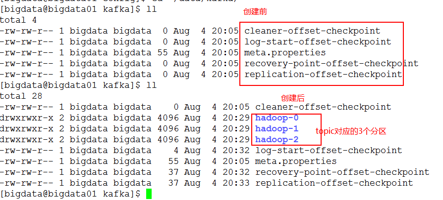

# 0. 今日大纲

- Kafka简介
- Kafka分布式集群安装
- Kafka-topic操作
- Kafka-api
- Kafka和Flume整合案例
- Kafka架构之道
- Kafka Leader Election
- Kafka高性能之道

# 1. Kafka简介

## 1.1. 消息队列

### 1.1.1. 为甚要有消息队列


### 1.1.2. 消息队列

​	消息 Message
   		网络中的两台计算机或者两个通讯设备之间传递的数据。例如说：文本、音乐、视频等内容。
​	队列 Queue
  		 一种特殊的线性表（数据元素首尾相接），特殊之处在于只允许在首部删除元素和在尾部追加元素。入队、出队。
​	消息队列 MQ
  	 消息+队列，保存消息的队列。消息的传输过程中的容器；主要提供生产、消费接口供外部调用做数据的存储和获取。

### 1.1.3. 消息队列的分类

​	<span style="color:red">MQ分类：点对点(p2p)、发布订阅(Pub/Sub)</span>

- Peer-to-Peer
    一般基于Pull或者Polling接收数据
    <span style="color:green">发送到队列中的消息被一个而且仅仅一个接收者所接受</span>，即使有多个接收者在同一个队列中侦听同一消息
    即支持异步“即发即收”的消息传递方式，也支持同步请求/应答传送方式

- 发布订阅
    <span style="color:green">发布到同一个主题的消息，可被多个订阅者所接收</span>
    发布/订阅即可基于Push消费数据，也可基于Pull或者Polling消费数据
    解耦能力比P2P模型更强

### 1.1.4. p2p和发布订阅MQ的比较

<span style="color:red">异同点</span>

- 共同点：
        消息生产者生产消息发送到queue中，然后消息消费者从queue中读取并且消费消息。
- 不同点：
    * p2p模型包括：消息队列(Queue)、发送者(Sender)、接收者(Receiver)
          <span style="color:green">一个生产者生产的消息只有一个消费者(Consumer)</span>(即一旦被消费，消息就不在消息队列中)。比如说打电话。
    * pub/Sub包含：消息队列(Queue)、主题(Topic)、发布者(Publisher)、订阅者(Subscriber)
          <span style="color:green">每个消息可以有多个消费者，彼此互不影响。</span>比如我发布一个微博：关注我的人都能够看到。

### 1.1.5. 消息系统的使用场景

- **解耦** 各系统之间通过消息系统这个统一的接口交换数据，无须了解彼此的存在

- **冗余** 部分消息系统具有消息持久化能力，可规避消息处理前丢失的风险

- **扩展** 消息系统是统一的数据接口，各系统可独立扩展

- **峰值处理能力** 消息系统可顶住峰值流量，业务系统可根据处理能力从消息系统中获取并处理对应量的请求

- **可恢复性** 系统中部分键失效并不会影响整个系统，它恢复会仍然可从消息系统中获取并处理数据

- **异步通信** 在不需要立即处理请求的场景下，可以将请求放入消息系统，合适的时候再处理

### 1.1.6. 常见的消息系统

- RabbitMQ Erlang编写，支持多协议AMQP，XMPP，SMTP，STOMP。支持负载均衡、数据持久化。同时支持Peer-to-Peer和发布/订阅模式。

- Redis 基于Key-Value对的NoSQL数据库，同时支持MQ功能，可做轻量级队列服务使用。就入队操作而言，Redis对短消息(小于10kb)的性能比RabbitMQ好，长消息性能比RabbitMQ差。

- ZeroMQ 轻量级，不需要单独的消息服务器或中间件，应用程序本身扮演该角色，Peer-to-Peer。它实质上是一个库，需要开发人员自己组合多种技术，使用复杂度高。

- ActiveMQ JMS实现，Peer-to-Peer，支持持久化、XA(分布式)事务

- Kafka/Jafka 高性能跨语言的分布式发布/订阅消息系统，数据持久化，全分布式，同时<span style="color:green">支持在线和离线处理</span>

- MetaQ/RocketMQ 纯Java实现，发布/订阅消息系统，支持本地事务和XA分布式事务

## 1.2. Kafka简介

### 1.2.1. 简介

```apl
Kafka是分布式的发布—订阅消息系统。它最初由LinkedIn(领英)公司发布，使用Scala语言编写，与2010年12月份开源，成为Apache的顶级项目。Kafka是一个高吞吐量的、持久性的、分布式发布订阅消息系统。它主要用于处理活跃Hive的数据(登录、浏览、点击、分享、喜欢等用户行为产生的数据)。
```


三大特点：

- 高吞吐量
       可以满足<span style="color:green">每秒百万级别</span>消息的生产和消费——生产消费。

- 持久性
       有一套完善的消息存储机制，确保数据的高效安全的<span style="color:green">持久化——中间存储</span>。

- 分布式
       基于分布式的扩展和容错机制；Kafka的数据都会复制到几台服务器上。当某一台故障失效时，生产者和消费者转而使用其它的机器——整体

- 健壮性。

### 1.2.2. 设计目标

- **高吞吐率** 在廉价的商用机器上单机可支持每秒100万条消息的读写

- **消息持久化** 所有消息均被持久化到磁盘，无消息丢失，支持消息重放

- **完全分布式** Producer，Broker，Consumer均支持水平扩展

- **同时适应在线流处理和离线批处理**

### 1.2.3. kafka核心的概念

<span style="color:red"> MQ组成：</span>生产、消费、消息类别、存储等等。
   对于kafka而言，kafka服务就像是一个大的水池。不断的生产、存储、消费着各种类别的消息。那么kafka由何组成呢？

> Kafka服务：

- **Topic：**主题，Kafka处理的消息的不同分类。

- **Broker**：消息服务器代理，<span style="color:green">Kafka集群中的一个kafka服务节点称为一个broker，主要存储消息数据。存在硬盘中。</span>每个topic都是有分区的。

- **Partition**：Topic物理上的分组，，<span style="color:green">一个topic在broker中被分为1个或者多个partition</span>，分区在创建topic的时候指定。

- **Message**：消息，是通信的基本单位，每个消息都属于一个partition 

    Kafka服务相关

- **Producer**：消息和数据的生产者，，<span style="color:green">向Kafka的一个topic发布消息。</span>

- **Consumer**：消息和数据的消费者，定于topic并处理其发布的消息。

- **Zookeeper**：协调kafka的正常运行。

# 2. kafka的分布式安装

## 2.1. 版本下载

​	安装包：http://archive.apache.org/dist/kafka/1.1.1/kafka_2.12-1.1.1.tgz     

   源码包：http://archive.apache.org/dist/kafka/1.1.1/kafka-1.1.1-src.tgz       

## 2.2. 安装过程

1. 解压

​	[bigdata@bigdata01 app]$  tar -zxvf ~/soft/kafka_2.11-1.1.1.tgz -C app/

2. 重命名

​	[bigdata@bigdata01 app]$ mv kafka_2.11-1.1.1/ kafka

3. 添加环境变量

​	[bigdata@bigdata01 kafka]$ vim ~/.bash_profile

```sh
export KAFKA_HOME=/home/bigdata/app/kafka
export PATH=$PATH:$KAFKA_HOME/bin
```

​	[bigdata@bigdata01 kafka]$ source ~/.bash_profile

4. 配置

​	修改$KAFKA_HOME/config/server.properties

```properties
broker.id=11 ## 当前kafka实例的id，必须为整数，一个集群中不可重复
log.dirs=/home/bigdata/data/kafka ## 生产到kafka中的数据存储的目录,目录需要手动创建
zookeeper.connect=bigdata01:2181,bigdata02:2181,bigdata03:2181/kafka ## kafka数据在zk中的存储目录
```

5. 同步到其它机器

```sh
scp -r kafka/ bigdata@bigdata02:/home/bigdata/app/
scp -r kafka/ bigdata@bigdata03:/home/bigdata/app/
```

6. 修改配置文件中的broker.id

```properties
broker.id=12 ##bigdata02
broker.id=13 ##bigdata03
```

7. 创建数据目录

```sh
mkdir -p /home/bigdata/data/kafka
```

8. 启动kafka服务

```sh
~/app/kafka/bin/kafka-server-start.sh -daemon ~/app/kafka/config/server.properties 
```


9. kafka服务测试

    

    ​	只要我们配置的kafka的服务都在zookeeper中进行了注册，便说明kafka已经安装启动成功

## 2.3. kafka在zookeeper中的目录说明

```properties
/kafka
    /cluster		
    	/id  {"version":"1","id":"Pks8sWZUT6GBJHqyVGQ5OA"}  ---》代表的是一个kafka集群包含集群的版本，和集群的id
    /controller  {"version":1,"brokerid":11,"timestamp":"1564976668049"} -->controller是kafka中非常重要的一个角色，意为控制器，控制partition的leader选举，topic的crud操作。brokerid意为由其id对应的broker承担controller的角色。
    /controller_epoch 2 代表的是controller的纪元，换句话说是代表controller的更迭，每当controller的brokerid更换一次，controller_epoch就+1.
    /brokers
       /ids	 [11, 12, 13] --->存放当前kafka的broker实例列表
       /topics	[hadoop, __consumer_offsets] ---->当前kafka中的topic列表
       /seqid	系统的序列id
    /consumers --->老版本用于存储kafka消费者的信息，主要保存对应的offset，新版本中基本不用，此时用户的消费信息，保存在一个系统的topic中：__consumer_offsets
    /config	--->存放配置信息
```

# 3. Kafka的基本操作

## 3.1. kafka的topic的操作

​		topic是kafka非常重要的核心概念，是用来存储各种类型的数据的，所以最基本的就需要学会如何在kafka中创建、修改、删除的topic，以及如何向topic生产消费数据。

​		关于topic的操作脚本：kafka-topics.sh

1. 创建topic

 ```sh
[bigdata@bigdata01 kafka]$ bin/kafka-topics.sh --create \
--topic hadoop \	## 指定要创建的topic的名称
--zookeeper bigdata01:2181,bigdata02:2181,bigdata03:2181/kafka \ ##指定kafka关联的zk地址
--partitions 3 \		##指定该topic的分区个数
--replication-factor 3	##指定副本因子
 ```

注意：指定副本因子的时候，不能大于broker实例个数，否则报错：


zookeeper目录变化

​	

kafka数据目录的变化

​	

2. 查看topic的列表

```sh
[bigdata@bigdata01 kafka]$ bin/kafka-topics.sh --list  \
--zookeeper bigdata01:2181,bigdata02:2181,bigdata03:2181/kafka
hadoop
```

3. 查看每一个topic的信息

```shell
[bigdata@bigdata01 kafka]$ bin/kafka-topics.sh --describe --topic hadoop \
--zookeeper bigdata01:2181,bigdata02:2181,bigdata03:2181/kafka

Topic:hadoop	PartitionCount:3	ReplicationFactor:3		Configs:
Topic: hadoop	Partition: 0	Leader: 12	Replicas: 12,13,11	Isr: 12,13,11
Topic: hadoop	Partition: 1	Leader: 13	Replicas: 13,11,12	Isr: 13,11,12
Topic: hadoop	Partition: 2	Leader: 11	Replicas: 11,12,13	Isr: 11,12,13

Partition:	当前topic对应的分区编号
Replicas :  副本因子，当前kafka对应的partition所在的broker实例的broker.id的列表
Leader	 :  该partition的所有副本中的leader领导者，处理所有kafka该partition读写请求
ISR		 :  该partition的存活的副本对应的broker实例的broker.id的列表
```

4. 修改一个topic

```sh
[bigdata@bigdata01 kafka]$ bin/kafka-topics.sh --alter --topic hadoop --partitions 4 --zookeeper bigdata01:2181/kafka
WARNING: If partitions are increased for a topic that has a key, the partition logic or ordering of the messages will be affected
Adding partitions succeeded!
```

但是注意：partition个数，只能增加，不能减少：


5. 删除一个topic


6. 生产数据

```sh
[bigdata@bigdata01 kafka]$ bin/kafka-console-producer.sh \
--topic hadoop \	-->指定数据被生产的topic
--broker-list bigdata01:9092,bigdata02:9092,bigdata03:9092 --->指定kafka的broker列表
```


7. 消费数据

```sh
[bigdata@bigdata03 kafka]$ bin/kafka-console-consumer.sh \
--topic hadoop \
--bootstrap-server bigdata01:9092,bigdata02:9092,bigdata03:9092
```


没数据，原因在于消费者后于生产者启动，在消费者启动之前生产者消费的数据变不能直接获取。

如果想要获取消费者启动之前生产者生产的数据，可以添加一个参数--from-beginning。

如图所示：


## 3.2. Kafka的数据消费的总结

​		kafka消费者在消费数据的时候，都是分组别的。不同组的消费不受影响，相同组内的消费，需要注意，如果partition有3个，消费者有3个，那么便是每一个消费者消费其中一个partition对应的数据；如果有2个消费者，此时一个消费者消费其中一个partition数据，另一个消费者消费2个partition的数据。如果有超过3个的消费者，同一时间只能最多有3个消费者能消费得到数据。


```sh
 bin/kafka-console-consumer.sh --topic spark \
 --bootstrap-server bigdata01:9092,bigdata02:9092,bigdata03:9092 \
 --group haha \		---》消费者对应的消费者组
 --offset earliest \		--->从什么位置(消息的偏移量)开始消费
 --partition 2		---->消费哪一个分区中的数据	
```

> offset：是kafka的topic中的partition中的每一条消息的标识，如何区分该条消息在kafka对应的partition的位置，就是用该偏移量。offset的数据类型是Long，8个字节长度。offset在分区内是有序的，分区间是不一定有序。如果想要kafka中的数据全局有序，就只能让partition个数为1。

​		

​	在组内，kafka的topic的partition个数，代表了kafka的topic的并行度，同一时间最多可以有多个线程来消费topic的数据，所以如果要想提高kafka的topic的消费能力，应该增大partition的个数。

## 3.3. kafka的编程的api

### 3.3.1. 创建kafka的项目


指定maven坐标


指定存放目录


导入maven依赖

```xml
  <!-- https://mvnrepository.com/artifact/org.apache.kafka/kafka-clients -->
<dependency>
    <groupId>org.apache.kafka</groupId>
    <artifactId>kafka-clients</artifactId>
    <version>1.1.1</version>
</dependency>
<!-- 下面的依赖，包含了上面的kafka-clients，所以只需要引入下面即可 -->
<dependency>
    <groupId>org.apache.kafka</groupId>
    <artifactId>kafka_2.11</artifactId>
    <version>1.1.1</version>
</dependency>
```

### 3.3.2. kafka生产者的api操作

​		<span style="color:red">入口类：Producer</span>

- 入门案例

```java
public class MyKafkaProducer {
    public static void main(String[] args) throws IOException {
        /*
            K: --->代表的是向topic中发送的每一条消息的key的类型，key可以为null
            V: --->代表的是向topic中发送的每一条消息的value的类型
         */
        Properties properties = new Properties();
//        properties.put("bootstrap.servers", "bigdata01:9092,bigdata02:9092,bigdata03:9092");
        properties.load(MyKafkaProducer.class.getClassLoader().getResourceAsStream("producer.properties"));
        Producer<Integer, String> producer = new KafkaProducer<Integer, String>(properties);

        //发送数据
        ProducerRecord<Integer, String> record = new ProducerRecord("spark", "11111");
        producer.send(record);
        producer.close();
    }
}
```

配置：

```properties
bootstrap.servers=bigdata01:9092,bigdata02:9092,bigdata03:9092
key.serializer=org.apache.kafka.common.serialization.IntegerSerializer
value.serializer=org.apache.kafka.common.serialization.StringSerializer
```

- 创建producer时需要指定的配置信息

```properties
bootstrap.servers=bigdata01:9092,bigdata02:9092,bigdata03:9092 ## kafka的服务器
key.serializer=org.apache.kafka.common.serialization.IntegerSerializer ##Key的序列化器
value.serializer=org.apache.kafka.common.serialization.StringSerializer ##value的序列化器
acks=[0|-1|1|all] ##消息确认机制
	0:	不做确认，直管发送消息即可
	-1|all: 不仅leader需要将数据写入本地磁盘，并确认，还需要同步的等待其它followers进行确认
	1:只需要leader进行消息确认即可，后期follower可以从leader进行同步
batch.size=1024 #每个分区内的用户缓存未发送record记录的空间大小
## 如果缓存区中的数据，没有沾满，也就是任然有未用的空间，那么也会将请求发送出去，为了减少请求次数，我们可以配置linger.ms大于0，
linger.ms=10 ## 不管缓冲区是否被占满，延迟10ms发送request
buffer.memory=10240 #控制的是一个producer中的所有的缓存空间
retries=0 #发送消息失败之后的重试次数
```

- 修改配置查看生产数据情况

配置文件

```properties
bootstrap.servers=bigdata01:9092,bigdata02:9092,bigdata03:9092

# specify the compression codec for all data generated: none, gzip, snappy, lz4
compression.type=none

# name of the partitioner class for partitioning events; default partition spreads data randomly
# 输入进入分区的方式
#partitioner.class=

# the maximum amount of time the client will wait for the response of a request
# 请求超时时间
#request.timeout.ms=

# how long `KafkaProducer.send` and `KafkaProducer.partitionsFor` will block for
# 使用send方法最大消息阻塞时间
#max.block.ms=

# the producer will wait for up to the given delay to allow other records to be sent so that the sends can be batched together
linger.ms=5000

# the maximum size of a request in bytes
## 最大的请求大小
#max.request.size=

# the default batch size in bytes when batching multiple records sent to a partition
batch.size=1024

buffer.memory=10240
key.serializer=org.apache.kafka.common.serialization.IntegerSerializer
value.serializer=org.apache.kafka.common.serialization.StringSerializer
```

代码

```java
public class MyKafkaProducer {
    public static void main(String[] args) throws Exception {
        /*
            K: --->代表的是向topic中发送的每一条消息的key的类型，key可以为null
            V: --->代表的是向topic中发送的每一条消息的value的类型
         */
        Properties properties = new Properties();
//        properties.put("bootstrap.servers", "bigdata01:9092,bigdata02:9092,bigdata03:9092");
        properties.load(MyKafkaProducer.class.getClassLoader().getResourceAsStream("producer.properties"));
        Producer<Integer, String> producer = new KafkaProducer<Integer, String>(properties);

        int start = 10;
        int end = start + 10;
        for (int i = start; i < end; i++) {
            //发送数据
            ProducerRecord<Integer, String> record = new ProducerRecord("spark", i,"11111");
            producer.send(record);
        }
        Thread.sleep(10000);
        producer.close();
    }
}
```

看到的现象

​	延迟等待了5秒之后一次性将数据发送到cluster。

### 3.3.3. kafka消费者的api操作

<span style="color:red">入口类：Consumer</span>

配置文件

```properties
bootstrap.servers=bigdata01:9092,bigdata02:9092,bigdata03:9092

# consumer group id
group.id=test-consumer-group

# What to do when there is no initial offset in Kafka or if the current
# offset does not exist any more on the server: latest, earliest, none
auto.offset.reset=earliest
key.deserializer=org.apache.kafka.common.serialization.IntegerDeserializer
value.deserializer=org.apache.kafka.common.serialization.StringDeserializer
```

执行代码

```java
public class MyKafkaConsumer {
    public static void main(String[] args) throws Exception {
        //消费者
        Properties properties = new Properties();
        properties.load(MyKafkaConsumer.class.getClassLoader().getResourceAsStream("consumer.properties"));
        Consumer<Integer, String> consumer = new KafkaConsumer<Integer, String>(properties);

        //订阅topic
        consumer.subscribe(Arrays.asList("spark"));

        //从kafka对应的topic中拉取数据

        while (true) {
            ConsumerRecords<Integer, String> consumerRecords = consumer.poll(1000);
            for (ConsumerRecord<Integer, String> record : consumerRecords) {
                Integer key = record.key();
                String value = record.value();

                int partition = record.partition();
                long offset = record.offset();
                String topic = record.topic();
                System.out.println(String.format("topic:%s\tpartition:%d\toffset:%d\tkey:%d\tvalue:%s",
                        topic,
                        partition,
                        offset,
                        key,
                        value)
                );
            }
        }
    }
}
```

### 3.3.4. record进入分区的策略

​		每一条producerRecord有，topic名称、可选的partition分区编号，以及一对可选的key和value组成。

​		三种策略进入分区

> ```html
> <p>
>     If a valid partition number is specified that partition will be used when sending the record. If no partition is* specified but a key is present a partition will be chosen using a hash of the key. If neither key nor partition is* present a partition will be assigned in a round-robin fashion.
> </p>
> ```

> 1、如果指定的partition，那么直接进入该partition
>
> 2、如果没有指定partition，但是指定了key，使用key的hash选择partition
>
> 3、如果既没有指定partition，也没有指定key，使用轮询的方式进入partition

### 3.3.5. 自定义分区

- 核心类

    ```java
    public interface Partitioner extends Configurable, Closeable {
    
        /**
         * Compute the partition for the given record.
         *	计算给定记录的分区
         * @param topic The topic name
         * @param key The key to partition on (or null if no key)
         * @param keyBytes key序列之后的字节数组的形式
         * @param value The value to partition on or null
         * @param valueBytes value序列之后的字节数组的形式
         * @param cluster The current cluster metadata 当前cluster的元数据信息
         */
        public int partition(String topic, Object key, byte[] keyBytes, Object value, byte[] valueBytes, Cluster cluster);
        /**
         * This is called when partitioner is closed.
         	分区结束之后被调用
         */
        public void close(); 
    }
    ```

    ```java
    public interface Configurable {
    
        /**
         * Configure this class with the given key-value pairs
         	指定当前producer的配置信息
         */
        void configure(Map<String, ?> configs);
    
    }
    ```

- 随机分区方式

    ```java
    public class RandomPartitioner implements Partitioner {
    
        public void close() {
        }
    
        public void configure(Map<String, ?> configs) {
        }
        private Random random = new Random();
        public int partition(String topic, Object key, byte[] keyBytes, Object value, byte[] valueBytes, Cluster cluster) {
            Integer partitionCount = cluster.partitionCountForTopic(topic);//返回当前topic的partition个数
            int partition = random.nextInt(partitionCount);
            System.out.println("partition: " + partition);
            return partition;
        }
    }
    ```

    <span style="color:red">注册使用</span>

    ```properties
    partitioner.class=com.desheng.bigdata.kafka.partitioner.RandomPartitioner
    ```

- hash分区方式

    ```java
    public class HashPartitioner implements Partitioner {
        public void close() {
        }
    
        public void configure(Map<String, ?> configs) {
        }
    
        public int partition(String topic, Object key, byte[] keyBytes, Object value, byte[] valueBytes, Cluster cluster) {
            Integer partCount = cluster.partitionCountForTopic(topic);
            int partition = Math.abs(key.hashCode()) % partCount;
            System.out.println("key: " + key + "partition: " + partition);
            return partition;
        }
    }
    ```

    <span style="color:red">注册使用</span>

    ```properties
    partitioner.class=com.desheng.bigdata.kafka.partitioner.HashPartitioner
    ```

- 轮询分区方式

    ```java
    public class RoundRobinPartitioner implements Partitioner {
    
        public void close() {
        }
    
        public void configure(Map<String, ?> configs) {
        }
        //定义一个原子计数器
        private AtomicInteger count = new AtomicInteger();
        
        public int partition(String topic, Object key, byte[] keyBytes, Object value, byte[] valueBytes, Cluster cluster) {
            int parCount = cluster.partitionCountForTopic(topic);
            int partition = count.getAndIncrement() % parCount;
            System.out.println("key: " + key + "\tpartition: " + partition);
            return partition;
        }
    }
    ```

    注册使用

    ```properties
    partitioner.class=com.desheng.bigdata.kafka.partitioner.RoundRobinPartitioner
    ```

# 4. flume和kafka的整合

<span style="color:red">flume主要是做日志数据（离线或实时）地采集。</span>


上图，显示的是flume采集完毕数据之后，进行的离线处理和实时处理两条业务线，现在再来学习flume和kafka的整合处理。

- 创建整合的topic

  ```sh
  [bigdata@bigdata01 kafka]$ bin/kafka-topics.sh --create \
  --topic flume-kafka \
  --zookeeper bigdata01:2181,bigdata02:2181,bigdata03:2181/kafka \
  --partitions 3 \
  --replication-factor 3
  Created topic "flume-kafka".
  ```

- 调整flume-agent配置文件

flume-kafka-sink-1903.conf

```properties
##a1就是flume agent的名称
## source r1
## channel c1
## sink k1
a1.sources = r1
a1.sinks = k1
a1.channels = c1

# Describe/configure the source
a1.sources.r1.type = netcat
a1.sources.r1.bind = bigdata01
a1.sources.r1.port = 44444

# 修改sink为kafka
a1.sinks.k1.type = org.apache.flume.sink.kafka.KafkaSink
a1.sinks.k1.kafka.bootstrap.servers = bigdata01:9092,bigdata02:9092,bigdata03:9092
a1.sinks.k1.kafka.topic = flume-kafka
a1.sinks.k1.kafka.producer.acks = 1
a1.sinks.k1.kafka.producer.linger.ms = 1

# Use a channel which buffers events in memory
a1.channels.c1.type = memory
a1.channels.c1.capacity = 1000
a1.channels.c1.transactionCapacity = 100

# Bind the source and sink to the channel
a1.sources.r1.channels = c1
a1.sinks.k1.channel = c1
```

- 启动flume和kafka的整合测试

  1. 消费者监听读取的数据

  ```sh
  [bigdata@bigdata03 kafka]$ bin/kafka-console-consumer.sh --topic flume-kafka \
  --bootstrap-server bigdata01:9092,bigdata02:9092,bigdata03:9092 \
  --from-beginning
  ```

  2. 启动flume-agent

  ```sh
  [bigdata@bigdata01 bin]$
  [hadoop@hadoop01 apache-flume-1.8.0-bin]$ ./flume-ng agent --conf conf --conf-file /home/hadoop/apps/apache-flume-1.8.0-bin/flume_conf/flume-kafka-sink-1903.conf  --name a1
  ```

  ​	3. 发送数据

  


  ​	
  ​		4. 接收数据


# 5. Kafka架构之道

## 5.1. Kafka基本架构


​	补充说明：

​		其一：Kafka中的broker对于调用者而言都是透明的，也就是说各个broker的地位都是一样的，但是在kafka内部有区分，主要就是controller和非controller之分，controller的角色我们可以在zookeeper的对应目录/kafka/controller中获取对应的brokerid。

​		其二：在kafka1.0以下的版本中使用zk来保存kafka消费者的offset（目录为/kafka/consumers/**）,但是在kafka1.0以上，不再使用zookeeper来保存，主要原因在于，避免zookeeper负载过高，造成相关联的框架无法使用，此时在kafka提供了一个系统级别的topic：__consumer_offsets来保存偏移量信息。

## 5.2. Topic & Partition 

- Topic

  逻辑概念，同一个Topic的消息可分布在一个或多个节点(Broker)上
  一个Topic包含一个或者多个Partition
  每条信息都属于且仅属于一个Topic
  Producer发布数据是，必须制定该消息发布到哪一个Topic
  Consumer订阅消息时，也必须制定订阅哪个Topic的消息

  

- Partition

  物理概念，一个Partition只分布在一个Broker上（不考虑备份）
  一个partition物理上对应一个文件夹
  一个Partition包含多个Segment（Segment对用户透明）
  一个Segment对应一个文件,Segment由一个个不可变记录组成
  记录只会被append到Segment中，不会被单独删除或者修改
  清除过期日志时，直接删除一个或多个Segment
  segment文件（log文件)文件名规范： 这个文件里面第一条消息的offset - 1

  

## 5.3. Kafka消息flush和Retention策略

- flush策略

  ```properties
  ############################# Log Flush Policy #############################
  # Messages are immediately written to the filesystem but by default we only fsync() to sync
  # the OS cache lazily. The following configurations control the flush of data to disk.
  # There are a few important trade-offs here:
  #    1. Durability: Unflushed data may be lost if you are not using replication.
  #    2. Latency: Very large flush intervals may lead to latency spikes when the flush does occur as there will be a lot of data to flush.
  #    3. Throughput: The flush is generally the most expensive operation, and a small flush interval may lead to excessive seeks.
  # The settings below allow one to configure the flush policy to flush data after a period of time or
  # every N messages (or both). This can be done globally and overridden on a per-topic basis.
  
  # The number of messages to accept before forcing a flush of data to disk
  ## 每当每一个topic接收到10000条message的时候，就会将数据flush到磁盘
  log.flush.interval.messages=10000
  
  # The maximum amount of time a message can sit in a log before we force a flush
  #每个1s flush一次数据
  log.flush.interval.ms=1000
  ```

  ​		为了提供kafka的读写数据能力，首先接收数据到kafka内存，不可能无限制的保存在内存，所以必然会将数据flush到磁盘(partition的segement)文件，在flush的时候做了Durability和Latency和Throughput的权衡与取舍。

- retention策略

  ```properties
  ############################# Log Retention Policy #############################
  # The following configurations control the disposal of log segments. The policy can
  # be set to delete segments after a period of time, or after a given size has accumulated.
  # A segment will be deleted whenever *either* of these criteria are met. Deletion always happens
  # from the end of the log.
  
  # The minimum age of a log file to be eligible for deletion due to age
  # 日志最小的保留时间：7天，超过这个时间，数据可能会被清理掉
  log.retention.hours=168
  
  # A size-based retention policy for logs. Segments are pruned(裁剪) from the log unless the remaining
  # segments drop below log.retention.bytes. Functions independently of log.retention.hours.
  ## segement文件如果超过log.retention.bytes的配置，将会可能被裁剪，直到小于log.retention.bytes配置
  #log.retention.bytes=1073741824
  
  # The maximum size of a log segment file. When this size is reached a new log segment will be created.
  # 一个segment文件最大的大小，超过log.segment.bytes一个G，将会创建一个新的segment文件
  log.segment.bytes=1073741824
  
  # The interval at which log segments are checked to see if they can be deleted according
  # to the retention policies
  ## 每隔5分钟，检测一次retention策略是否达到
  log.retention.check.interval.ms=300000
  ```

  ​		partition对应的文件，就保存在一个个的segment文件中，每一个文件默认大小是1G，但是log.retention.check.interval.ms监测频率是5分钟一次，所以segment文件可能会超过1G，此时就会启动retion策略，将文件裁剪到log.retention.bytes配置，如果超过了log.segment.bytes=1G配置，将会创建一个新的segment文件；默认情况，segment文件会保留7天。

## 5.4. Kafka消息检索原理

- message的物理结构


- .index文件和.log文件说明

  partition分区目录下的文件列表，主要包含两种类型的文件 x.index索引文件和x.log segment文件，其中x.log保存的是message信息，x.index保存的是索引数据。


​	这二者文件的大致结果如下：


> 为什么会出现消息offset和文件中的偏移量不一样的问题？
>
> 因为一个partition下面有多个segment文件，segment文件当达到retention策略之后将会被裁剪或删除，同时partition中的offset是单调递增的，从0开始增加，但是segment文件中的消息在该文件中的偏移量指的是文件开头到该文件走过的字节长度，显然这两个不一样。

​		所以，直接根据msg的offset是无法直接读取到消息的，那怎么办？所以此时就需要俺们的x.index中保存的相对偏移量来帮忙了。

​		x.index中保存的内容：

​	a. index文件的序号就是message在日志文件中的相对偏移量
​	b. OffsetIndex是稀疏索引，也就是说不会存储所有的消息的相对offset和position

​	也就是说index文件的序号对应的是log文件中的消息偏移量；index文件中的地址栏对应的是log文件中文件中的便宜字节。

- 通过命令查看segment文件内容

  	这些信息都是可以通过kafka的命令来查看的。

```sh
kafka-run-class.sh kafka.tools.DumpLogSegments \
--print-data-log \		--->打印读取到的segment日志文件内容
--files 00000000000000000000.log	--->指定读取的segment日志文件
```

读取到的数据格式如下：


其中的offset是该条message在该partition中的偏移量，position为该条消息在该文件中的字节偏移量。

- 消息检索过程

  以这个partition目录下面，00000000001560140916为例
  定位offset 为1560140921的message

1. 定位到具体的segment日志文件
       由于log日志文件的文件名是这个文件中第一条消息的(offset-1). 因此可以根据offset定位到这个消息所在日志文件：00000000001560140916.log

2. 计算查找的offset在日志文件的相对偏移量
       segment文件中第一条消息的offset = 1560140917
       计算message相对偏移量：需要定位的offset - segment文件中第一条消息的offset + 1 = 1560140921 - 1560140917 + 1 = 5
       查找index索引文件， 可以定位到该消息在日志文件中的偏移字节为456. 综上， 直接读取文件夹00000000001560140916.log中偏移456字节的数据即可。
    1560140922 -1560140917 + 1 = 6
       如果查找的offset在日志文件的相对偏移量在index索引文件不存在， 可根据其在index索引文件最接近的上限偏移量，往下顺序查找

# 6. Kafka Leader Election

## 6.0. zookeeper基本复习

- zookeeper简介&分布式事务

  	ZooKeeper是一个高性能分布式应用协调服务，本质上就是一个分布式文件系统。


​	主要的作用：Name Service 配置管理、Leader Election 服务发现、Group Service 组服务、分布式队列、两阶段提交。

​	这里提到了一个两段式提交（two-phase-commit）,又名分布式事务。分布式事务是相对于集中式事务而言，集中式事务非常简单，事务的开启，事务的提交都在一台机器上面完成；下面来看分布式事务：


- zookeeper工作的方式

  Zookeeper集群包含1个Leader，多个Follower
  所有的Follower都可提供读服务
  所有的写操作都会被forward到Leader
  Client与Server通过NIO通信
  全局串行化所有的写操作
  保证同一客户端的指令被FIFO执行
  保证消息通知的FIFO


## 6.1. zookeeper zab协议

​		zab（zookeeper atomic boradcast）协议被称之为zookeeper原子广播协议，zab协议保证所有的zookeeper的读写操作的正常执行。

​		zab协议有两种模式：广播模式（正常情况）和恢复模式(非正常情况)

- 广播模式


> 1. Leader将所有更新(称之为proposal)，顺序发送给Follower
>
> 2. 当Leader收到半数以上的Follower对此proposal的ACK是，即向所有的Follower发送commit消息，并在本地commit该消息
>
> 3. Follower收到Proposal后即将该Proposal写入磁盘，写入成功即返回ACK给Leader
>
> 4. 每个Proposal都有一个唯一的单调递增的proposal ID，即zxid

说明：

1、查询和维护管理员命令之包含1和6，即不会和Leader打交道，响应是及时响应。
2、Create、Delete、SetACL、SetData、CreateSession、CloseSession等命令要经过上图的六个过程。
3、Client与Follower之间采用NIO通信，Leader与Follower之间采用的是TCP/IP模式。

- 恢复模式

> - 进入恢复模式 当Leader宕机或者丢失大多数Follower后，即进入恢复模式
>
> - 结束恢复模式 新领导被选举出来，且大多数Follower完成了与Leader的状态同步后，恢复模式即结束，从而进入广播模式
>
> - 恢复模式的意义 
>
>   1. 发现集群中被commit的proposal的最大zxid
>
>   2. 建立新的epoch，从而保证之前的Leader不能再commit新的Proposal
>
>   3. 集群中大部分节点都commit过前一个Leader commit过的消息，而新的Leader是被大部分节点所支持的，所以被之前Leader commit过的Proposal不会丢失，至少被一个节点所保存
>
>   4. 新Leader会与所有Follower通信，从而保证大部分节点都拥有最新的数据

zxid的构成


​		由两部分组成，高32位为epoch纪元，每当leader发生一次变换，epoch+1；低32位为counter计数器，每当数据被更新一次，counter+1。

​	- 恢复模式中的保证阶段

1. 若一条消息在一台机器上被deliver，那么该消息必须将在每台机器上deliver，及时那台机器故障了

2. 一个被skip的消息，必须仍然需要被skip


- zookeeper的一致性

  学习cap定义：http://www.ruanyifeng.com/blog/2018/07/cap.html

  **顺序一致性** 从一个客户端发出的更新操作会按发送顺序被顺序执行
  **原子性** 更新操作要么成功要么失败，无中间状态
  **单一系统镜像** 一个客户端只会看到同一个view，无论它连到哪台服务器
  **可靠性** 
  	一旦一个更新被应用，该更新将被持久化，直到客户端更新该结果
  	如果一个客户端得到更新成功的状态码，则该更新一定已经生效
  	任何一个被客户端通过读或者更新“看到”的结果，将不会被回滚，即使是从失败中恢复
  **实时性** 保证客户端可在一定时间(通常是几十秒)内看到最新的视图

- zookeeper在使用过程需要注意的问题

  只保证同一客户端的单一系统镜像，并不保证多个不同客户端在同一时刻一定看到同一系统镜像，如果要实现这种效果，需要在读取数据之前调用sync操作。
  zookeeper读性能好于写性能，因为任何Server均可提供读服务，而只有Leader可提供写服务
  为了保证ZooKeeper本身的Leader Election顺利进行，通常将Server设置为奇数
  若需容忍f个Server的失败，必须保证有2f+1个以上的Server

## 6.2. zookeeper的基本操作

### 6.2.1. zookeeper原生操作


```java
public class ZooKeeperTest1 {
    static ZooKeeper zooKeeper = null;
    public static void main(String[] args) throws Exception {
        String connectString = "bigdata01:2181,bigdata02:2181,bigdata03:2181";
        int sessionTimeout = 6000;

        Watcher watcher = new Watcher() {
            //一旦监听到对应目录的变化，该方法将会被触发
            public void process(WatchedEvent event) {
                String path = event.getPath();
                switch (event.getType().getIntValue()) {
                    case 1 ://NodeCreated
                        System.out.println("节点被创建");
                    break;
                    case 2 ://NodeDeleted
                        System.out.println("节点被删除");
                    break;
                    case 3 ://NodeDataChanged
                        System.out.println("节点数据被更新");
                    break;
                    case 4 ://NodeChildrenChanged
                        System.out.println("子节点被更新");
                    break;
                    default:
                        break;
                }
                System.out.println("path: " + path);
            }
        };
        zooKeeper = new ZooKeeper(connectString, sessionTimeout, watcher);
        zooKeeper.register(watcher);
        String path = "/test/seq";
        zooKeeper.create(path, "seq".getBytes(), ZooDefs.Ids.OPEN_ACL_UNSAFE, CreateMode.PERSISTENT_SEQUENTIAL);
        Thread.sleep(10000);
        zooKeeper.close();
    }
}
```

### 6.2.2. zookeeper的客户端框架——curator

- 简介

  网址：http://curator.apache.org


- maven依赖

```xml
<!-- curator -->
<dependency>
    <groupId>org.apache.curator</groupId>
    <artifactId>curator-framework</artifactId>
    <version>2.6.0</version>
</dependency>
<dependency>
    <groupId>org.apache.curator</groupId>
    <artifactId>curator-client</artifactId>
    <version>2.6.0</version>
</dependency>
```

- 基本操作——CRUD

```java
public class CuratorFrameworkTest {
    public static void main(String[] args) throws Exception {
        CuratorFramework client = CuratorFrameworkFactory.builder()
                                          .connectString("bigdata01:2181,bigdata02:2181,bigdata03:2181")
                                          .retryPolicy(new ExponentialBackoffRetry(1000, 3))
                                          .build();
        //使用之前必须要start
        client.start();

        //c
        String path = client.create()
                              .creatingParentsIfNeeded()//如是多级目录需要创建，会进行多级目录递归创建
                              .withMode(CreateMode.PERSISTENT_SEQUENTIAL)
                              .forPath("/zk/one", "one".getBytes());
        System.out.println("path: " + path);
        // 查询
        List<String> children = client.getChildren().forPath("/zk");
        for(String child : children) {
            System.out.println(child);
        }
        // 获取数据
        byte[] bytes = client.getData().forPath("/zk/one");
        System.out.println("/zk/one对应的数据：" + new String(bytes));
        //删除
        client.delete()
                .deletingChildrenIfNeeded()//递归删除
                .forPath("/zk/one");
        client.close();
    }
}
```

- curator完成服务的监听

```java
/**
 * 使用curatorFramework来完成服务的发现
 *  既然要进行服务的发现，所以就需要一个监听器watcher
 *  监听/zk目录
 */
public class CuratorServiceDiscover implements Watcher {
    private String path = "/zk";
    private CuratorFramework client;
    private List<String> children;
    public CuratorServiceDiscover() {
        try {
            client = CuratorFrameworkFactory.builder()
                                  .connectString("bigdata01:2181,bigdata02:2181,bigdata03:2181")
                                  .retryPolicy(new ExponentialBackoffRetry(1000, 3))
                                  .build();
            //使用之前必须要start
            client.start();
            //注册监听的服务
            children = client.getChildren().usingWatcher(this).forPath(path);
            System.out.println("初始监听目录节点信息：" + children);
        } catch (Exception e) {
            e.printStackTrace();
        }
    }

    @Override
    public void process(WatchedEvent event) {
        try {
            System.out.println("当前方法会被调用-----");
            //要想以后反复的监听对应的目录，就需要重新注册监听服务
            List<String> newChildren = client.getChildren().usingWatcher(this).forPath(path);
            if(newChildren.size() > children.size()) {//新增 a b | a b c
                for(String child : newChildren) {
                    if(!children.contains(child)) {
                        System.out.println("新增节点：" + child);
                    }
                }
            } else {//减少
                for(String child : children) {
                    if(!newChildren.contains(child)) {
                        System.out.println("被删除的节点：" + child);
                        MailUtil.sendMail("大写的警告！！！", "相关服务器宕机啦！！！！" + child);
                    }
                }
            }
            children = newChildren;//更新数据
        } catch (Exception e) {
            e.printStackTrace();
        }
    }


    public static void main(String[] args) {
        CuratorServiceDiscover csd = new CuratorServiceDiscover();
        csd.start();//执行服务的发现
    }

    private void start() {
        for(;;){}
    }
}
```

- 发送邮件相关

  依赖

  ```xml
  <dependency>
      <groupId>javax.mail</groupId>
      <artifactId>mail</artifactId>
      <version>1.4</version>
  </dependency>
  ```

  工具类

```java
public class MailUtil {
    public static void sendMail(String subject, String content) {
        Transport t = null;
        Session session = null;
        try {
            // 会话需要的相关信息
            Properties prop = new Properties();
            prop.setProperty("mail.transport.protocol", "smtp");// 发送邮件的协议
            prop.setProperty("mail.smtp.host", "smtp.126.com");// 使用的邮箱服务器
            prop.setProperty("mail.smtp.auth", "true");
            session = Session.getInstance(prop);

            // 创建邮件
            MimeMessage message = new MimeMessage(session);
            InternetAddress fromAddr = new InternetAddress("xxx", "老李");// 发件人的信息
            InternetAddress toAddr = new InternetAddress("xxx", "小美");// 收件人的信息
            message.setFrom(fromAddr);// 在信封上写上
            message.setRecipient(Message.RecipientType.TO, toAddr);

            message.setSubject(subject);
            message.setContent(content, "text/html;charset=UTF-8");

            // 发送邮件
            t = session.getTransport();
            t.connect("xxx", "abc123");//这里登陆的时候最好使用126邮箱经过认证之后的密码
            t.sendMessage(message, message.getAllRecipients());
        }catch (Exception e) {
            e.printStackTrace();
        }finally {
            try {
                if(t != null) {
                    t.close();
                }
            } catch (MessagingException e) {
                e.printStackTrace();
            }
        }
    }
}
```

## 6.3. zookeeper的leader选举策略

### 6.3.1. 原生zookeeper的leader的选举策略

- 非公平模式

是一个抢注Leader节点的操作

1. 创建Leader父节点，如/chroot，并将期设置为persist节点

2. 各客户端通过在/chroot下创建Leader节点，如/chroot/leader，来竞争Leader。该节点应被设置为ephemeral

3. 若某创建Leader节点成功，则该客户端成功竞选为Leader

4. 若创建Leader节点失败，则竞选Leader失败，在/chroot/leader节点上注册exist的watch，一旦该节点被删除则获得通知

5. Leader可通过删除Leader节点来放弃Leader

6. 如果Leader宕机，由于Leader节点被设置为ephemeral，Leader节点会自行删除。而其它节点由于在Leader节点上注册了watch，故可得到通知，参与下一轮竞选，从而保证总有客户端以Leader角色工作

- 公平模式

按照先来后到的数据进行leader选举

1. 创建Leader父节点，如/chroot，并将其设置为persist节点

2. 各客户端通过在/chroot下创建Leader节点，如/chroot/leader，来竞争Leader。该节点应被设置为ephemeral_sequential

3. 客户端通过getChildren方法获取/chroot/下所有子节点，如果其注册的节点的id在所有子节点中最小，则当前客户端竞选Leader成功

4. 否则，在前面一个节点上注册watch，一旦前者被删除，则它得到通知，返回step 3（并不能直接认为自己成为新Leader，因为可能前面的节点只是宕机了）

5. Leader节点可通过自行删除自己创建的节点以放弃Leader

### 6.3.2. curator的leader的选举策略

 - maven依赖

   ```xml
   <dependency>
       <groupId>org.apache.curator</groupId>
       <artifactId>curator-recipes</artifactId>
       <version>2.6.0</version>
   </dependency>
   ```

- latch

  spark中zookeeper的操作使用的curator，完成leader选举是基于leaderLatch的方式进行选举。

  1. 竞选为Leader后，不可自行放弃领导权(leadership)

  2. 只能通过close方法放弃领导权

  3. 强烈建议增加ConnectionStateListener，当连接SUSPENDED或者LOST时视为丢失领导权

  4. 可通过await方法等待成功获取领导权，并可加入timeout

  5. 可通过hasLeadership方法判断是否为Leader

  6. 可通过getLeader方法获取当前Leader

  7. 可通过getParticipants方法获取当前竞选Leader的参与方

  代码实现过程：

  ```scala
  import org.apache.curator.RetryPolicy;
  import org.apache.curator.framework.CuratorFramework;
  import org.apache.curator.framework.CuratorFrameworkFactory;
  import org.apache.curator.framework.recipes.leader.LeaderLatch;
  import org.apache.curator.framework.recipes.leader.LeaderLatchListener;
  import org.apache.curator.retry.ExponentialBackoffRetry;
  
  public class LeaderLatchDemo {
      public static void main(String[] args) throws Exception {
          RetryPolicy retryPolicy = new ExponentialBackoffRetry(1000, 5);
          CuratorFramework curator = CuratorFrameworkFactory.newClient("bigdata01:2181", retryPolicy);
  
  
          LeaderLatch leaderLatch = new LeaderLatch(curator, "/leaderlatch", "participant1");
          leaderLatch.addListener(new LeaderLatchListener() {
              @Override
              public void isLeader() {
                  System.out.println("I'm the leader now");
              }
  
              @Override
              public void notLeader() {
                  System.out.println("I relinquish the leadership");
              }
          });
          curator.start();
          leaderLatch.start();
          leaderLatch.await();
          System.out.println("Is leader " + leaderLatch.hasLeadership());
          System.in.read();
          System.out.println("After delete node, Is leader " + leaderLatch.hasLeadership());
          System.in.read();
          System.out.println("After delete node, Is leader " + leaderLatch.hasLeadership());
          System.in.read();
          System.out.println("After reelect node, Is leader " + leaderLatch.hasLeadership());
          leaderLatch.close();
          System.in.read();
          System.out.println("After close, Is leader " + leaderLatch.hasLeadership());
          curator.close();
          Thread.sleep(100000);
      }
  }
  ```

  通过代码，我们可以看到，leaderLatch的方式在zk的相关目录下面创建的顺序的临时节点ephemeral_sequential,最先创建则为leader，当leader挂掉之后，后序节点通过zk的公平模式选举。

- selector

  1. 竞选Leader成功后回调takeLeadership方法

  2. 可在takeLeadership方法中实现业务逻辑

  3. 一旦takeLeadership方法返回，即视为放弃领导权

  4. 可通过autoRequeue方法循环获取领导权

  5. 可通过hasLeadership方法判断是否为Leader

  6. 可通过getLeader方法获取当前Leader

  7. 可通过getParticipants方法获取当前竞选Leader的参与方

代码实现过程：

```scala
import org.apache.curator.RetryPolicy;
import org.apache.curator.framework.CuratorFramework;
import org.apache.curator.framework.CuratorFrameworkFactory;
import org.apache.curator.framework.recipes.leader.LeaderSelector;
import org.apache.curator.framework.recipes.leader.LeaderSelectorListenerAdapter;
import org.apache.curator.retry.ExponentialBackoffRetry;

public class LeaderSelectorDemo {
    public static void main(String[] args) throws Exception {
        RetryPolicy retryPolicy = new ExponentialBackoffRetry(1000, 5);
        CuratorFramework curator = CuratorFrameworkFactory.newClient("bigdata01:2181", retryPolicy);

        LeaderSelector leaderSelector = new LeaderSelector(curator, "/leaderselector",
                new CustomizedAdapter());
        leaderSelector.autoRequeue();//循环获取leader的领导权
        curator.start();
        leaderSelector.start();//通过start方法发起leader竞争，竞争成功之后调用takeLeadership

        Thread.sleep(1000000);
        leaderSelector.close();
        curator.close();
    }
    public static class CustomizedAdapter extends LeaderSelectorListenerAdapter {
        /**
         * 竞争成功之后调用takeLeadership，当该方法执行完毕之后释放leadership
         * @param client
         * @throws Exception
         */
        @Override
        public void takeLeadership(CuratorFramework client) throws Exception {
            System.out.println("Take the leadership --> ");
            Thread.sleep(3000);
        }
    }
}
```

​		通过代码演示，我们发现，一直邢湾takeLeadership方法，则会释放leadership，所以在生产中如果业务逻辑相对较少，那么会造成leadership的频繁切换。一般情况下不用这种方式进行leader的选举。

# 7. Kafka高性能之道

## 7.1. 高性能原因

- 高效使用磁盘

  1. 顺序写磁盘 顺序写磁盘性能高于随机写内存

  2. Append Only 数据不更新，无记录级的数据删除（只会整个segment删除）

  3. 充分利用Page Cache
     	I/O Scheduler将连续的小块写组装成大块的物理写从而提高性能
     	I/O Scheduler会尝试将一些写操作重新按顺序排好，从而减少磁盘头的移动时间

  4. 充分利用所有空闲内存(非JVM内存)
     	应用层cache也会有对应的page cache与之对应，直接使用page cache可增大可用cache，如使用heap内的cache，会增加GC负担

  5. 读操作可直接在page cache内进行。如果进程重启，JVM内的cache会失效，但page cache仍然可用

  6. 可通过如下参数强制flush，但并不建议这么做
     	log.flush.interval.messages=10000
     	log.flush.interval.ms=1000
     8 . 支持多Directory

- 零拷贝

  传统模式下数据从文件传输到网络需要4次数据拷贝，4次上下文切换和2次系统调用

  

  通过NIO的transferTo/transferFrom调用操作系统的sendfile实现零拷贝。总共2次内核数据拷贝，2次上下文切换和1次系统调用，消除了CPU数据拷贝

  

- 批处理和压缩

  1. Producer和Consumer均支持批量处理数据，从而减少了网络传输的开销

  2. Producer可将数据压缩后发送给broker，从而减少网络传输代价。目前支持Snappy，Gzip和LZ4压缩

- Partition

  1. 通过Partition实现了并行处理和水平扩展

  2. Partition是Kafka（包括kafka Stream）并行处理的最小单位

  3. 不同Partition可处于不同的Broker，充分利用多机资源

  4. 同一Broker上的不同Partition可置于不同的Directory，如果节点上有多个Disk Drive，可将不同的Drive对应的Directory，从而是Kafka充分利用Disk Drive的磁盘优势

- ISR

  1. ISR实现了可用性和一致性的动态平衡
     	replica.log.time.max.ms=10000
     	replica.log.max.messages=4000

  2. ISR可容忍更多的节点失败
     	Majority Quorum如果要容忍f个节点失败，至少需要2f+1个节点
     	ISR如果要容忍f个节点失败，至少需要f+1个节点

  3. 如何处理Replica Crach
     	Leader crash后，ISR中的任何replica皆可竞选称为Leader
     	如果所有replica都crash，可选择让第一个recover的replica或者第一个在ISR中的replica称为leader
     	unclean.leader.election.enable=true

## 7.2. kafka性能影响因子

- producer

  

  producer和吞吐量成正比

- consumer

  

  ​	consumer数据量在没有达到partition个数之前，和消费的吞吐量成正比。

- partition

  

  分区格式和生成的吞吐量，在一定范围内，先增长，当达到某一个值之后区域稳定，在上下浮动。

- message-size

  

  随着message size的增大，生产者对应的每秒生成的记录数在成下降趋势，区里的数据体积成上升趋势。

- replication

  

  ​	副本越大，自然需要同步数据的量就越多，自然kafka的生成的吞吐量就越低。

- 借助kafka脚本来查看kafka集群性能

  1. kafka-producer-perf-test.sh

     通过该脚本查看kafka生产者的性能。

     

     ```sh
     bin/kafka-producer-perf-test.sh --topic spark \
     --num-records 100000 \		-->测试生成多少条记录
     --throughput 10000 \		--->生产这的吞吐量，约等于messages/sec
     --record-size 10 \			-->每条消息的大小
     --producer.config config/producer.properties
     ```

  2. kafka-consumer-perf-test.sh

     通过该脚本查看kafka消费者的性能。

     

     ```sh
     bin/kafka-consumer-perf-test.sh --topic spark \
     --broker-list bigdata01:9092,bigdata02:9092,bigdata03:9092 \
     --messages 100000 ---->总共要读取多少条记录
     ```

     读取到的结果

     ```properties
     start.time=2019-08-06 02:31:23:738	--->开始时间
     end.time=2019-08-06 02:31:24:735	--->结束时间
     data.consumed.in.MB=0.9534			--->总共消费的数据体积
     MB.sec=0.9562						--->每秒钟消费数据体积
     data.consumed.in.nMsg=100000		--->总共消费的数据记录数
     nMsg.sec=100300.9027				--->每秒钟消费记录数
     rebalance.time.ms=47				--->进行rebalance的时间
     fetch.time.ms=950					--->抓取这10w条数据总共花费多长时间
     fetch.MB.sec=1.0035					--->每秒钟抓取数据体积
     fetch.nMsg.sec=105263.1579			--->每秒钟抓取数据记录数
     ```

     