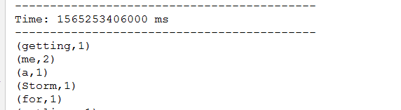

0. SparkStreaming课程大纲

- 流式计算简介
- SparkStreaming实时处理入门案例
- SparkStreaming和HDFS整合
- SparkStreaming与Kafka整合
- SparkStreaming常见transformation算子
- SparkStreaming高可用及其优化建议

# 1. 流式计算简介

## 1.1. 流式计算

​		如何去理解流式计算，最形象的例子，就是小明的往水池中放(入)水又放(出)水的案例。流式计算就像水流一样，数据连绵不断的产生，并被快速处理，所以流式计算拥有如下一些特点：

- 数据是无界的(unbounded)
- 数据是动态的

- 计算速度是非常快的

- 计算不止一次

- 计算不能终止

​		反过来看看一下离线计算有哪些特点：

- 数据是有界的(Bounded)
- 数据静态的

- 计算速度通常较慢

- 计算只执行一次

- 计算终会终止

## 1.2. 常见的离线和流式计算框架

- 常见的离线计算框架

    1. mapreduce

    2. spark-core

    3. flink-dataset

- 常见的流式计算框架

    1. storm(jstorm)

    2. spark-streaming

    3. flink-datastream(blink)

## 1.3. SparkStreaming简介

​		SparkStreaming，和SparkSQL一样，也是Spark生态栈中非常重要的一个模块，主要是用来进行流式计算的框架。流式计算框架，从计算的延迟上面，又可以分为纯实时流式计算和准实时流式计算，**SparkStreaming是属于的准实时计算框架**。

​		所谓纯实时的计算，指的是来一条记录(event事件)，启动一次计算的作业；离线计算，指的是每次计算一个非常大的一批(比如几百G，好几个T)数据；准实时呢，介于纯实时和离线计算之间的一种计算方式。显然不是每一条记录就计算一次，显然比起离线计算数据量小的多，怎么表示？Micro-batch（微小的批次）。

​		SparkStreaming是SparkCore的api的一种扩展，使用DStream(*discretized stream* or DStream)作为数据模型，基于内存处理连续的数据流，本质上还是RDD的基于内存的计算。

​		DStream，本质上是RDD的序列。SparkStreaming的处理流程可以归纳为下图：


	## 1.4. SparkStreaming基本工作原理

​    	接收实时输入数据流，然后将数据拆分成多个batch，比如每收集1秒的数据封装为一个batch，然后将每个batch交给Spark的计算引擎进行处理，最后会生产出一个结果数据流，其中的数据，也是由一个一个的batch所组成的。

​		Spark Streaming提供了一种高级的抽象，叫做DStream，英文全称为Discretized Stream，中文翻译为“离散流”，它代表了一个持续不断的数据流。DStream可以通过输入数据源来创建，比如Kafka、Flume、ZMQ和Kinesis；也可以通过对其他DStream应用高阶函数来创建，比如map、reduce、join、window。
​		DStream的内部，其实一系列持续不断产生的RDD。RDD是Spark Core的核心抽象，即，分布式式弹性数据集。DStream中的每个RDD都包含了一个时间段内的数据。


​		对DStream应用的算子，比如map，其实在底层会被翻译为对DStream中每个RDD的操作。比如对一个DStream执行一个map操作，会产生一个新的DStream。但是，在底层，其实其原理为，对输入DStream中每个时间段的RDD，都应用一遍map操作，然后生成的新的RDD，即作为新的DStream中的那个时间段的一个RDD。底层的RDD的transformation操作。
​		还是由Spark Core的计算引擎来实现的。Spark Streaming对Spark Core进行了一层封装，隐藏了细节，然后对开发人员提供了方便易用的高层次的API。


## 1.5. Storm V.S. SparkStreaming V.S. Flink

- 三者对比


- storm和flink简介

    storm: storm.apache.org

    

    flink: flink.apache.org

    

## 1.6. 如何选择一款合适的流式处理框架

- 对于Storm来说：
    1、建议在需要纯实时，不能忍受1秒以上延迟的场景下使用，比如实时计算系统，要求纯实时进行交易和分析时。
    2、在实时计算的功能中，要求可靠的事务机制和可靠性机制，即数据的处理完全精准，一条也不能多，一条也不能少，也可以考虑使用Storm，但是Spark Streaming也可以保证数据的不丢失。
    3、如果我们需要考虑针对高峰低峰时间段，动态调整实时计算程序的并行度，以最大限度利用集群资源（通常是在小型公司，集群资源紧张的情况），我们也可以考虑用Storm

- 对于Spark Streaming来说：
    1、不满足上述3点要求的话，我们可以考虑使用Spark Streaming来进行实时计算。
    2、考虑使用Spark Streaming最主要的一个因素，应该是针对整个项目进行宏观的考虑，即，如果一个项目除了实时计算之外，还包括了离线批处理、交互式查询、图计算和MLIB机器学习等业务功能，而且实时计算中，可能还会牵扯到高延迟批处理、交互式查询等功能，那么就应该首选Spark生态，用Spark Core开发离线批处理，用Spark SQL开发交互式查询，用Spark Streaming开发实时计算，三者可以无缝整合，给系统提供非常高的可扩展性。

- 对于Flink来说：
    支持高吞吐、低延迟、高性能的流处理
    支持带有事件时间的窗口（Window）操作
    支持有状态计算的Exactly-once语义
    支持高度灵活的窗口（Window）操作，支持基于time、count、session，以及data-driven的窗口操作
    支持具有Backpressure功能的持续流模型
    支持基于轻量级分布式快照（Snapshot）实现的容错
    一个运行时同时支持Batch on Streaming处理和Streaming处理
    Flink在JVM内部实现了自己的内存管理
    支持迭代计算
    支持程序自动优化：避免特定情况下Shuffle、排序等昂贵操作，中间结果有必要进行缓存

# 2. SparkStreaming实时处理入门案例

## 2.1. 创建项目模块

​	

指定maven左表


执行存储位置


导入maven依赖

```xml
<dependency>
    <groupId>org.apache.spark</groupId>
    <artifactId>spark-streaming_2.11</artifactId>
    <version>2.2.2</version>
</dependency>
```

完整的pom文件

```xml
<?xml version="1.0" encoding="UTF-8"?>
<project xmlns="http://maven.apache.org/POM/4.0.0"
         xmlns:xsi="http://www.w3.org/2001/XMLSchema-instance"
         xsi:schemaLocation="http://maven.apache.org/POM/4.0.0 http://maven.apache.org/xsd/maven-4.0.0.xsd">
    <parent>
        <artifactId>spark-parent-1903</artifactId>
        <groupId>com.desheng.parent</groupId>
        <version>1.0-SNAPSHOT</version>
    </parent>
    <modelVersion>4.0.0</modelVersion>

    <groupId>com.desheng.bigdata</groupId>
    <artifactId>spark-streaming</artifactId>
    <version>1.0-SNAPSHOT</version>
    <properties>
        <project.build.sourceEncoding>UTF-8</project.build.sourceEncoding>
        <maven.compiler.source>1.8</maven.compiler.source>
        <maven.compiler.target>1.8</maven.compiler.target>
    </properties>
    <dependencies>
        <dependency>
            <groupId>org.apache.spark</groupId>
            <artifactId>spark-streaming_2.11</artifactId>
        </dependency>
    </dependencies>
</project>
```

## 2.2. 编码

### 2.2.1. 入口类StreamingContext

​		SparkStreaming中的入口类，称之为StreamingContext,但是底层还是得需要依赖SparkContext。

```scala
object _01SparkStreamingWordCountOps {
    def main(args: Array[String]): Unit = {
        /*
            StreamingContext的初始化，需要至少两个参数，SparkConf和BatchDuration
            SparkConf不用多说
            batchDuration：提交两次作业之间的时间间隔，每次会提交一个DStream，将数据转化batch--->RDD
            所以说：sparkStreaming的计算，就是每隔多长时间计算一次数据
         */
        val conf = new SparkConf()
                    .setAppName("SparkStreamingWordCount")
                    .setMaster("local[*]")
        val duration = Seconds(2)
        val ssc = new StreamingContext(conf, duration)

		//业务
        
        
        //为了执行的流式计算，必须要调用start来启动
        ssc.start()
        //为了不至于start启动程序结束，必须要调用awaitTermination方法等待程序业务完成之后调用stop方法结束程序，或者异常
        ssc.awaitTermination()
    }
}
```

### 2.2.2. 业务编写

```scala
object _01SparkStreamingWordCountOps {
    def main(args: Array[String]): Unit = {
        if(args == null || args.length < 2) {
            println(
                """
                  |Usage: <hostname> <port>
                """.stripMargin)
            System.exit(-1)
        }
        val Array(hostname, port) = args
        /*
            StreamingContext的初始化，需要至少两个参数，SparkConf和BatchDuration
            SparkConf不用多说
            batchDuration：提交两次作业之间的时间间隔，每次会提交一个DStream，将数据转化batch--->RDD
            所以说：sparkStreaming的计算，就是每隔多长时间计算一次数据
         */
        val conf = new SparkConf()
                    .setAppName("SparkStreamingWordCount")
                    .setMaster("local[*]")
        val duration = Seconds(2)
        val ssc = new StreamingContext(conf, duration)

        //接入数据

        val lines:ReceiverInputDStream[String] = ssc.socketTextStream(hostname, port.toInt)

//        lines.print()
        val retDStream:DStream[(String, Int)] = lines.flatMap(_.split("\\s+")).map((_, 1)).reduceByKey(_+_)
        retDStream.print()

        //为了执行的流式计算，必须要调用start来启动
        ssc.start()
        //为了不至于start启动程序结束，必须要调用awaitTermination方法等待程序业务完成之后调用stop方法结束程序，或者异常
        ssc.awaitTermination()
    }
}
```

### 2.2.3. 使用netcat进行测试




## 2.3. StreamingContext和Receiver说明

### 2.3.1. StreamingContext

​	StreamingContext是程序的入口类，用于创建DStream，维护SparkStreaming程序的声明周期。

- 关于local说明

    当我们将上述程序中的master由local[*],修改为local的时候，程序业务不变，发生只能接收数据，无法处理数据。

    

    local[*]和local的区别，后者只为当前程序提供一个线程来处理，前者提供可用的所有的cpu的core来处理，当前情况下为2或者4。

    所以我们推测，当前程序无法处理数据的原因，只能是拥有cpu-core或者线程个数造成的。

    同时还可以推到出来的是，SparkStreaming在当下案例中，优先使用线程资源来接收数据，其次才是对数据的处理，接收数据的对象就是Receiver。

    所以，以后注意，如果读取数据的时候有receiver，程序的线程个数至少为2。

- start

    start方法是用来启动当前sparkStreaming应用的，所以，是不能在ssc.start()之后再添加任何业务逻辑，否则，凉凉！

    

    - awaitTermination

    

### 2.3.2. Receiver

​		Receiver，顾名思义，就是数据的接收者，这里把资源分成了两部分，一部分用来接收数据，一部分用来处理数据。Receiver接收到的数据，说白了就是一个个的batch数据，是RDD，存储在Executor内存。Receiver就是Executor内存中的一部分。

​		通过下图，来阐述基于Receiver的程序执行的流程


# 3. SparkStreaming和HDFS整合

## 3.1. 说明

​		SparkStreaming监听hdfs的某一个目录，目录下的新增文件，做实时处理。这种方式在特定情况下还是挺多的。需要使用的api为：ssc.fileStream()。

​		监听的文件，必须要从另一个相匹配的目录移动到其它目录。

  - 监听本地

    无法读取手动拷贝，或者剪切到指定目录下的文件，只能读取通过流写入的文件。

  - 监听hdfs

    有的操作系统和监听本地是一样。

    正常情况下，我们可以读取到通过put上传的文件，还可以读取通过cp拷贝的文件，但是读取不了mv移动的文件。

    读取文件的这种方式，没有额外的Receiver消耗线程资源，所以可以指定master为local

## 3.2. 编码

```scala
object _01SparkStreamingHDFS {
    def main(args: Array[String]): Unit = {
        Logger.getLogger("org.apache.hadoop").setLevel(Level.WARN)
        Logger.getLogger("org.apache.spark").setLevel(Level.WARN)
        Logger.getLogger("org.spark_project").setLevel(Level.WARN)

        val conf = new SparkConf()
            .setAppName("SparkStreamingHDFS")
            .setMaster("local[2]")
        val duration = Seconds(2)
        val ssc = new StreamingContext(conf, duration)
        //读取local中数据 --->需要通过流的方式写入
//        val lines = ssc.textFileStream("file:///E:/data/monitored")

        //hdfs
        val lines = ssc.textFileStream("hdfs://bigdata01:9000/data/spark")

        lines.print()

        ssc.start()
        ssc.awaitTermination()
    }
}
```

# 4. SparkStreaming与Kafka整合（*）

## 4.1. 整合简述

​		kafka是做消息的缓存，数据和业务隔离操作的消息队列，而sparkstreaming是一款准实时流式计算框架，所以二者的整合，是大势所趋。

​		二者的整合，有主要的两大版本。


​	在spark-stremaing-kafka-0-8的版本中又分为了两种方式：receiver的方式和direct的方式来读取kafka中的数据，主要区别就是是否依赖zookeeper来管理offset信息，以及是否拥有receiver。

## 4.2. spark-stremaing-kafka-0-8

导入依赖

```xml
<dependency>
    <groupId>org.apache.spark</groupId>
    <artifactId>spark-streaming-kafka-0-8_2.11</artifactId>
    <version>2.2.2</version>
</dependency>
```

入口类便是KafkaUtils

### 4.2.1. Receiver的方式

- 编程

    ```scala
    /**
      * 使用kafka的receiver-api读取数据
      */
    object _02SparkStreamingWithKafkaReceiverOps {
        def main(args: Array[String]): Unit = {
            val conf = new SparkConf()
                .setAppName("SparkStreamingWithKafkaReceiver")
                .setMaster("local[*]")
            val duration = Seconds(2)
            val ssc = new StreamingContext(conf, duration)
            val kafkaParams = Map[String, String](
                "zookeeper.connect" -> "bigdata01:2181,bigdata02:2181,bigdata03:2181/kafka",
                "group.id" -> "g_1903_1",
                "zookeeper.connection.timeout.ms" -> "10000"
            )
            val topics = Map[String, Int](
                "spark" -> 3
            )
            val messages:ReceiverInputDStream[(String, String)] = KafkaUtils
                .createStream[String, String, StringDecoder, StringDecoder](ssc, kafkaParams, topics,StorageLevel.MEMORY_AND_DISK_SER_2)
    
            messages.print()
    
            ssc.start()
            ssc.awaitTermination()
        }
    }
    ```

- 说明

       这种方式使用Receiver来获取数据。Receiver是使用Kafka的高层次Consumer API来实现的。receiver从Kafka中获取的数据都是存储在Spark Executor的内存中的，然后Spark Streaming启动的job会去处理那些数据。

    		然而，在默认的配置下，这种方式可能会因为底层的失败而丢失数据。如果要启用高可靠机制，让数据零丢失，就必须启用Spark Streaming的预写日志机制（Write Ahead Log，WAL）。该机制会同步地将接收到的Kafka数据写入分布式文件系统（比如HDFS）上的预写日志中。所以，即使底层节点出现了失败，也可以使用预写日志中的数据进行恢复。

- 需要注意的地方

    1. Kafka的topic分区和Spark Streaming中生成的RDD分区没有关系。 在KafkaUtils.createStream中增加分区数量只会增加单个receiver的线程数， 不会增加Spark的并行度

    2. 可以创建多个的Kafka的输入DStream， 使用不同的group和topic， 使用多个receiver并行接收数据。

    3. 如果启用了HDFS等有容错的存储系统， 并且启用了写入日志，则接收到的数据已经被复制到日志中。因此，输入流的存储级别设置StorageLevel.MEMORY_AND_DISK_SER（即使用KafkaUtils.createStream（...，StorageLevel.MEMORY_AND_DISK_SER））的存储级别。

- 数据会丢失原因


### 4.2.2. Direct的方式

- 编码

    ```scala
    //基于direct方式整合kafka
    object _03SparkStreamingWithKafkaDirectOps {
        def main(args: Array[String]): Unit = {
            Logger.getLogger("org.apache.hadoop").setLevel(Level.WARN)
            Logger.getLogger("org.apache.spark").setLevel(Level.WARN)
            Logger.getLogger("org.spark_project").setLevel(Level.WARN)
            val conf = new SparkConf()
                .setAppName("SparkStreamingWithKafkaDirect")
                .setMaster("local[*]")
            val duration = Seconds(2)
            val ssc = new StreamingContext(conf, duration)
            val kafkaParams = Map[String, String](
                "bootstrap.servers" -> "bigdata01:9092,bigdata02:9092,bigdata03:9092",
                "group.id" -> "g_1903_2",
                "auto.offset.reset" -> "largest"
            )
            val topics = "spark".split(",").toSet
            val messages: InputDStream[(String, String)] = KafkaUtils.createDirectStream[String, String, StringDecoder, StringDecoder](ssc, kafkaParams, topics)
    
            messages.foreachRDD((rdd, bTime) => {
                if(!rdd.isEmpty()) {
                    val offsetRDD = rdd.asInstanceOf[HasOffsetRanges]
                    val offsetRanges = offsetRDD.offsetRanges
                    for(offsetRange <- offsetRanges) {
                        val topic = offsetRange.topic
                        val partition = offsetRange.partition
                        val fromOffset = offsetRange.fromOffset
                        val untilOffset = offsetRange.untilOffset
                        println(s"topic:${topic}\tpartition:${partition}\tstart:${fromOffset}\tend:${untilOffset}")
                    }
                    rdd.count()
                }
            })
            ssc.start()
            ssc.awaitTermination()
        }
    }
    ```

- 说明

    1. **简化的并行性**：不需要创建多个输入Kafka流并将其合并。 使用directStream，Spark Streaming将创建与使用Kafka分区一样多的RDD分区，这些分区将全部从Kafka并行读取数据。 所以在Kafka和RDD分区之间有一对一的映射关系。

    2. **效率**：在第一种方法中实现零数据丢失需要将数据存储在预写日志中，这会进一步复制数据。这实际
        上是效率低下的，因为数据被有效地复制了两次:一次是Kafka，另一次是由预先写入日志（Write
        Ahead Log）复制。这个第二种方法消除了这个问题，因为没有接收器，因此不需要预先写入日志。
        只要Kafka数据保留时间足够长。

    3. **正好一次（Exactly-once）的语义**：第一种方法使用Kafka的高级API来在Zookeeper中存储消耗的偏移量。传统上这是从Kafka消费数据的方式。虽然这种方法（结合提前写入日志）可以确保零数据丢失（即至少一次语义），但是在某些失败情况下，有一些记录可能会消费两次。发生这种情况是因为Spark Streaming可靠接收到的数据与Zookeeper跟踪的偏移之间的不一致。因此，在第二种方法中，我们使用不使用Zookeeper的简单Kafka API。在其检查点内，Spark Streaming跟踪偏移量。这消除了Spark Streaming和Zookeeper/Kafka之间的不一致，因此Spark Streaming每次记录都会在发生故障的情况下有效地收到一次。为了实现输出结果的一次语义，将数据保存到外部数据存储区的输出操作必须是幂等的，或者是保存结果和偏移量的原子事务。

        幂等说明：多次操作结果都一样，把这种操作称之为幂等操作，比如数据库的delete操作，或者：

        ```sql
        INSERT INTO USER (id, NAME, age) VALUES(3, 'wangwu1', 16) ON DUPLICATE KEY UPDATE age=16, NAME='wangwu1'
        ```

- offset的问题

    ```scala
    /*
        offset的checkpoint(检查点)
        把需要管理的相关数据保存在某一个目录下面，后续的时候直接从该目录中读取即可，
        在此处就是保存offset数据
     */
    object _04CheckpointWithKafkaDirectOps {
        def main(args: Array[String]): Unit = {
            Logger.getLogger("org.apache.hadoop").setLevel(Level.WARN)
            Logger.getLogger("org.apache.spark").setLevel(Level.WARN)
            Logger.getLogger("org.spark_project").setLevel(Level.WARN)
            val conf = new SparkConf()
                .setAppName("CheckpointWithKafkaDirectOps")
                .setMaster("local")
            val duration = Seconds(2)
            val checkpoint = "file:///E:/data/monitored/chk"
    
            def createFunc():StreamingContext = {
                val ssc = new StreamingContext(conf, duration)
                ssc.checkpoint(checkpoint)
                val kafkaParams = Map[String, String](
                    "bootstrap.servers" -> "bigdata01:9092,bigdata02:9092,bigdata03:9092",
                    "group.id" -> "g_1903_2",
                    "auto.offset.reset" -> "smallest"
                )
                val topics = "spark".split(",").toSet
                val messages: InputDStream[(String, String)] = KafkaUtils.createDirectStream[String, String, StringDecoder, StringDecoder](ssc, kafkaParams, topics)
    
                messages.foreachRDD((rdd, bTime) => {
                    if(!rdd.isEmpty()) {
                        println("num: " + rdd.getNumPartitions)
                        val offsetRDD = rdd.asInstanceOf[HasOffsetRanges]
                        val offsetRanges = offsetRDD.offsetRanges
                        for(offsetRange <- offsetRanges) {
                            val topic = offsetRange.topic
                            val partition = offsetRange.partition
                            val fromOffset = offsetRange.fromOffset
                            val untilOffset = offsetRange.untilOffset
                            println(s"topic:${topic}\tpartition:${partition}\tstart:${fromOffset}\tend:${untilOffset}")
                        }
                        rdd.count()
                    }
                })
                ssc
            }
    
            //创建或者恢复出来一个StreamingContext
            val ssc = StreamingContext.getOrCreate(checkpoint, createFunc)
    
            ssc.start()
            ssc.awaitTermination()
        }
    }
    ```

    说明，这种方式，虽然能够解决offset跟踪问题，但是会在checkpoint目录下面产生大量的小文件，并且操作进行磁盘的IO操作，性能相对较差，那我们如何管理offset偏移量呢？

    常见的管理offset偏移量的方式有如下：zookeeper、redis、hbase、mysql、elasticsearch、kafka，zookeeper也不建议使用，zookeeper太重要了，zk负载过高，容易出故障。

- zookeeper管理offset

    ```scala
    /*
        基于direct方式整合kafka
        使用zk手动管理offset
     */
    
    object _05KafkaDirectWithZKOps {
    
    
        def main(args: Array[String]): Unit = {
            Logger.getLogger("org.apache.hadoop").setLevel(Level.WARN)
            Logger.getLogger("org.apache.spark").setLevel(Level.WARN)
            Logger.getLogger("org.spark_project").setLevel(Level.WARN)
            val conf = new SparkConf()
                .setAppName("SparkStreamingWithKafkaDirect")
                .setMaster("local")
            val duration = Seconds(2)
            val ssc = new StreamingContext(conf, duration)
            val kafkaParams = Map[String, String](
            "bootstrap.servers" -> "bigdata01:9092,bigdata02:9092,bigdata03:9092",
            "group.id" -> "g_1903_2",
            "auto.offset.reset" -> "smallest"
            )
            val topics = "spark".split(",").toSet
    
            val messages: InputDStream[(String, String)] = createMsg(ssc, kafkaParams, topics)
    
    
            messages.foreachRDD((rdd, bTime) => {
                if(!rdd.isEmpty()) {
                    println("-------------------------------------------")
                    println(s"Time: $bTime")
                    println("###########count: " + rdd.count())
                    storeOffsets(rdd.asInstanceOf[HasOffsetRanges].offsetRanges, kafkaParams("group.id"))
                    println("-------------------------------------------")
                }
            })
    
    
            ssc.start()
            ssc.awaitTermination()
        }
        /*
            从zk中读取手动保存offset信息，然后从kafka指定offset位置开始读取数据，当然如果没有读取到offset信息，
            那么从最开始或者从最新的位置开始读取信息
         */
        def createMsg(ssc: StreamingContext, kafkaParams: Map[String, String], topics: Set[String]): InputDStream[(String, String)] = {
            //从zk中读取offset
            val fromOffsets: Map[TopicAndPartition, Long] = getFromOffsets(topics, kafkaParams("group.id"))
            var messages: InputDStream[(String, String)] = null
    
            if(fromOffsets.isEmpty) {//没有读到offset
                messages = KafkaUtils.createDirectStream[String, String, StringDecoder, StringDecoder](ssc, kafkaParams, topics)
            } else {//读取到了offset，从指定位置开始读取
                val messageHandler = (msgHandler:MessageAndMetadata[String, String]) => (msgHandler.key(), msgHandler.message())
                messages = KafkaUtils.createDirectStream[String, String, StringDecoder, StringDecoder, (String, String)](ssc,
                    kafkaParams, fromOffsets, messageHandler)
            }
            messages
        }
        /*
            从zk中读取offset信息
            首先，定义offset交互的信息，比如数据的存放位置，存放格式
            官方的操作：/kafka/consumers/${group.id}/offsets/${topic}/${partition} -->data为offset
               存放位置&数据：/kafka/consumers/offsets/${topic}/${group.id}/${partition} -->data为offset
            其次，用什么和zk中交互
                zookeeper原生的api
                curatorFramework(选择)
         */
        def getFromOffsets(topics:Set[String], group:String):Map[TopicAndPartition, Long] = {
            val offsets = mutable.Map[TopicAndPartition, Long]()
            for (topic <- topics) {
                val path = s"${topic}/${group}"
                //判断当前路径是否存在
                checkExists(path)
                for(partition <- JavaConversions.asScalaBuffer(client.getChildren.forPath(path))) {
                    val fullPath = s"${path}/${partition}"
                    val offset = new String(client.getData.forPath(fullPath)).toLong
                    offsets.put(TopicAndPartition(topic, partition.toInt), offset)
                }
            }
            offsets.toMap
        }
    
        def storeOffsets(offsetRanges: Array[OffsetRange], group:String) = {
            for(offsetRange <- offsetRanges) {
                val topic = offsetRange.topic
                val partition = offsetRange.partition
                val offset = offsetRange.untilOffset
                val path = s"${topic}/${group}/${partition}"
                checkExists(path)
                client.setData().forPath(path, offset.toString.getBytes)
            }
        }
    
        def checkExists(path:String): Unit = {
            if(client.checkExists().forPath(path) == null) {//路径不能存在
                client.create().creatingParentsIfNeeded().forPath(path)
            }
        }
    
        val client = {
            val client = CuratorFrameworkFactory.builder()
                    .connectString("bigdata01:2181,bigdata02:2181,bigdata03:2181")
                    .retryPolicy(new ExponentialBackoffRetry(1000, 3))
                    .namespace("kafka/consumers/offsets")
                    .build()
            client.start()
            client
        }
    }
    ```

- redis管理offset

    导入redis的maven依赖

    ```xml
    <dependency>
        <groupId>redis.clients</groupId>
        <artifactId>jedis</artifactId>
        <version>2.9.0</version>
    </dependency>
    ```

    提供redis的操作工具类(在spark-common模块中处理)

    ```java
    //入口类：Jedis -->代表的是redis的一个客户端连接，相当于Connection
    public class JedisUtil {
    
        static JedisPool pool;
        static {
            JedisPoolConfig config = new JedisPoolConfig();
            String host = "bigdata01";
            int port = 6379;
            pool = new JedisPool(config, host, port);
        }
    
        public static Jedis getJedis() {
            return pool.getResource();
        }
        public static void release(Jedis jedis) {
    		jedis.close();
        }
    }
    ```

    在spark-streaming模块中引入

    ```xml
    <dependency>
        <groupId>com.desheng.bigdata</groupId>
        <artifactId>spark-common</artifactId>
        <version>1.0-SNAPSHOT</version>
    </dependency>
    ```

    代码实现

    ```scala
    /*
        基于direct方式整合kafka
        使用redis手动管理offset
     */
    
    object _06KafkaDirectWithRedisOps {
    
        def main(args: Array[String]): Unit = {
            Logger.getLogger("org.apache.hadoop").setLevel(Level.WARN)
            Logger.getLogger("org.apache.spark").setLevel(Level.WARN)
            Logger.getLogger("org.spark_project").setLevel(Level.WARN)
            val conf = new SparkConf()
                .setAppName("KafkaDirectWithRedis")
                .setMaster("local")
            val duration = Seconds(2)
            val ssc = new StreamingContext(conf, duration)
            val kafkaParams = Map[String, String](
            "bootstrap.servers" -> "bigdata01:9092,bigdata02:9092,bigdata03:9092",
            "group.id" -> "g_1903_2",
            "auto.offset.reset" -> "smallest"
            )
            val topics = "spark".split(",").toSet
    
            val messages: InputDStream[(String, String)] = createMsg(ssc, kafkaParams, topics)
    
    
            messages.foreachRDD((rdd, bTime) => {
                if(!rdd.isEmpty()) {
                    println("-------------------------------------------")
                    println(s"Time: $bTime")
                    println("###########count: " + rdd.count())
                    storeOffsets(rdd.asInstanceOf[HasOffsetRanges].offsetRanges, kafkaParams("group.id"))
                    println("-------------------------------------------")
                }
            })
    
    
            ssc.start()
            ssc.awaitTermination()
        }
        /*
            从zk中读取手动保存offset信息，然后从kafka指定offset位置开始读取数据，当然如果没有读取到offset信息，
            那么从最开始或者从最新的位置开始读取信息
         */
        def createMsg(ssc: StreamingContext, kafkaParams: Map[String, String], topics: Set[String]): InputDStream[(String, String)] = {
            //从zk中读取offset
            val fromOffsets: Map[TopicAndPartition, Long] = getFromOffsets(topics)
            var messages: InputDStream[(String, String)] = null
    
            if(fromOffsets.isEmpty) {//没有读到offset
                messages = KafkaUtils.createDirectStream[String, String, StringDecoder, StringDecoder](ssc, kafkaParams, topics)
            } else {//读取到了offset，从指定位置开始读取
                val messageHandler = (msgHandler:MessageAndMetadata[String, String]) => (msgHandler.key(), msgHandler.message())
                messages = KafkaUtils.createDirectStream[String, String, StringDecoder, StringDecoder, (String, String)](ssc,
                    kafkaParams, fromOffsets, messageHandler)
            }
            messages
        }
        /*
            从redis中读取offset信息K-V
            首先，定义offset交互的信息，比如数据的存放位置，存放格式
                topic partition offset group
                五种数据结构：
                    string
                        topic|group|partition offset
                    list
                        a
                        b
                        c
                    hash
                        key field-value ...
                        topic group|partition offset
                        group topic|partition offset
                    set
                    zset
            其次，用什么和redis中交互
         */
        def getFromOffsets(topics:Set[String]):Map[TopicAndPartition, Long] = {
            val offsets = mutable.Map[TopicAndPartition, Long]()
            val jedis = JedisUtil.getJedis
            for (topic <- topics) {
                val gpo = jedis.hgetAll(topic)
                for((gp, offset) <- gpo) {
                    val partition = gp.substring(gp.indexOf("|") + 1).toInt
                    offsets.put(TopicAndPartition(topic, partition), offset.toLong)
                }
            }
            JedisUtil.release(jedis)
            offsets.toMap
        }
    
        def storeOffsets(offsetRanges: Array[OffsetRange], group:String) = {
            val jedis = JedisUtil.getJedis
            for(offsetRange <- offsetRanges) {
                val topic = offsetRange.topic
                val partition = offsetRange.partition
                val offset = offsetRange.untilOffset
                val gp = s"${group}|${partition}"
                jedis.hset(topic, gp, offset.toString)
            }
            JedisUtil.release(jedis)
        }
    }
    ```

    数据结构

    

##  4.3. SparkStreaming和kafka整合需要注意地方

抽取kafka基于zk操作的工具类

```scala
package com.desheng.bigdata.streaming.util

import com.desheng.bigdata.streaming.p2._05KafkaDirectWithZKOps.client
import kafka.common.TopicAndPartition
import kafka.message.MessageAndMetadata
import kafka.serializer.StringDecoder
import org.apache.curator.framework.CuratorFramework
import org.apache.spark.streaming.StreamingContext
import org.apache.spark.streaming.dstream.InputDStream
import org.apache.spark.streaming.kafka.{KafkaUtils, OffsetRange}

import scala.collection.{JavaConversions, mutable}

object KafkaManager {

    /*
    从zk中读取手动保存offset信息，然后从kafka指定offset位置开始读取数据，当然如果没有读取到offset信息，
    那么从最开始或者从最新的位置开始读取信息
 */
    def createMsg(ssc: StreamingContext, kafkaParams: Map[String, String], topics: Set[String], client:CuratorFramework): InputDStream[(String, String)] = {
        //从zk中读取offset
        val fromOffsets: Map[TopicAndPartition, Long] = getFromOffsets(topics, kafkaParams("group.id"), client)
        var messages: InputDStream[(String, String)] = null

        if(fromOffsets.isEmpty) {//没有读到offset
            messages = KafkaUtils.createDirectStream[String, String, StringDecoder, StringDecoder](ssc, kafkaParams, topics)
        } else {//读取到了offset，从指定位置开始读取
        val messageHandler = (msgHandler:MessageAndMetadata[String, String]) => (msgHandler.key(), msgHandler.message())
            messages = KafkaUtils.createDirectStream[String, String, StringDecoder, StringDecoder, (String, String)](ssc,
                kafkaParams, fromOffsets, messageHandler)
        }
        messages
    }
    /*
        从zk中读取offset信息
        首先，定义offset交互的信息，比如数据的存放位置，存放格式
        官方的操作：/kafka/consumers/${group.id}/offsets/${topic}/${partition} -->data为offset
           存放位置&数据：/kafka/consumers/offsets/${topic}/${group.id}/${partition} -->data为offset
        其次，用什么和zk中交互
            zookeeper原生的api
            curatorFramework(选择)
     */
    def getFromOffsets(topics:Set[String], group:String, client:CuratorFramework):Map[TopicAndPartition, Long] = {
        val offsets = mutable.Map[TopicAndPartition, Long]()
        for (topic <- topics) {
            val path = s"${topic}/${group}"
            //判断当前路径是否存在
            checkExists(path, client)
            for(partition <- JavaConversions.asScalaBuffer(client.getChildren.forPath(path))) {
                val fullPath = s"${path}/${partition}"
                val offset = new String(client.getData.forPath(fullPath)).toLong
                offsets.put(TopicAndPartition(topic, partition.toInt), offset)
            }
        }
        offsets.toMap
    }

    def storeOffsets(offsetRanges: Array[OffsetRange], group:String, client:CuratorFramework) = {
        for(offsetRange <- offsetRanges) {
            val topic = offsetRange.topic
            val partition = offsetRange.partition
            val offset = offsetRange.untilOffset
            val path = s"${topic}/${group}/${partition}"
            checkExists(path, client)
            client.setData().forPath(path, offset.toString.getBytes)
        }
    }

    def checkExists(path:String, client:CuratorFramework): Unit = {
        if(client.checkExists().forPath(path) == null) {//路径不能存在
            client.create().creatingParentsIfNeeded().forPath(path)
        }
    }
}

```

### 4.3.1. 输出一致性语义的问题


- 幂等操作

    ```scala
    object KafkaOffsetIdempotent {
      def main(args: Array[String]): Unit = {
        val sparkConf = new SparkConf().setAppName("test").setMaster("local[2]")
    
        val processingInterval = 2
        val brokers = "bigdata01:9092,bigdata02:9092,bigdata03:9092"
        val topic = "mytopic1"
        // Create direct kafka stream with brokers and topics
        val topicsSet = topic.split(",").toSet
        val kafkaParams = Map[String, String](
          "metadata.broker.list" -> brokers,
          "auto.offset.reset" -> "largest",
          "group.id" -> "myspark"
        )
    
    
        /*
    
           1. 创建测试的mysql数据库
           create database test;
           2. 建表
           create table myorders(name varchar(20), orderid varchar(100) primary key);
           3. 新建topic： mytopic1
             kafka-topics.sh --zookeeper bigdata01:2181/kafka --create --topic mytopic1 --partitions 3 --replication-factor 1
           4. 往mytopic1发送数据， 数据格式为 "字符,数字"  比如  abc,3
         */
    
        val ssc = new StreamingContext(sparkConf, Seconds(processingInterval))
    
        val messages = KafkaManager.createMsg(ssc, kafkaParams, topicsSet, client)
    
        val jdbcUrl =  "jdbc:mysql://localhost:3306/test"
        val jdbcUser = "root"
        val jdbcPassword = "sorry"
    
        messages.foreachRDD(rdd=>{
          if(!rdd.isEmpty()) {
            val offsetRanges = rdd.asInstanceOf[HasOffsetRanges].offsetRanges
            rdd.map(x=>x._2).foreachPartition(partition =>{
              val pOffsetRange = offsetRanges(TaskContext.get.partitionId)
              val dbConn = DriverManager.getConnection(jdbcUrl, jdbcUser, jdbcPassword)
              partition.foreach(msg=>{
                val name = msg.split(",")(0)
                val orderid = msg.split(",")(1)
                val sql = s"insert into myorders(name, orderid) values ('$name', '$orderid') ON DUPLICATE KEY UPDATE name='${name}'"
                val pstmt = dbConn.prepareStatement(sql)
                pstmt.execute()
              })
              dbConn.close()
            })
            KafkaManager.storeOffsets(rdd.asInstanceOf[HasOffsetRanges].offsetRanges, kafkaParams("group.id"), client)
          }
        })
    
        ssc.start()
        ssc.awaitTermination()
      }
    
      val client = {
        val client = CuratorFrameworkFactory.builder()
            .connectString("bigdata01:2181,bigdata02:2181,bigdata03:2181")
            .retryPolicy(new ExponentialBackoffRetry(1000, 3))
            .namespace("kafka/consumers/offsets")
            .build()
        client.start()
        client
      }
    }
    ```

- 原子性操作

    基于scala-jdbc的方式操作数据库

    ```scala
    package com.desheng.bigdata.streaming.p2.exactly
    
    import kafka.common.TopicAndPartition
    import kafka.message.MessageAndMetadata
    import kafka.serializer.StringDecoder
    import org.apache.spark.streaming.kafka.{HasOffsetRanges, KafkaUtils}
    import org.apache.spark.streaming.{Seconds, StreamingContext}
    import org.apache.spark.{SparkConf, TaskContext}
    import scalikejdbc.{ConnectionPool, DB}
    import scalikejdbc._
    
    
    /**
      * 事务{
      *     保存数据
      *     保存offset
      * }
      *
      *
      * 1. 创建测试的mysql数据库
           create database test;
        2. 新建topic： mytopic1
           kafka-topics.sh --zookeeper bigdata01:2181/kafka --create --topic mytopic1 --partitions 3 --replication-factor 1
        3. 建表
           create table mytopic(topic varchar(200), partid int, offset bigint);
           create table mydata(name varchar(200), id int);
    
           初始化表：
            insert into mytopic(topic, partid, offset) values('mytopic1',0,0);
            insert into mytopic(topic, partid, offset) values('mytopic1',1,0);
            insert into mytopic(topic, partid, offset) values('mytopic1',2,0);
        4. 往mytopic1发送数据， 数据格式为 "字符,数字"  比如  abc,3
        5. 在pom文件加入依赖
           <dependency>
              <groupId>org.scalikejdbc</groupId>
              <artifactId>scalikejdbc_2.11</artifactId>
              <version>3.2.0</version>
          </dependency>
    
      */
    object KafkaOffsetTransanction {
      def main(args: Array[String]): Unit = {
        val sparkConf = new SparkConf().setAppName("test").setMaster("local[2]")
    
        val processingInterval = 2
        val brokers = "bigdata01:9092,bigdata02:9092,bigdata03:9092"
        val topic = "mytopic1"
        // Create direct kafka stream with brokers and topics
        val topicsSet = topic.split(",").toSet
        val kafkaParams = Map[String, String]("metadata.broker.list" -> brokers,  "auto.offset.reset" -> "smallest")
    
        val ssc = new StreamingContext(sparkConf, Seconds(processingInterval))
    
        val groupName =  "myspark"
        //val messages = createMyDirectKafkaStream(ssc, kafkaParams, topicsSet, groupName)
    
    
        val driver = "com.mysql.jdbc.Driver"
        val jdbcUrl =  "jdbc:mysql://localhost:3306/test"
        val jdbcUser = "root"
        val jdbcPassword = "sorry"
    
        // 设置jdbc
        Class.forName(driver)
        // 设置连接池
        ConnectionPool.singleton(jdbcUrl, jdbcUser, jdbcPassword)
        val fromOffsets = DB.readOnly { implicit session => sql"select topic, partid, offset from mytopic".
            map { r =>
              TopicAndPartition(r.string(1), r.int(2)) -> r.long(3)
            }.list.apply().toMap
        }
    
        val messageHandler = (mmd : MessageAndMetadata[String, String]) => (mmd.topic, mmd.message())
        val  messages = KafkaUtils.createDirectStream[String, String, StringDecoder, StringDecoder, (String, String)](ssc, kafkaParams, fromOffsets, messageHandler)
    
        messages.foreachRDD(rdd=> {
            if(!rdd.isEmpty()) {
                rdd.foreachPartition(partiton=>{
                    val offsetRanges = rdd.asInstanceOf[HasOffsetRanges].offsetRanges
                    val pOffsetRange = offsetRanges(TaskContext.get.partitionId)
    
                    // localTx 开启事务操作
                    DB.localTx { implicit session =>
                        partiton.foreach(msg=>{
                            // 或者使用scalike的batch 插入
                            val name = msg._2.split(",")(0)
                            val id =msg._2.split(",")(1)
                            val dataResult = sql"""insert into  mydata(name,id) values (${name},${id})""".execute().apply()
                        })
    //                    val i = 1 / 0
                        val offsetResult =
                            sql"""update mytopic set offset = ${pOffsetRange.untilOffset} where topic =
                      ${pOffsetRange.topic} and partid = ${pOffsetRange.partition}""".update.apply()
                    }
                })
            }
        })
        ssc.start()
        ssc.awaitTermination()
      }
    }
    
    ```

### 4.3.2. 常见问题

- 限流

    sparkstreaming要从kafka拉取数据，并进行处理；下一次再循环，如果批次的间隔时间为2s，但是数据的处理时间为3s，所以会有越来越多的没有被处理的数据进行累积，最后会拖垮程序，这不是我们所期望的。

    解决思路，只能限制流量。非常简单，通过一个参数搞定：spark.streaming.kafka.maxRatePerPartition

    > spark.streaming.kafka.maxRatePerPartition: spark程序每秒中从每个partition分区读取的最大的数据条数。比如batchInterval为2s，topic的分区为3，该参数的值为100，请问，每个批次最多可以读取多少条数据？2×3×100=600条。

    ```scala
    object _07SparkStreamingWithKafkaLimitRateOps {
        def main(args: Array[String]): Unit = {
            Logger.getLogger("org.apache.hadoop").setLevel(Level.WARN)
            Logger.getLogger("org.apache.spark").setLevel(Level.WARN)
            Logger.getLogger("org.spark_project").setLevel(Level.WARN)
            val conf = new SparkConf()
                .setAppName("SparkStreamingWithKafkaDirect")
                .setMaster("local")
                .set("spark.streaming.kafka.maxRatePerPartition", "100")
            val duration = Seconds(2)
            val ssc = new StreamingContext(conf, duration)
            val kafkaParams = Map[String, String](
                "bootstrap.servers" -> "bigdata01:9092,bigdata02:9092,bigdata03:9092",
                "group.id" -> "g_1903_2",
                "auto.offset.reset" -> "smallest"
            )
            val topics = "spark".split(",").toSet
            val messages: InputDStream[(String, String)] = KafkaUtils.createDirectStream[String, String, StringDecoder, StringDecoder](ssc, kafkaParams, topics)
            messages.foreachRDD((rdd, bTime) => {
                if(!rdd.isEmpty()) {
                    println("-------------------------------------------")
                    println(s"Time: $bTime")
                    println("########rdd's count: " + rdd.count())
                    println("-------------------------------------------")
                }
            })
            ssc.start()
            ssc.awaitTermination()
        }
    }
    ```

    

- 偏移量过期（作业）

    

### 4.3.3. 在线ETL应用案例

​		实时的做数据的ETL。

- 需求

    数据格式：

    ```properties
    <<<!>>>3111<<<!>>>		--->记录id
    <<<!>>>238<<<!>>>		--->userid
    <<<!>>>20181111132902<<<!>>>	--->用户操作时间
    <<<!>>>58.223.1.112<<<!>>>	--->用户ip地址
    <<<!>>>202.102.92.18<<<!>>>	--->用户访问ip地址
    <<<!>>>59947<<<!>>>			--->用户端口
    <<<!>>>80<<<!>>>			--->服务端口
    <<<!>>>www.sumecjob.com<<<!>>>	-->服务域名
    <<<!>>><<<!>>>
    <<<!>>><<<!>>>
    <<<!>>><<<!>>>
    <<<!>>><<<!>>>
    <<<!>>><<<!>>>
    <<<!>>>http://www.sumecjob.com/Social.aspx<<<!>>> -->用户访问的具体url
    <<<!>>>2556928066<<<!>>>
    ```

    从kafka指定的topic中读取如上数据，进行清洗，剔除上述无用字段，保留有用信息，包括userid 用户操作时间(timestamp) 用户ip地址:端口 服务地址：服务端口 url,最后将清洗结果送回kafka指定的topic中，完成在线etl。

- 编码

    ```scala
    object _08SparkStreamingWithKafkaETLOps {
    
        def main(args: Array[String]): Unit = {
            Logger.getLogger("org.apache.hadoop").setLevel(Level.WARN)
            Logger.getLogger("org.apache.spark").setLevel(Level.WARN)
            Logger.getLogger("org.spark_project").setLevel(Level.WARN)
            val conf = new SparkConf()
                .setAppName("KafkaDirectWithRedis")
                .setMaster("local[*]")
            val duration = Seconds(2)
            val ssc = new StreamingContext(conf, duration)
            val kafkaParams = Map[String, String](
            "bootstrap.servers" -> "bigdata01:9092,bigdata02:9092,bigdata03:9092",
            "group.id" -> "g_1903_2",
            "auto.offset.reset" -> "smallest"
            )
            val topics = "source".split(",").toSet
            val target = "target"
            val messages: InputDStream[(String, String)] = JedisManager.createMsg(ssc, kafkaParams, topics)
    
    
            messages.foreachRDD((rdd, bTime) => {
                if(!rdd.isEmpty()) {
                    println("-------------------------------------------")
                    println(s"Time: $bTime")
                    processETL(rdd, target)//处理过程
                    JedisManager.storeOffsets(rdd.asInstanceOf[HasOffsetRanges].offsetRanges,
                        kafkaParams("group.id"))
                    println("-------------------------------------------")
                }
            })
            ssc.start()
            ssc.awaitTermination()
        }
        //在线etl处理过程
        def processETL(rdd: RDD[(String, String)], targetTopic: String): Unit = {
            val prcessedRDD = rdd.map{case (key, value) => {
                val fields = value.split(",")
                if(fields == null || fields.length != 15) {
                    "" //异常数据
                } else {//正常数据
                    val userid = fields(1).replaceAll("<<<!>>>", "")
                    //2018 11 11 13 29 02-->yyyyMMddHHmmss-->yyyy-MM-dd HH:mm:ss
                    val time = fields(2).replaceAll("<<<!>>>", "")
                    val timestamp = DateUtil.time2Stamp(time)
                    val clientIp = fields(3).replaceAll("<<<!>>>", "")
                    val serverIp = fields(4).replaceAll("<<<!>>>", "")
                    val clientPort = fields(5).replaceAll("<<<!>>>", "")
                    val serverPort = fields(6).replaceAll("<<<!>>>", "")
                    val url = fields(13).replaceAll("<<<!>>>", "")
    
                    s"${userid}|${timestamp}|${clientIp}:${clientPort}|${serverIp}:${serverPort}|${url}"
                }
            }}.filter(_ != "")
    
            //写入kafka中
            prcessedRDD.foreach(msg => {
                val properties = new Properties()
                properties.put("bootstrap.servers", "bigdata01:9092,bigdata02:9092,bigdata03:9092")
                properties.put("acks", "0")
                properties.put("retries", "0")
                properties.put("batch.size", "16384")
                properties.put("linger.ms", "1")
                properties.put("buffer.memory", "33554432")
                properties.put("key.serializer", "org.apache.kafka.common.serialization.StringSerializer")
                properties.put("value.serializer", "org.apache.kafka.common.serialization.StringSerializer")
                val producer = new KafkaProducer[String, String](properties)
                val record = new ProducerRecord[String, String](targetTopic, msg)
                producer.send(record)
                producer.close()
            })
        }
    }
    ```

    redis工具类

    ```scala
    package com.desheng.bigdata.streaming.util
    
    import com.desheng.bigdata.common.db.JedisUtil
    import kafka.common.TopicAndPartition
    import kafka.message.MessageAndMetadata
    import kafka.serializer.StringDecoder
    import org.apache.spark.streaming.StreamingContext
    import org.apache.spark.streaming.dstream.InputDStream
    import org.apache.spark.streaming.kafka.{KafkaUtils, OffsetRange}
    
    import scala.collection.mutable
    import scala.collection.JavaConversions._
    object JedisManager {
        def createMsg(ssc: StreamingContext, kafkaParams: Map[String, String], topics: Set[String]): InputDStream[(String, String)] = {
            //从zk中读取offset
            val fromOffsets: Map[TopicAndPartition, Long] = getFromOffsets(topics)
            var messages: InputDStream[(String, String)] = null
    
            if(fromOffsets.isEmpty) {//没有读到offset
                messages = KafkaUtils.createDirectStream[String, String, StringDecoder, StringDecoder](ssc, kafkaParams, topics)
            } else {//读取到了offset，从指定位置开始读取
            val messageHandler = (msgHandler:MessageAndMetadata[String, String]) => (msgHandler.key(), msgHandler.message())
                messages = KafkaUtils.createDirectStream[String, String, StringDecoder, StringDecoder, (String, String)](ssc,
                    kafkaParams, fromOffsets, messageHandler)
            }
            messages
        }
        /*
            从redis中读取offset信息K-V
            首先，定义offset交互的信息，比如数据的存放位置，存放格式
                topic partition offset group
                五种数据结构：
                    string
                        topic|group|partition offset
                    list
                        a
                        b
                        c
                    hash
                        key field-value ...
                        topic group|partition offset
                        group topic|partition offset
                    set
                    zset
            其次，用什么和redis中交互
         */
        def getFromOffsets(topics:Set[String]):Map[TopicAndPartition, Long] = {
            val offsets = mutable.Map[TopicAndPartition, Long]()
            val jedis = JedisUtil.getJedis
            for (topic <- topics) {
                val gpo = jedis.hgetAll(topic)
                for((gp, offset) <- gpo) {
                    val partition = gp.substring(gp.indexOf("|") + 1).toInt
                    offsets.put(TopicAndPartition(topic, partition), offset.toLong)
                }
            }
            JedisUtil.release(jedis)
            offsets.toMap
        }
    
        def storeOffsets(offsetRanges: Array[OffsetRange], group:String) = {
            val jedis = JedisUtil.getJedis
            for(offsetRange <- offsetRanges) {
                val topic = offsetRange.topic
                val partition = offsetRange.partition
                val offset = offsetRange.untilOffset
                val gp = s"${group}|${partition}"
                jedis.hset(topic, gp, offset.toString)
            }
            JedisUtil.release(jedis)
        }
    }
    ```

    日期工具类

    ```scala
    public class DateUtil {
    
        private static DateFormat df = new SimpleDateFormat("yyyyMMddHHmmss");
        //2018 11 11 13 29 02-->yyyyMMddHHmmss-->timestamp
        public static long time2Stamp(String srcDate) {
            try {
                return df.parse(srcDate).getTime();
            } catch (ParseException e) {
                e.printStackTrace();
            }
            return System.currentTimeMillis();
        }
    }
    ```

    在代码执行过程中，可能会出现如下异常：

    

    原因是因为使用了线程非安全的SimpleDateFormat造成的，如何解决！

    以如下案例来解决：

    ```java
    /*
        演示SimpleDateFormat多线程安全问题
        执行一下代码，可能会出现NumberFormatException: For input string: "E.178E1"
        主要原因是因为由于SimpleDateFormat为线程非安全的类所造成的
     */
    public class SampleDateFormatTest {
        public static void main(String[] args) {
            List<String> list = Arrays.asList(
                    "2019-08-09 17:12:47",
                    "2019-08-08 17:12:47",
                    "2019-08-07 17:12:47",
                    "2019-08-06 17:12:47",
                    "2019-08-05 17:12:47"
            );
            //转化为实践戳，但是以多线程方式操作
            SimpleDateFormat df = new SimpleDateFormat("yyyy-MM-dd HH:mm:ss");
    
            for (String time : list) {
                new Thread(() -> {
                    try {
                        System.out.println(df.parse(time));
                    } catch (ParseException e) {
                        e.printStackTrace();
                    }
                }).start();
            }
        }
    }
    ```

    有三种解决方案：

    1. 使用局部变量创建SimpleDateFormat

        

    2. 使用ThreadLocal

        

    3. 使用线程安全的DateFormat---FastDateFormat

        使用apache提供的线程安全的类来处理：org.apache.commons.lang3.time.FastDateFormat

        

    思考题：解决sparkstreaming写入kafka效率问题！

# 5. SparkStreaming常见transformation算子

## 5.1. 常见的算子操作


​		对cogroup做一简单的说明：cogroup就是groupByKey的另外一种变体，groupByKey是操作一个K-V键值对，而cogroup一次操作两个，有点像join，不同之处在于返回值结果：

```scala
val ds1:DStream[(K, V)]
val ds2:DStream[(K, w)]
val cg:DStream[(K, (Iterable[V], Iterable[W]))] = ds1.cogroup(ds1)
```

## 5.2. transform

### 5.2.1. 概述

​		transform是一个transformation算子，转换算子。


​		人话：DStream上述提供的所有的transformation操作，都是DStream-2-DStream操作，没有一个DStream和RDD的直接操作，而DStream本质上是一系列RDD，所以RDD-2-RDD操作是显然被需要的，所以此时官方api中提供了一个为了达成此操作的算子——transform操作。

​		其最最最经典的实现就是DStream和rdd的join操作，还有dstream重分区(分区减少，coalsce)。

​		也就是说transform主要就是用来自定义官方api没有提供的一些操作。

### 5.2.2. 需求简介——动态黑名单过滤

​     	广告计费系统，是电商必不可少的一个功能点。为了防止恶意的广告点击(假设商户A和B同时在某电商做了广告，A和B为竞争对手，那么如果A使用点击机器人进行对B的广告的恶意点击，那么B的广告费用将很快被用完)，必须对广告点击进行黑名单过滤。黑名单的过滤可以是ID，可以是IP等等，黑名单就是过滤的条件，利用SparkStreaming的流处理特性，可实现实时黑名单的过滤实现。可以使用leftouter join 对目标数据和黑名单数据进行关联，将命中黑名单的数据过滤掉。

### 5.2.3. 代码实现

```scala
/**
  * 在线黑名单过滤
  *
  * 类名起名规范
  *     首字母大写，多单词，采用驼峰
  *     一律名词，不能动词
  *     并且单数不能复数
  * 方法名起名规范
  *     首字母小写，多单词，采用驼峰
  *     一般采用动宾短语（动词+名词）
  * 尽量少用一些汉语拼音，中文
  *
  *  需求：
  *     从用户请求的nginx日志中过滤出黑名单的数据，保留白名单数据进行后续业务统计。
  *  data structure
  *  27.19.74.143##2016-05-30 17:38:20##GET /static/image/common/faq.gif HTTP/1.1##200##1127
110.52.250.126##2016-05-30 17:38:20##GET /data/cache/style_1_widthauto.css?y7a HTTP/1.1##200##1292
  */
object _01OnlineBlacklistFilterOps {
    def main(args: Array[String]): Unit = {

        Logger.getLogger("org.apache.hadoop").setLevel(Level.WARN)
        Logger.getLogger("org.apache.spark").setLevel(Level.WARN)
        Logger.getLogger("org.spark_project").setLevel(Level.WARN)

        val conf = new SparkConf()
            .setAppName("OnlineBlacklistFilter")
            .setMaster("local[*]")
        val duration = Seconds(2)
        val ssc = new StreamingContext(conf, duration)

        //黑名单RDD
        val blacklistRDD:RDD[(String, Boolean)] = ssc.sparkContext.parallelize(List(
            ("27.19.74.143", true),
            ("110.52.250.126", true)
        ))
        //接入外部的数据流
        val lines:DStream[String] = ssc.socketTextStream("bigdata01", 9999)
        //黑名单过滤
//        110.52.250.126##2016-05-30 17:38:20##GET /data/cache/style_1_widthauto.css?y7a HTTP/1.1##200##1292
        val ip2OtherDStream:DStream[(String, String)] = lines.map(line => {
            val index = line.indexOf("##")
            val ip = line.substring(0, index)
            val other = line.substring(index + 2)
            (ip, other)
        })
        val filteredDStream:DStream[(String, String)] = ip2OtherDStream.transform(rdd => {
            val join = rdd.leftOuterJoin(blacklistRDD)

            join.filter{case (ip, (left, right)) => {
                !right.isDefined
            }}.map{case (ip, (left, right)) => {
                (ip, left)
            }}
        })

        filteredDStream.print()
        //重分区
//        filteredDStream.transform(_.coalesce(8))

        ssc.start()
        ssc.awaitTermination()
    }
}
```


## 5.3. updateStateByKey

### 5.3.1. 概述

​		updateStateByKey(func) 	根据于key的前置状态和key的新值，对key进行更新，返回一个新状态的Dstream。

​		人话：统计截止到目前为止key的状态。

​		通过分析，我们需要清楚：在这个操作中需要两个数据，一个是key的前置状态，一个是key的新增(当前批次的数据)；还有历史数据(前置状态)得需要存储在磁盘，不应该保存在内存中。

​		同时key的前置状态可能有可能没有。


### 5.3.2. 案例实现——wordcount

```scala
/**
  * 统计，截止到目前为止出现的每一个key的次数
  */
object _02WordCountUpdateStateByKeyOps {
    def main(args: Array[String]): Unit = {

        Logger.getLogger("org.apache.hadoop").setLevel(Level.WARN)
        Logger.getLogger("org.apache.spark").setLevel(Level.WARN)
        Logger.getLogger("org.spark_project").setLevel(Level.WARN)

        val conf = new SparkConf()
            .setAppName("WordCountUpdateStateByKey")
            .setMaster("local[*]")
        val duration = Seconds(2)
        val ssc = new StreamingContext(conf, duration)
        ssc.checkpoint("file:/E:/data/out/1903/chk")
        val lines:DStream[String] = ssc.socketTextStream("bigdata01", 9999)

        val pairs:DStream[(String, Int)] = lines.flatMap(_.split("\\s+")).map((_, 1))

        val usb:DStream[(String, Int)] = pairs.updateStateByKey(updateFunc)
        usb.print()
        ssc.start()
        ssc.awaitTermination()
    }

    /*
        状态更新函数
        根据key的前置状态和key的最新值，聚合得到截止到目前为止key的状态
            seq:为当前key的状态
            option为key对应的历史值
     */
    def updateFunc(seq: Seq[Int], option: Option[Int]): Option[Int] = {
        println("option:" + option +  "> seq: " + seq.mkString("[", ",", "]"))
//        var sum = 0
//        for(i <- seq) sum += i
//        if(option.isDefined) {
//            sum += option.get
//        }
//        Option(sum)
        Option(seq.sum + option.getOrElse(0))
    }
}
```


## 5.4. window

### 5.4.1. 概述

​		window操作就是窗口函数。Spark Streaming提供了滑动窗口操作的支持，从而让我们可以对一个滑动窗口内的数据执行计算操作。每次掉落在窗口内的RDD的数据，会被聚合起来执行计算操作，然后生成的RDD，会作为window DStream的一个RDD。比如下图中，就是对每三秒钟的数据执行一次滑动窗口计算，这3秒内的3个RDD会被聚合起来进行处理，然后过了两秒钟，又会对最近三秒内的数据执行滑动窗口计算。所以每个滑动窗口操作，都必须指定两个参数，窗口长度以及滑动间隔，而且这两个参数值都必须是batch间隔的整数倍。


1. 红色的矩形就是一个窗口，窗口hold的是一段时间内的数据流。

2. 这里面每一个time都是时间单元，在官方的例子中，每隔window size是3 time unit, 而且每隔2个单位时间，窗口会slide一次。
    所以基于窗口的操作，需要指定2个参数：
     window length - The duration of the window (3 in the figure)
     slide interval - The interval at which the window-based operation is performed (2 in the figure).  

1. 窗口大小，个人感觉是一段时间内数据的容器。

2. 滑动间隔，就是我们可以理解的cron表达式吧。

### 5.4.2. 案例说明

```scala
/**
  * 统计，截止到目前为止出现的每一个key的次数
  * window窗口操作，每个多长M时间,通过过往N长时间内产生的数据
  * M就是滑动长度sliding interval
  * N就是窗口长度window length
  */
object _03WordCountWindowsOps {
    def main(args: Array[String]): Unit = {

        Logger.getLogger("org.apache.hadoop").setLevel(Level.WARN)
        Logger.getLogger("org.apache.spark").setLevel(Level.WARN)
        Logger.getLogger("org.spark_project").setLevel(Level.WARN)

        val conf = new SparkConf()
            .setAppName("WordCountUpdateStateByKey")
            .setMaster("local[*]")
        val batchInterval = 2
        val duration = Seconds(batchInterval)
        val ssc = new StreamingContext(conf, duration)
        val lines:DStream[String] = ssc.socketTextStream("bigdata01", 9999)
        val pairs:DStream[(String, Int)] = lines.flatMap(_.split("\\s+")).map((_, 1))

        val ret:DStream[(String, Int)] = pairs.reduceByKeyAndWindow(_+_,
            windowDuration = Seconds(batchInterval * 3),
            slideDuration = Seconds(batchInterval * 2))

        ret.print()

        ssc.start()
        ssc.awaitTermination()
    }

    /*
        状态更新函数
        根据key的前置状态和key的最新值，聚合得到截止到目前为止key的状态
            seq:为当前key的状态
            option为key对应的历史值
     */
    def updateFunc(seq: Seq[Int], option: Option[Int]): Option[Int] = {
        println("option:" + option +  "> seq: " + seq.mkString("[", ",", "]"))
//        var sum = 0
//        for(i <- seq) sum += i
//        if(option.isDefined) {
//            sum += option.get
//        }
//        Option(sum)
        Option(seq.sum + option.getOrElse(0))
    }
}
```


# 6. SparkSQL和SparkStreaming的整合案例

## 6.1. 需求

​    Spark最强大的地方在于，可以与Spark Core、Spark SQL整合使用，之前已经通过transform、foreachRDD等算子看到，如何将DStream中的RDD使用Spark Core执行批处理操作。现在就来看看，如何将DStream中的RDD与Spark SQL结合起来使用。
案例：top3的商品排序： 最新的top3

​		这里就是基于updatestateByKey，统计截止到目前为止的不同品类下的商品销量top3

## 6.2. 代码实现

```scala
/**
  * SparkStreaming整合SparkSQL的案例之，热门品类top3排行
  */
object _04StreamingIntegerationSQLOps {
    def main(args: Array[String]): Unit = {

        Logger.getLogger("org.apache.hadoop").setLevel(Level.WARN)
        Logger.getLogger("org.apache.spark").setLevel(Level.WARN)
        Logger.getLogger("org.spark_project").setLevel(Level.WARN)

        val conf = new SparkConf()
            .setAppName("StreamingIntegerationSQL")
            .setMaster("local[*]")
        val batchInterval = 2
        val duration = Seconds(batchInterval)
        val spark = SparkSession.builder()
                    .config(conf)
                    .getOrCreate()
        val ssc = new StreamingContext(spark.sparkContext, duration)
        ssc.checkpoint("file:/E:/data/out/1903/chk-1")
        val lines:DStream[String] = ssc.socketTextStream("bigdata01", 9999)
        //001 mi moblie
        val pairs:DStream[(String, Int)] = lines.map(line => {
            val fields = line.split("\\s+")
            if(fields == null || fields.length != 3) {
                ("", -1)
            } else {
                val brand = fields(1)
                val category = fields(2)
                (s"${category}_${brand}", 1)
            }
        }).filter(t => t._2 != -1)

        val usb:DStream[(String, Int)] = pairs.updateStateByKey(updateFunc)

        usb.foreachRDD((rdd, bTime) => {
            if(!rdd.isEmpty()) {//category_brand count
                import spark.implicits._
                val df = rdd.map{case (cb, count) => {
                    val category = cb.substring(0, cb.indexOf("_"))
                    val brand = cb.substring(cb.indexOf("_") + 1)
                    (category, brand, count)
                }}.toDF("category", "brand", "sales")

                df.createOrReplaceTempView("tmp_category_brand_sales")
                val sql =
                    """
                      |select
                      |  t.category,
                      |  t.brand,
                      |  t.sales
                      |  t.rank
                      |from (
                      |  select
                      |    category,
                      |    brand,
                      |    sales,
                      |    row_number() over(partition by category order by sales desc) rank
                      |  from tmp_category_brand_sales
                      |) t
                      |where t.rank < 4
                    """.stripMargin
                spark.sql(sql).show()
            }
        })

        ssc.start()
        ssc.awaitTermination()
    }

    def updateFunc(seq: Seq[Int], option: Option[Int]): Option[Int] = {
        Option(seq.sum + option.getOrElse(0))
    }
}
```


# 7. SparkStreaming高可用及其优化建议

## 7.1. SparkStreaming缓存操作

​		SparkStreaming的缓存，说白了就是DStream的缓存，DStream的缓存就只有一个方面，DStream对应的RDD的缓存，RDD如何缓存？rdd.persist()，所以DStream的缓存说白了就是RDD的缓存，使用persist()指定，及其需要指定持久化策略，大多算子默认情况下，持久化策略为MEMORY_AND_DISK_SER_2。

## 7.2. SparkStreaming的checkpoint机制

### 7.2.1 概述

1、每一个Spark Streaming应用，正常来说，都是要7*24小时运转的，这就是实时计算程序的特点。因为要持续不断的对数据进行计算。因此，对实时计算应用的要求，应该是必须要能够对与应用程序逻辑无关的失败，进行容错。
2、如果要实现这个目标，Spark Streaming程序就必须将足够的信息checkpoint到容错的存储系统上，从而让它能够从失败中进行恢复。有两种数据需要被进行checkpoint：
1）元数据checkpoint——将定义了流式计算逻辑的信息，保存到容错的存储系统上，比如HDFS。当运行Spark Streaming应用程序的Driver进程所在节点失败时，该信息可以用于进行恢复。元数据信息包括了：
   配置信息——创建Spark Streaming应用程序的配置信息，比如SparkConf中的信息。
   DStream的操作信息——定义了Spark Stream应用程序的计算逻辑的DStream操作信息。
   未处理的batch信息——那些job正在排队，还没处理的batch信息。

2)、数据checkpoint——将实时计算过程中产生的RDD的数据保存到可靠的存储系统中。
   对于一些将多个batch的数据进行聚合的，有状态的transformation操作，这是非常有用的。在这种transformation操作中，生成的RDD是依赖于之前的batch的RDD的，这会导致随着时间的推移，RDD的依赖链条变得越来越长。
   	要避免由于依赖链条越来越长，导致的一起变得越来越长的失败恢复时间，有状态的transformation操作执行过程中间产生的RDD，会定期地被checkpoint到可靠的存储系统上，比如HDFS。从而削减RDD的依赖链条，进而缩短失败恢复时，RDD的恢复时间。
   	总结，**元数据checkpoint主要是为了从driver失败中进行恢复；而RDD checkpoint主要是为了，使用到有状态的transformation操作时，能够在其生产出的数据丢失时，进行快速的失败恢复**。

### 7.2.2. 启动checkpoint

- 启动方式一

​	1、使用了有状态的transformation操作——比如updateStateByKey，或者reduceByKeyAndWindow操作，被使用了，那么checkpoint目录要求是必须提供的，也就是必须开启checkpoint机制，从而进行周期性的RDD checkpoint。
​	2、要保证可以从Driver失败中进行恢复——元数据checkpoint需要启用，来进行这种情况的恢复。
​	3、要注意的是，并不是说，所有的Spark Streaming应用程序，都要启用checkpoint机制，如果即不强制要求从Driver失败中自动进行恢复，又没使用有状态的transformation操作，那么就不需要启用checkpoint。事实上，这么做反而是有助于提升性能的。

- 启动方式二

​     1、对于有状态的transformation操作，启用checkpoint机制，定期将其生产的RDD数据checkpoint，是比较简单的。
   可以通过配置一个容错的、可靠的文件系统（比如HDFS）的目录，来启用checkpoint机制，checkpoint数据就会写入该目录。使用StreamingContext的checkpoint()方法即可。然后，你就可以放心使用有状态的transformation操作了。
​     2、如果为了要从Driver失败中进行恢复，那么启用checkpoint机制，是比较复杂的。需要改写Spark Streaming应用程序。
​     当应用程序第一次启动的时候，需要创建一个新的StreamingContext，并且调用其start()方法，进行启动。当Driver从失败中恢复过来时，需要从checkpoint目录中记录的元数据中，恢复出来一个StreamingContext。

​	这里针对第二点(重新修改代码)做一说明：

```scala
def createFuc():StreamingContext = {
    val ssc = new StreamingContext(conf, batchInterval)
    ssc.checkpoint(checkpoint)
    //业务逻辑
   	.....
    ssc
}
val ssc = StreamingContext.getOrCreate(checkpoint, createFunc)
```

eg:

```scala
/*
    offset的checkpoint(检查点)
    把需要管理的相关数据保存在某一个目录下面，后续的时候直接从该目录中读取即可，
    在此处就是保存offset数据
 */
object _04CheckpointWithKafkaDirectOps {
    def main(args: Array[String]): Unit = {
        Logger.getLogger("org.apache.hadoop").setLevel(Level.WARN)
        Logger.getLogger("org.apache.spark").setLevel(Level.WARN)
        Logger.getLogger("org.spark_project").setLevel(Level.WARN)
        val conf = new SparkConf()
            .setAppName("CheckpointWithKafkaDirectOps")
            .setMaster("local")
        val duration = Seconds(2)
        val checkpoint = "file:///E:/data/monitored/chk"

        def createFunc():StreamingContext = {
            val ssc = new StreamingContext(conf, duration)
            ssc.checkpoint(checkpoint)
            val kafkaParams = Map[String, String](
                "bootstrap.servers" -> "bigdata01:9092,bigdata02:9092,bigdata03:9092",
                "group.id" -> "g_1903_2",
                "auto.offset.reset" -> "smallest"
            )
            val topics = "spark".split(",").toSet
            val messages: InputDStream[(String, String)] = KafkaUtils.createDirectStream[String, String, StringDecoder, StringDecoder](ssc, kafkaParams, topics)

            messages.foreachRDD((rdd, bTime) => {
                if(!rdd.isEmpty()) {
                    println("num: " + rdd.getNumPartitions)
                    val offsetRDD = rdd.asInstanceOf[HasOffsetRanges]
                    val offsetRanges = offsetRDD.offsetRanges
                    for(offsetRange <- offsetRanges) {
                        val topic = offsetRange.topic
                        val partition = offsetRange.partition
                        val fromOffset = offsetRange.fromOffset
                        val untilOffset = offsetRange.untilOffset
                        println(s"topic:${topic}\tpartition:${partition}\tstart:${fromOffset}\tend:${untilOffset}")
                    }
                    rdd.count()
                }
            })
            ssc
        }
        //创建或者恢复出来一个StreamingContext
        val ssc = StreamingContext.getOrCreate(checkpoint, createFunc)

        ssc.start()
        ssc.awaitTermination()
    }
}
```

​		当程序对应的driver失败进行恢复的时候，上述的修改，只是完成了第一步，还有第二步，第三步要走。

第二步，修改spark-submit脚本中的参数：--deploy-mode cluster

第三步，修改spark-submit脚本中的参数：--supervise

## 7.3. DriverHA

### 7.3.1. DriverHA的原理

   	由于流计算系统是长期运行、且不断有数据流入，因此其Spark守护进程（Driver）的可靠性至关重要，它决定了Streaming程序能否一直正确地运行下去。
  	 Driver实现HA的解决方案就是将元数据持久化，以便重启后的状态恢复。如图一所示，Driver持久化的元数据包括：
   	Block元数据（图1中的绿色箭头）：Receiver从网络上接收到的数据，组装成Block后产生的Block元数据；
Checkpoint数据（图1中的橙色箭头）：包括配置项、DStream操作、未完成的Batch状态、和生成的RDD数据等；


   	恢复计算（图2中的橙色箭头）：使用Checkpoint数据重启driver，重新构造上下文并重启接收器。恢复元数据块（图2中的绿色箭头）：恢复Block元数据。

   	恢复未完成的作业（图2中的红色箭头）：使用恢复出来的元数据，再次产生RDD和对应的job，然后提交到Spark集群执行。
   	通过如上的数据备份和恢复机制，Driver实现了故障后重启、依然能恢复Streaming任务而不丢失数据，因此提供了系统级的数据高可靠。

### 7.3.2. DriverHA的配置

```sh
#!/bin/sh

SPARK_HOME=/home/bigdata/app/spark

$SPARK_HOME/bin/spark-submit \
--master spark://bigdata01:7077 \
--deploy-mode cluster \
--class com.desheng.bigdata.streaming.p3._05SparkStreamingDriverHAOps \
--executor-memory 600M \
--executor-cores 2 \
--driver-cores 1 \
--supervise \
--total-executor-cores 3 \
hdfs://ns1/jars/spark/1903-bd/sparkstreaming-drverha.jar \
2 bigdata01 9999 \
hdfs://ns1/checkpoint/spark/driverha
```

### 7.3.3. Driver代码实现

```scala
object _05SparkStreamingDriverHAOps {
    def main(args: Array[String]): Unit = {

        Logger.getLogger("org.apache.hadoop").setLevel(Level.WARN)
        Logger.getLogger("org.apache.spark").setLevel(Level.WARN)
        Logger.getLogger("org.spark_project").setLevel(Level.WARN)

        if(args == null || args.length < 4) {
            System.err.println(
                """
                  |Parameter Errors! Usage: <batchInterval> <host> <port> <checkpoint>
                """.stripMargin)
            System.exit(-1)
        }

        val Array(batchInterval, host, port, checkpoint) = args
        val conf = new SparkConf()
            .setAppName("SparkStreamingDriverHA")
            .setMaster("local[*]")

        def createFunc():StreamingContext = {
            val ssc = new StreamingContext(conf, Seconds(batchInterval.toLong))
            ssc.checkpoint(checkpoint)
            val lines:DStream[String] = ssc.socketTextStream(host, port.toInt)

            val pairs:DStream[(String, Int)] = lines.flatMap(_.split("\\s+")).map((_, 1))

            val usb:DStream[(String, Int)] = pairs
                .updateStateByKey((seq, option) => Option(seq.sum + option.getOrElse(0)))
            usb.print()
            ssc
        }

        val ssc = StreamingContext.getOrCreate(checkpoint, createFunc)
        ssc.start()
        ssc.awaitTermination()
    }
}
```

## 7.4. SparkStreaming程序的部署、升级与维护

- 部署


- 升级

    

- 监控

    

## 7.5. 调优建议

### 7.5.1.设置合理的CPU

很多情况下Streaming程序需要的内存不是很多，但是需要的CPU要很多。在Streaming程序中，CPU资源的使用可以分为两大类：

（1）、用于接收数据；

（2）、用于处理数据。我们需要设置足够的CPU资源，使得有足够的CPU资源用于接收和处理数据，这样才能及时高效地处理数据。

### 7.5.2.关于接受数据的调优说明

1、通过网络接收数据时（比如Kafka、Flume、ZMQ、RocketMQ、RabbitMQ和ActiveMQ等），会将数据反序列化，并存储在Spark的内存中。

2、如果数据接收成为系统的瓶颈，那么可以考虑并行化数据接收。每一个输入DStream都会在某个Worker的Executor上启动一个Receiver，该Receiver接收一个数据流。因此可以通过创建多个输入DStream，并且配置它们接收数据源不同的分区数据，达到接收多个数据流的效果。

3、举例说明：一个接收4个Kafka Topic的输入DStream，可以被拆分为两个输入DStream，每个分别接收二个topic的数据。这样就会创建两个Receiver，从而并行地接收数据，进而提升吞吐量。多个DStream可以使用union算子进行聚合，从而形成一个DStream。然后后续的transformation算子操作都针对该一个聚合后的DStream即可。

4、使用inputStream.repartition(<number of partitions>)即可。这样就可以将接收到的batch，分布到指定数量的机器上，然后再进行进一步的操作。

5、数据接收并行度调优，除了创建更多输入DStream和Receiver以外，还可以考虑调节block interval。通过参数，spark.streaming.blockInterval，可以设置block interval，默认是200ms。对于大多数Receiver来说，在将接收到的数据保存到Spark的BlockManager之前，都会将数据切分为一个一个的block。而每个batch中的block数量，则决定了该batch对应的RDD的partition的数量，以及针对该RDD执行transformation操作时，创建的task的数量。每个batch对应的task数量是大约估计的，即**batch interval / block interval**。

举个例子

   1)、batch interval为3s，block interval为150ms，会创建20个task。如果你认为每个batch的task数量太少，即低于每台机器的cpu core数量，那么就说明batch的task数量是不够的，因为所有的cpu资源无法完全被利用起来。要为batch增加block的数量，那么就减小block interval

 

   2)、推荐的block interval最小值是50ms，如果低于这个数值，那么大量task的启动时间，可能会变成一个性能开销点。

### 7.5.2.设置合理的并行度

   如果在计算的任何stage中使用的并行task的数量没有足够多，那么集群资源是无法被充分利用的。举例来说，对于分布式的reduce操作，比如reduceByKey和reduceByKeyAndWindow，默认的并行task的数量是由spark.default.parallelism参数决定的。你可以在reduceByKey等操作中，传入第二个参数，手动指定该操作的并行度，也可以调节全局的spark.default.parallelism参数

该参数说的是，对于那些shuffle的父RDD的最大的分区数据。对于parallelize或者textFile这些输入算子，因为没有父RDD，所以依赖于ClusterManager的配置。如果是local模式，该默认值是local[x]中的x；如果是mesos的细粒度模式，该值为8，其它模式就是Math.max(2, 所有的excutor上的所有的core的总数)。

### 7.5.3.序列化调优说明

   数据序列化造成的系统开销可以由序列化格式的优化来减小。在流式计算的场景下，有两种类型的数据需要序列化。
   1、输入数据：默认情况下，接收到的输入数据，是存储在Executor的内存中的，使用的持久化级别是StorageLevel.MEMORY_AND_DISK_SER_2。这意味着，数据被序列化为字节从而减小GC开销，并且会复制以进行executor失败的容错。因此，数据首先会存储在内存中，然后在内存不足时会溢写到磁盘上，从而为流式计算来保存所有需要的数据。这里的序列化有明显的性能开销——Receiver必须反序列化从网络接收到的数据，然后再使用Spark的序列化格式序列化数据。

   2、流式计算操作生成的持久化RDD：流式计算操作生成的持久化RDD，可能会持久化到内存中。例如，窗口操作默认就会将数据持久化在内存中，因为这些数据后面可能会在多个窗口中被使用，并被处理多次。然而，不像Spark Core的默认持久化级别，StorageLevel.MEMORY_ONLY，流式计算操作生成的RDD的默认持久化级别是StorageLevel.MEMORY_ONLY_SER ，默认就会减小GC开销。

   在上述的场景中，使用Kryo序列化类库可以减小CPU和内存的性能开销。使用Kryo时，一定要考虑注册自定义的类，并且禁用对应引用的tracking（spark.kryo.referenceTracking）。

### 7.5.4. batchInterval

   如果想让一个运行在集群上的Spark Streaming应用程序可以稳定，它就必须尽可能快地处理接收到的数据。换句话说，batch应该在生成之后，就尽可能快地处理掉。对于一个应用来说，这个是不是一个问题，可以通过观察Spark UI上的batch处理时间来定。batch处理时间必须小于batch interval时间。

　  在构建StreamingContext的时候，需要我们传进一个参数，用于设置Spark Streaming批处理的时间间隔。Spark会每隔batchDuration时间去提交一次Job，如果你的Job处理的时间超过了batchDuration的设置，那么会导致后面的作业无法按时提交，随着时间的推移，越来越多的作业被拖延，最后导致整个Streaming作业被阻塞，这就间接地导致无法实时处理数据，这肯定不是我们想要的。

　　另外，虽然batchDuration的单位可以达到毫秒级别的，但是经验告诉我们，如果这个值过小将会导致因频繁提交作业从而给整个Streaming带来负担，所以请尽量不要将这个值设置为小于500ms。在很多情况下，设置为500ms性能就很不错了。

　　那么，如何设置一个好的值呢？我们可以先将这个值位置为比较大的值（比如10S），如果我们发现作业很快被提交完成，我们可以进一步减小这个值，知道Streaming作业刚好能够及时处理完上一个批处理的数据，那么这个值就是我们要的最优值。

### 7.5.5. 内存调优

   内存调优的另外一个方面是垃圾回收。对于流式应用来说，如果要获得低延迟，肯定不想要有因为JVM垃圾回收导致的长时间延迟。有很多参数可以帮助降低内存使用和GC开销：

   1、DStream的持久化：正如在“数据序列化调优”一节中提到的，输入数据和某些操作生产的中间RDD，默认持久化时都会序列化为字节。与非序列化的方式相比，这会降低内存和GC开销。使用Kryo序列化机制可以进一步减少内存使用和GC开销。进一步降低内存使用率，可以对数据进行压缩，由spark.rdd.compress参数控制（默认false）。

   2、清理旧数据：默认情况下，所有输入数据和通过DStream transformation操作生成的持久化RDD，会自动被清理。Spark Streaming会决定何时清理这些数据，取决于transformation操作类型。例如，你在使用窗口长度为10分钟内的window操作，Spark会保持10分钟以内的数据，时间过了以后就会清理旧数据。但是在某些特殊场景下，比如Spark SQL和Spark Streaming整合使用时，在异步开启的线程中，使用Spark SQL针对batch RDD进行执行查询。那么就需要让Spark保存更长时间的数据，直到Spark SQL查询结束。可以使用streamingContext.remember()方法来实现。

​    3、CMS垃圾回收器：使用并行的mark-sweep垃圾回收机制，被推荐使用，用来保持GC低开销。虽然并行的GC会降低吞吐量，但是还是建议使用它，来减少batch的处理时间（降低处理过程中的gc开销）。如果要使用，那么要在driver端和executor端都开启。在spark-submit中使用--driver-java-options设置；使用spark.executor.extraJavaOptions参数设置。-XX:+UseConcMarkSweepGC。

 